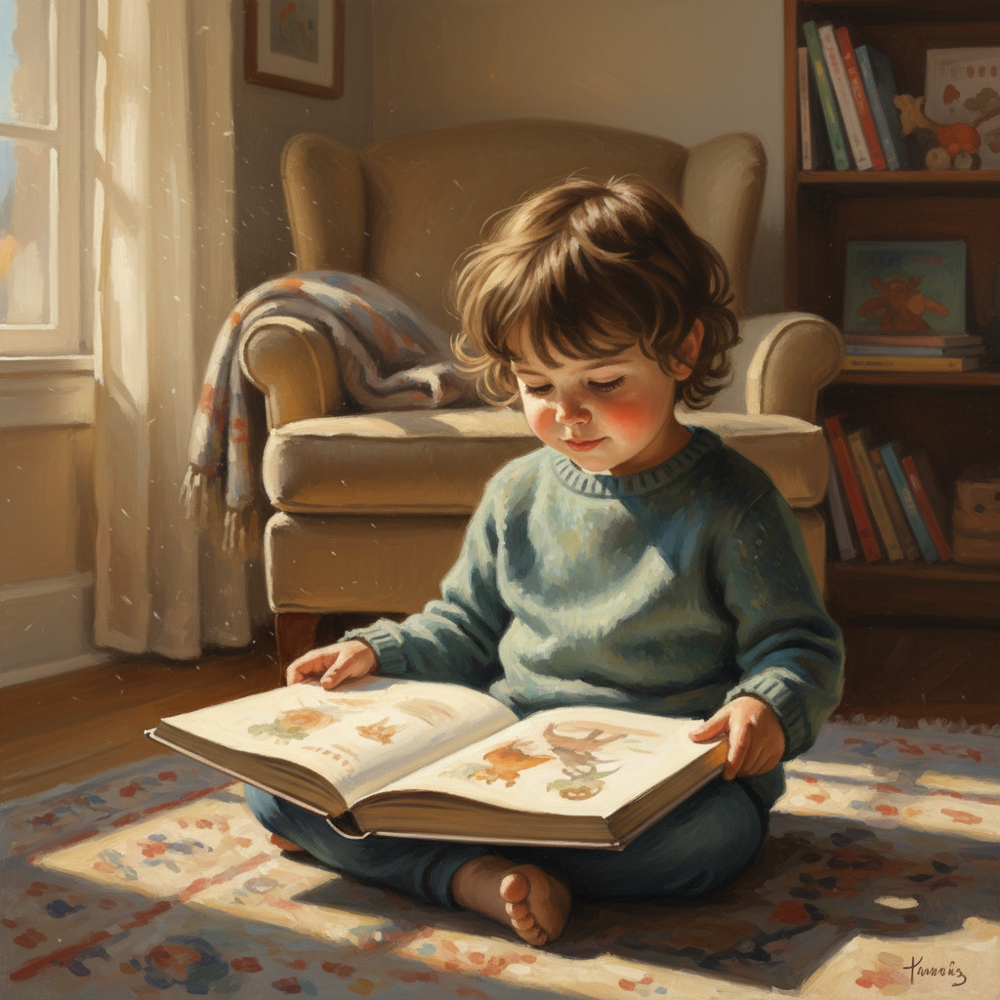

# Ernest Crichlow 欧内斯特·克里奇洛

> **时期：** 1914–2005  
> **关键词：** 黑人儿童肖像、温暖人文主义、社会现实主义、社区艺术教育

## 概述

Ernest Crichlow 是美国画家和插画家，以温暖而有尊严地描绘非裔美国儿童而闻名。他的作品避免了当时常见的两个极端——既不美化也不悲情化黑人生活，而是以安静的人文主义捕捉日常生活中的尊严和美。他是Cinque Gallery的联合创始人，致力于为少数族裔艺术家提供展示空间。

## 风格特征

- **儿童肖像的心理深度**：捕捉黑人儿童的内心世界和情感状态
- **温暖的光线**：柔和的光线赋予画面亲密和安全感
- **安静的叙事**：描绘阅读、玩耍、沉思等安静的日常时刻
- **写实但不照相**：保持观察的准确性同时注入情感温度
- **社区视角**：从社区内部而非外部观察者的角度描绘生活

## 代表作品

- *White Fence*（1967）
- *Young Girl Reading*（约1960s）
- *The Lovers*（1938）
- 多部儿童书籍插图

## 历史意义

Crichlow 通过温暖而有尊严的黑人儿童形象，对抗了美国视觉文化中对黑人儿童的系统性忽视和歪曲。他的Cinque Gallery为Romare Bearden、Norman Lewis等艺术家提供了重要的展示平台。

## 概念图

