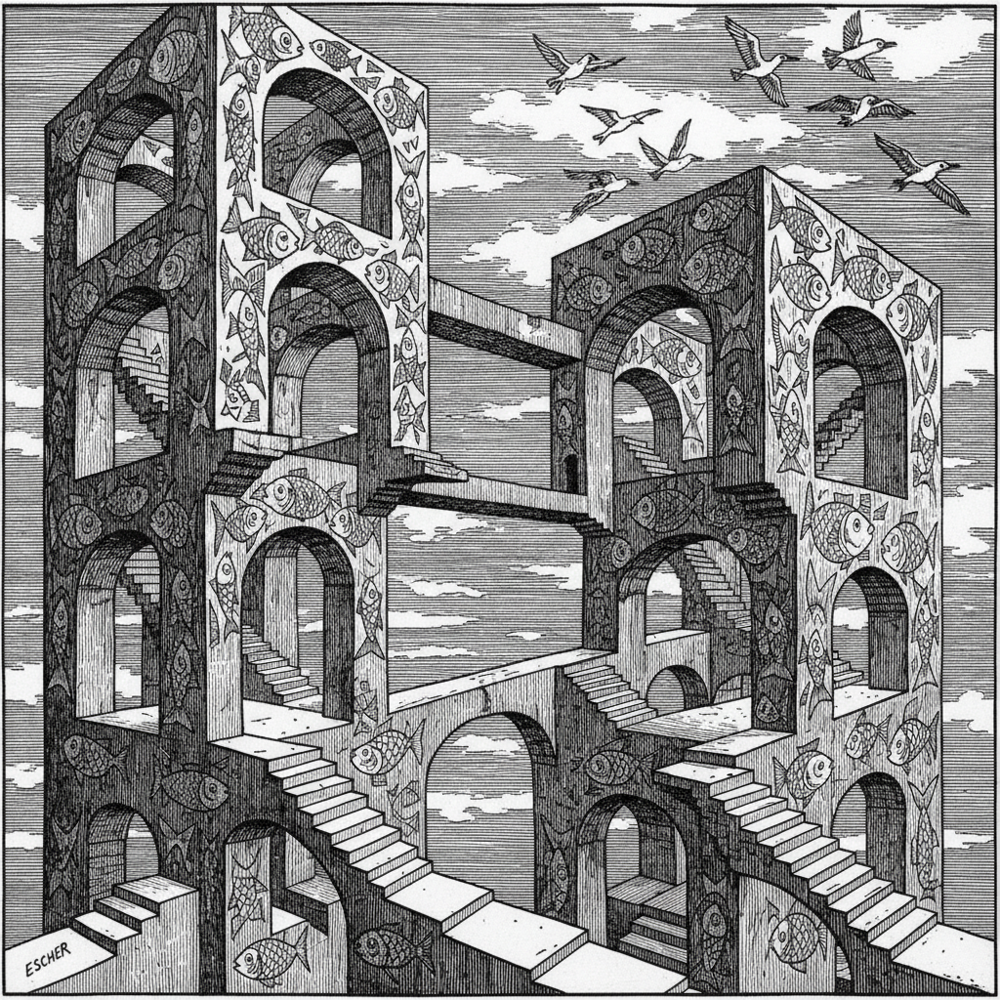

# M.C. Escher 埃舍尔

> "We adore chaos because we love to produce order." — M.C. Escher

## 概述

莫里茨·科内利斯·埃舍尔（M.C. Escher，1898–1972）是荷兰版画家，以数学精确的视觉悖论闻名——不可能的建筑、无限循环的楼梯、互相变形的镶嵌图案。他的作品在艺术与数学之间架起桥梁，至今仍是视觉错觉和几何美学的代名词。

## 核心特征

| 特征 | 描述 |
|------|------|
| 不可能图形 | 违反物理定律的建筑与空间 |
| 镶嵌图案 | 互锁的动物和几何形状铺满平面 |
| 无限循环 | 楼梯永远上升、水永远流动 |
| 变形 | 一种形态渐变为另一种 |
| 版画技法 | 木刻和石版画的精确线条 |
| 数学之美 | 对称、分形、双曲几何 |

## 代表作品

| 作品 | 年代 | 意义 |
|------|------|------|
| *Relativity* | 1953 | 多重引力方向的不可能空间 |
| *Ascending and Descending* | 1960 | 永远上升的楼梯 |
| *Metamorphosis II* | 1939–40 | 4米长的渐变镶嵌 |
| *Drawing Hands* | 1948 | 自我指涉的悖论 |
| *Sky and Water I* | 1938 | 鸟变鱼的镶嵌经典 |

## AI生成概念图

## 与其他风格的关系

- **Op Art** → 视觉错觉的先驱
- **Mathematics** → 与数学家的深度合作
- **Surrealism** → 共享对不可能的兴趣，但方法不同
- **Islamic Art** → 受阿尔罕布拉宫镶嵌启发
