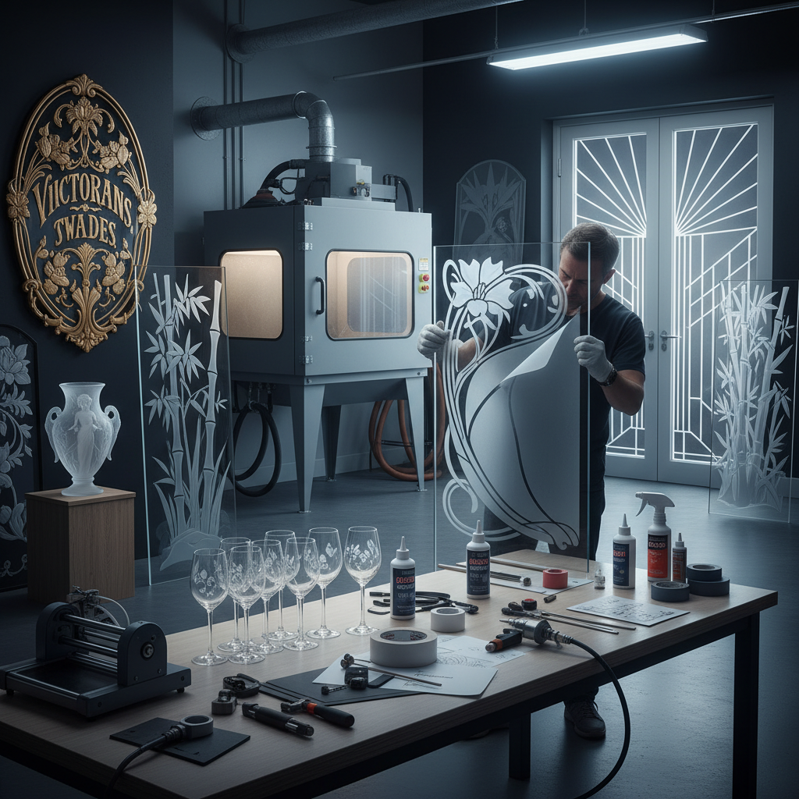

# Etched Glass Art 蚀刻玻璃艺术

> "Etching transforms glass from transparent to mysterious — acid or abrasive bites into the surface, frosting it to a soft white opacity that scatters light like morning mist. Where the resist protects, the glass remains clear as water; where the acid touches, it becomes cloud. The etched glass artist paints with absence, creating images not by adding pigment but by removing clarity, turning windows into veils and vessels into lanterns." — Unknown

## 概述

蚀刻玻璃艺术（Etched Glass Art）是通过化学腐蚀（氢氟酸）或物理研磨（喷砂）在玻璃表面创造磨砂图案的装饰工艺——通过在玻璃表面涂覆抗蚀剂（resist），露出需要蚀刻的区域，然后用酸液或砂粒处理，形成透明与磨砂的对比图案。

蚀刻玻璃艺术的实践包括：1）酸蚀——用氢氟酸腐蚀玻璃表面；2）喷砂——用高压砂粒研磨玻璃表面；3）多层蚀刻——通过多次蚀刻创造不同深度；4）浮雕蚀刻——深度蚀刻形成浮雕效果；5）建筑蚀刻——建筑玻璃的装饰蚀刻；6）器物蚀刻——玻璃器皿的蚀刻装饰；7）当代蚀刻——将蚀刻作为当代艺术表达的创作。

## 核心特征

| 特征 | 描述 |
|------|------|
| 对比 | 透明与磨砂的对比 |
| 精细 | 可实现极精细的图案 |
| 光影 | 独特的光线散射效果 |
| 持久 | 永久性的表面处理 |
| 隐私 | 提供视觉隐私 |
| 优雅 | 优雅的装饰效果 |

## 视觉特征

- **磨砂**：柔和的磨砂白色
- **透明**：保留的透明区域
- **对比**：清晰与模糊的对比
- **光线**：光线穿过的散射效果
- **深度**：多层蚀刻的深度感
- **细节**：精细的图案细节

## 代表作品

| 作品 | 艺术家/文化 | 年代 | 意义 |
|------|-------------|------|------|
| *Victorian etched glass* | 英国维多利亚 | 19世纪 | 维多利亚蚀刻玻璃 |
| *Lalique glass* | René Lalique | 1920s-1930s | 装饰艺术蚀刻 |
| *Pub glass panels* | 英国传统 | 19-20世纪 | 酒吧蚀刻玻璃 |
| *Contemporary sandblasting* | Various | 当代 | 当代喷砂艺术 |
| *Architectural etched glass* | Various | 当代 | 建筑蚀刻玻璃 |

## 历史时间线

| 时期 | 事件 |
|------|------|
| 17世纪 | 酸蚀玻璃技术的发明 |
| 19世纪 | 维多利亚时代的蚀刻玻璃繁荣 |
| 1870s | 喷砂技术的发明 |
| 20世纪 | 装饰艺术风格的蚀刻 |
| 当代 | 蚀刻玻璃的多元发展 |

## 中国语境

蚀刻玻璃艺术在中国主要体现在建筑装饰和工业应用领域。中国的建筑装饰市场大量使用蚀刻玻璃——从酒店大堂到办公室隔断，蚀刻玻璃提供了优雅的视觉隐私解决方案。中国的玻璃加工企业在喷砂蚀刻方面有很强的技术能力——可以实现极其精细的图案和多层深度效果。中国的一些艺术家将蚀刻玻璃作为创作媒介——在玻璃上创造具有中国传统美学的图案，如山水、花鸟等。中国的室内设计中，蚀刻玻璃屏风是一种流行的装饰元素——将传统屏风的概念与现代玻璃工艺相结合。中国的一些高端定制家具品牌也使用蚀刻玻璃——作为柜门和桌面的装饰。中国的玻璃艺术教育中，蚀刻是基础技法之一——学生通过蚀刻学习玻璃表面处理的基本原理。

## AI生成概念图

## 与其他风格的关系

- **Stained Glass** → 彩色玻璃
- **Sandblasting** → 喷砂艺术
- **Engraving** → 雕刻艺术
- **Architecture** → 建筑艺术
- **Light Art** → 光艺术
- **Decorative Art** → 装饰艺术

---

*浮光艺志 | Chronicle of Artistry*
