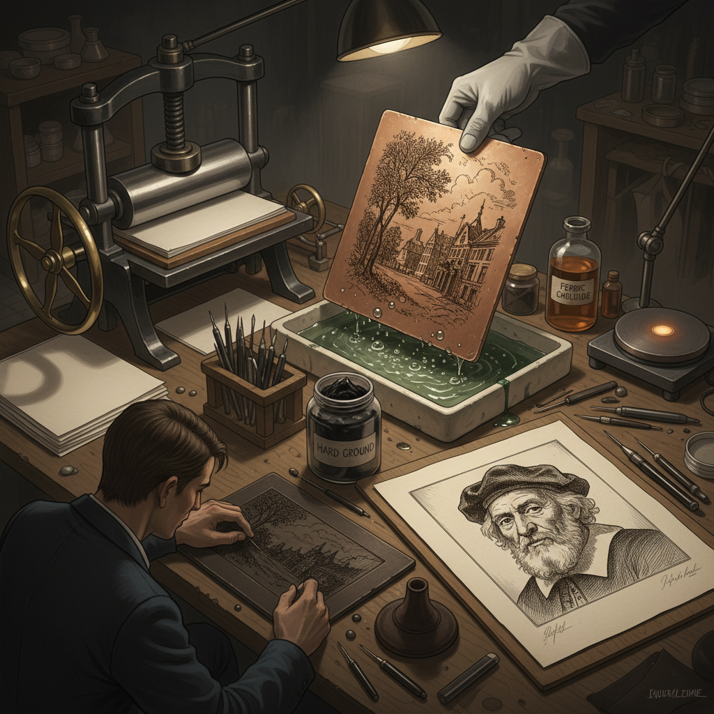

# Etching Art 蚀刻版画艺术

> "Etching is drawing with acid — the artist scratches through a waxy ground to expose metal beneath, then bathes the plate in acid that bites into the exposed lines. The longer the acid works, the deeper the groove, the darker the printed line. It is a medium of time and chemistry, where patience produces depth and haste produces delicacy, where the artist must think in reverse and trust the invisible work of corrosion." — Unknown

## 概述

蚀刻版画艺术（Etching Art）是通过酸液腐蚀金属板来制作凹版印刷图像的版画艺术形式——艺术家在涂有防腐蚀层（ground）的金属板上用针刻画图案，暴露出金属表面，然后将板浸入酸液中，酸液腐蚀暴露的金属形成凹槽，最后在凹槽中填入油墨进行印刷。蚀刻版画以其精细的线条和丰富的调子著称。

蚀刻版画的实践包括：1）线蚀刻——基本的线条蚀刻技法；2）软地蚀刻——使用软质防腐层的蚀刻；3）糖举法——用糖液绘画后蚀刻的技法；4）多次腐蚀——通过多次腐蚀获得不同深度的线条；5）彩色蚀刻——多版套色的彩色蚀刻版画；6）照相蚀刻——利用感光技术的蚀刻；7）当代蚀刻——将蚀刻与其他技法结合的实验创作。

## 核心特征

| 特征 | 描述 |
|------|------|
| 线条 | 精细自由的线条 |
| 腐蚀 | 酸液腐蚀的原理 |
| 凹版 | 凹版印刷方式 |
| 层次 | 丰富的明暗层次 |
| 精细 | 极其精细的细节 |
| 版次 | 可印刷多个版次 |

## 视觉特征

- **线条**：精细流畅的线条
- **交叉**：交叉排线的阴影
- **压痕**：版边的压痕
- **墨色**：温暖的油墨色调
- **纸张**：优质版画纸的质感
- **深度**：线条粗细的变化

## 代表作品

| 作品 | 艺术家 | 年代 | 意义 |
|------|--------|------|------|
| *The Three Crosses* | Rembrandt | 1653 | 蚀刻版画巅峰 |
| *Los Caprichos* | Goya | 1799 | 讽刺蚀刻版画 |
| *Prisons (Carceri)* | Piranesi | 1745-61 | 建筑幻想蚀刻 |
| *Whistler etchings* | James Whistler | 19世纪 | 印象派蚀刻 |
| *Contemporary etchings* | Various | 当代 | 当代蚀刻版画 |

## 历史时间线

| 时期 | 事件 |
|------|------|
| 15世纪 | 蚀刻技术从盔甲装饰发展而来 |
| 17世纪 | 伦勃朗将蚀刻提升为高级艺术 |
| 18-19世纪 | 蚀刻版画的广泛应用 |
| 19世纪末 | 蚀刻版画的艺术复兴运动 |
| 当代 | 蚀刻的当代艺术实践 |

## 中国语境

蚀刻版画艺术在中国的发展始于20世纪——随着西方版画技术的传入，中国的美术院校开始教授蚀刻版画。中国的版画传统以木刻为主——鲁迅在1930年代推动的新兴木刻运动是中国现代版画的起点。蚀刻版画作为一种精细的版画技法，在中国的美术院校中受到重视——许多版画专业的学生学习蚀刻技法。中国当代的一些版画家专注于蚀刻创作——利用蚀刻版画独特的线条质感和层次表现力进行艺术探索。中国的一些版画工坊配备了蚀刻设备——为艺术家提供创作条件。中国的蚀刻版画在国际版画双年展中也有一定的展示——一些中国艺术家的蚀刻作品获得了国际认可。

## AI生成概念图

## 与其他风格的关系

- **Printmaking** → 版画艺术
- **Engraving** → 雕版画
- **Drypoint** → 干刻版画
- **Aquatint** → 飞尘腐蚀版画
- **Mezzotint** → 美柔汀版画
- **Drawing** → 素描

---

*浮光艺志 | Chronicle of Artistry*
