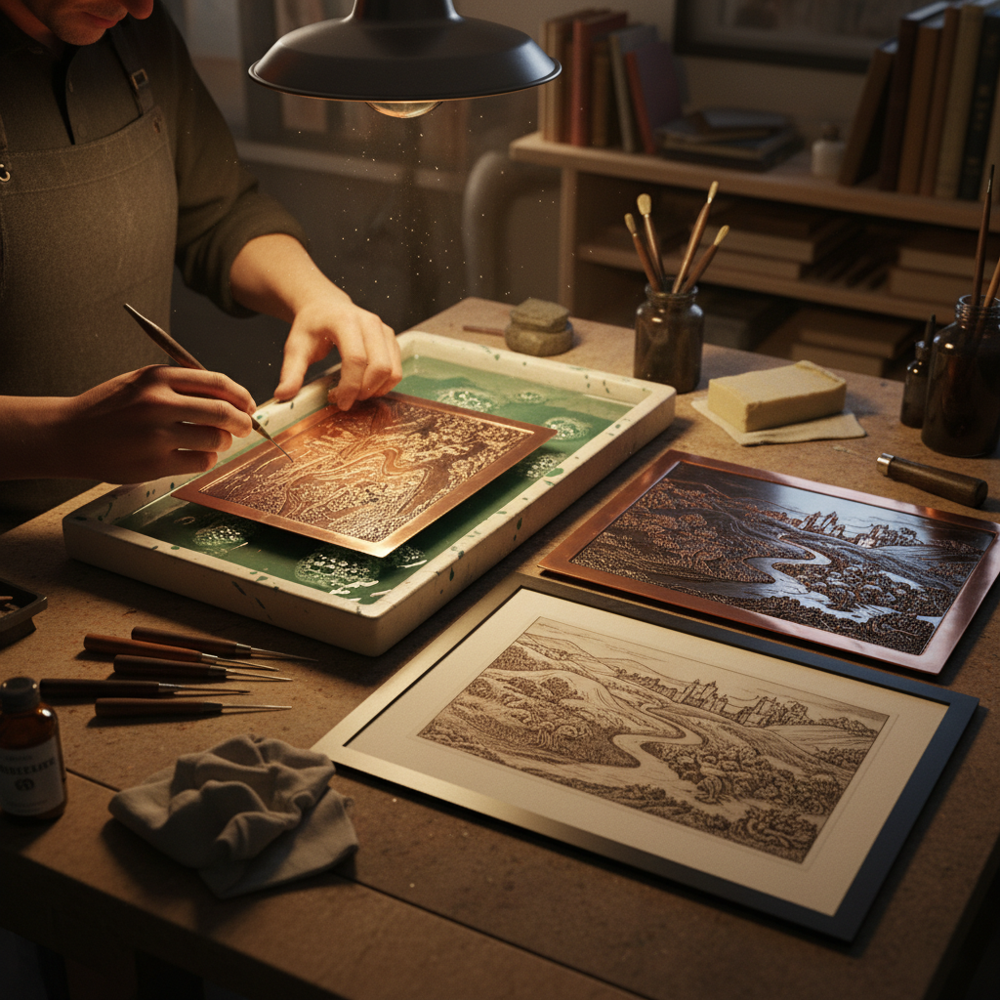

# Etching (Metal) 金属蚀刻

> "Etching lets acid do the drawing — the artist guides, but chemistry creates the line." — Unknown

## 概述

金属蚀刻（Etching）是利用酸或其他腐蚀剂在金属表面创造图案的技法。艺术家先在金属板上涂覆防腐蚀的保护层（ground），然后用针在保护层上划出图案露出金属，再将金属板浸入酸液中——酸只腐蚀露出的部分，形成凹陷的线条。蚀刻既是版画的重要技法（凹版印刷），也是金属装饰的独立工艺。与雕刻（engraving）的刚硬线条不同，蚀刻的线条更自由、更接近绘画的笔触。

蚀刻的哲学在于：间接的创造——艺术家不直接在金属上刻画，而是通过化学反应让酸来完成最终的"绘制"。

## 核心特征

| 特征 | 描述 |
|------|------|
| 化学 | 利用酸的腐蚀作用 |
| 间接 | 间接的创作方式 |
| 自由 | 线条比雕刻更自由 |
| 保护层 | 防腐蚀保护层 |
| 深浅 | 可控制腐蚀深度 |
| 多用途 | 版画和装饰双重用途 |

## 视觉特征

- **线条**：自由流畅的线条
- **灰调**：丰富的灰度层次
- **细腻**：细腻的纹理效果
- **自由**：如绘画般的自由感
- **深浅**：不同深度的线条
- **质感**：酸蚀的独特质感

## 代表作品

| 作品 | 艺术家 | 年代 | 意义 |
|------|--------|------|------|
| *Rembrandt etchings* | Rembrandt | 1620s-60s | 蚀刻版画巅峰 |
| *Goya's Los Caprichos* | Francisco Goya | 1799 | 蚀刻的表现力 |
| *Piranesi's Prisons* | Giovanni Piranesi | 1745-61 | 建筑蚀刻 |
| *Etched armor* | 匿名 | 16世纪 | 盔甲蚀刻装饰 |
| *Circuit board etching* | Various | 20世纪+ | 工业蚀刻应用 |

## 历史时间线

| 时期 | 事件 |
|------|------|
| 15世纪 | 盔甲装饰蚀刻 |
| 16世纪 | 蚀刻版画的发明 |
| 17世纪 | Rembrandt的蚀刻巅峰 |
| 18-19世纪 | 蚀刻版画的黄金时代 |
| 20世纪 | 工业蚀刻（电路板等） |
| 当代 | 艺术蚀刻和工业蚀刻并存 |

## 中国语境

蚀刻技法在中国传统金属工艺中也有应用——称为"腐蚀"或"咬花"。中国传统的铜器和铁器上有使用酸蚀创造图案的例子。当代中国的版画艺术家广泛使用蚀刻技法创作铜版画。在工业领域，中国是全球最大的PCB（印刷电路板）蚀刻生产国。当代中国的金属艺术家也在探索蚀刻在装饰和艺术中的新应用。

## AI生成概念图

## 与其他风格的关系

- **Engraving** → 雕刻是物理版的蚀刻
- **Printmaking** → 凹版印刷
- **Intaglio** → 凹版技法家族
- **Aquatint** → 蚀刻的面积调子版本
- **Niello** → 蚀刻后填充黑金
- **Industrial Design** → 工业蚀刻应用

---

*浮光艺志 | Chronicle of Artistry*
