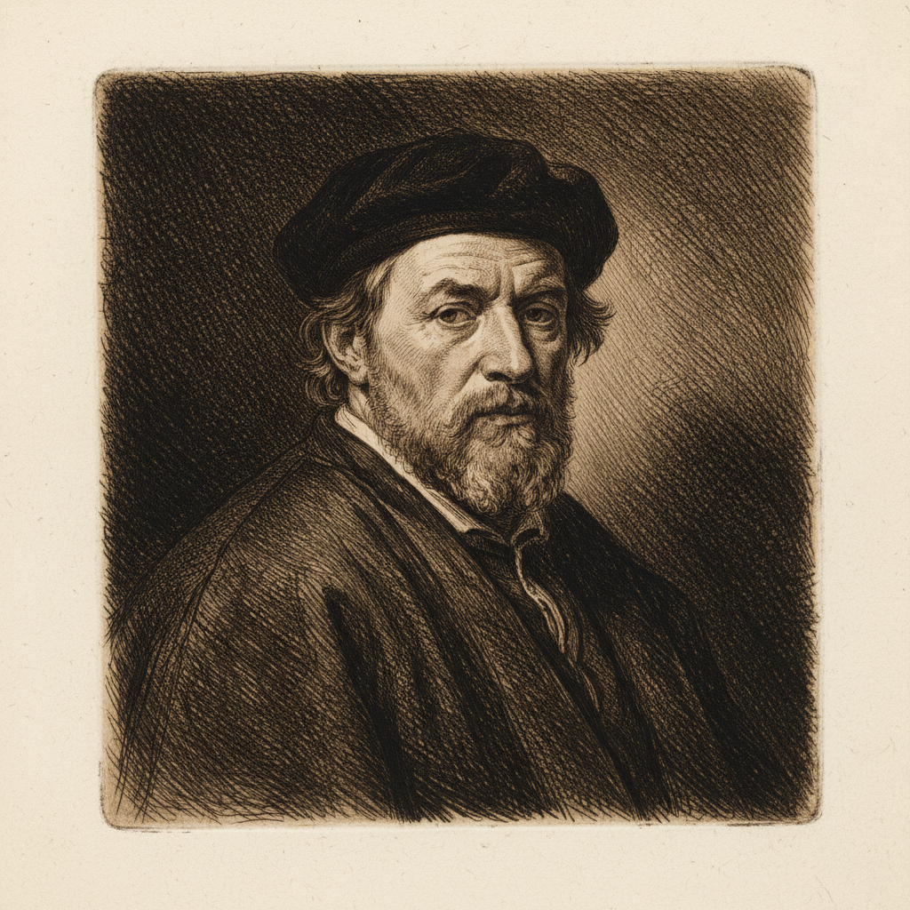

# Etching 蚀刻版画

> "The etcher's needle is as free as the pen." — Rembrandt

## 概述

蚀刻版画（Etching）是一种凹版印刷技法——在金属板（通常是铜板或锌板）上涂覆防腐蚀的蜡质地层（ground），用针在地层上刻画图案露出金属，然后将金属板浸入酸液中腐蚀出凹槽，最后在凹槽中填入油墨并用压力机印刷。

蚀刻版画比直接雕刻（engraving）更自由——针在蜡层上滑动几乎没有阻力，画家可以像用铅笔画素描一样自由地创作。从伦勃朗到戈雅，从惠斯勒到毕加索，蚀刻是艺术家最亲密的版画媒介。

## 核心特征

| 特征 | 描述 |
|------|------|
| 酸蚀原理 | 用酸液腐蚀金属产生凹槽 |
| 线条自由 | 针在蜡层上几乎无阻力——极度自由 |
| 色调控制 | 通过腐蚀时间控制线条深浅 |
| 精细细节 | 可以实现极精细的线条和交叉排线 |
| 多次腐蚀 | 分步腐蚀可创造丰富的明暗层次 |
| 限量版 | 铜板磨损后印数有限——限量版 |

## 视觉特征

- **线条**：自由流畅的、如铅笔般的线条
- **色调**：通过交叉排线（cross-hatching）建立色调
- **细节**：极精细的线条细节
- **边缘**：印刷时金属板边缘留下的压痕（plate mark）
- **墨色**：温暖的深褐或黑色油墨
- **纸张**：柔软的手工纸上的凹印质感

## 代表人物

| 画家 | 蚀刻特点 | 时期 |
|------|---------|------|
| Rembrandt | 300幅蚀刻——光影的极致 | 荷兰黄金时代 |
| Francisco Goya | *Los Caprichos*, *Disasters of War* | 浪漫主义 |
| James McNeill Whistler | 威尼斯蚀刻系列 | 19世纪 |
| Pablo Picasso | *Vollard Suite* | 20世纪 |
| Käthe Kollwitz | 社会批判版画 | 表现主义 |
| Giorgio Morandi | 静物蚀刻 | 20世纪 |

## 技法变体

| 变体 | 描述 |
|------|------|
| Aquatint 飞尘法 | 用松香粉创造色调面积 |
| Soft Ground 软地法 | 可转印织物纹理 |
| Drypoint 干刻法 | 直接在金属上刻画（无酸） |
| Mezzotint 美柔汀 | 从黑到白的刮磨法 |
| Sugar Lift 糖举法 | 用糖液绘画后腐蚀 |

## 与其他技法的关系

- **Engraving** → 雕刻是直接刻金属，蚀刻用酸
- **Lithography** → 石版画是平版，蚀刻是凹版
- **Woodcut** → 木刻是凸版，蚀刻是凹版
- **Drawing** → 蚀刻的线条自由度接近素描
- **Rembrandt** → 伦勃朗将蚀刻提升为独立艺术

## 概念图

---

*浮光艺志 | Chronicle of Artistry*
