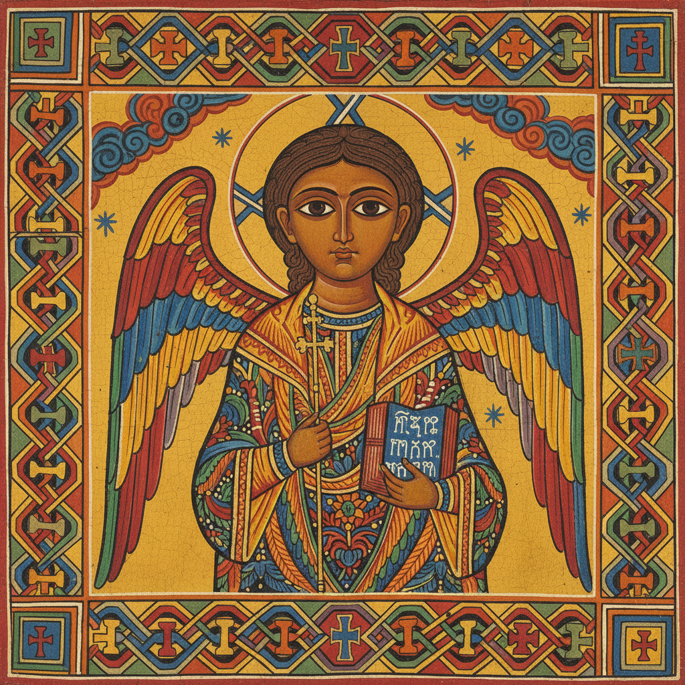

# Ethiopian & Coptic Art 埃塞俄比亚与科普特艺术

> **"大眼睛凝视着你——非洲之角最古老的基督教视觉传统。"**

## 概述

埃塞俄比亚艺术（Ethiopian Art）是非洲大陆最独特的视觉艺术传统之一，根植于公元4世纪即已皈依基督教的阿克苏姆王国。与埃及科普特艺术（Coptic Art）同属东方基督教艺术体系，但发展出完全独立的风格——以其标志性的大眼睛正面人物、鲜艳色彩和精美手抄本彩饰闻名。拉利贝拉岩石教堂、格兹语手抄本和埃塞俄比亚十字架是其三大视觉遗产。

## 核心特征

- **大眼正面像**：圣人和天使以正面大眼凝视观者
- **侧面=邪恶**：恶人和魔鬼被画成侧面像
- **鲜艳色彩**：红、黄、蓝、绿的强烈对比
- **平面化**：无透视深度，装饰性优先
- **手抄本传统**：格兹语（Ge'ez）福音书的精美彩饰
- **十字架设计**：数百种独特的埃塞俄比亚十字架造型

## 主要形式

| 形式 | 特征 |
|------|------|
| 手抄本彩饰 | 格兹语福音书插图，几何边框 |
| 教堂壁画 | 岩石教堂内壁的圣经叙事 |
| 圣像画 | 木板蛋彩画，大眼正面圣人 |
| 金属十字架 | 镂空几何设计，数百种变体 |
| 魔法卷轴 | 护身符卷轴上的天使和恶魔 |

## 时间线

| 时期 | 特征 |
|------|------|
| 阿克苏姆 (4–7世纪) | 早期基督教化，石碑和硬币 |
| 扎格韦王朝 (12–13世纪) | 拉利贝拉岩石教堂 |
| 所罗门王朝 (13–16世纪) | 手抄本彩饰的黄金时代 |
| 贡德尔时期 (17–18世纪) | 教堂壁画的巅峰 |
| 当代 | 传统风格的现代诠释 |

## 视觉特征

- 正面大眼的标志性人物造型
- 鲜艳饱和的红黄蓝绿
- 几何化的装饰边框和填充
- 天使翅膀的程式化表现
- 编织图案（类似十字绣）的背景
- 叙事性的连续场景排列

## 与其他风格的关系

| 风格 | 关系 |
|------|------|
| 拜占庭艺术 | 共享东方基督教传统，但独立发展 |
| 科普特艺术 | 同属非洲基督教艺术，互相影响 |
| 亚美尼亚手抄本 | 共享东方基督教手抄本传统 |
| 当代非洲艺术 | 埃塞俄比亚风格影响泛非洲视觉身份 |
| 拉斯塔法里文化 | 埃塞俄比亚视觉元素的全球传播 |

## 概念图

---

*浮光艺志 | Chronicle of Artistry*
