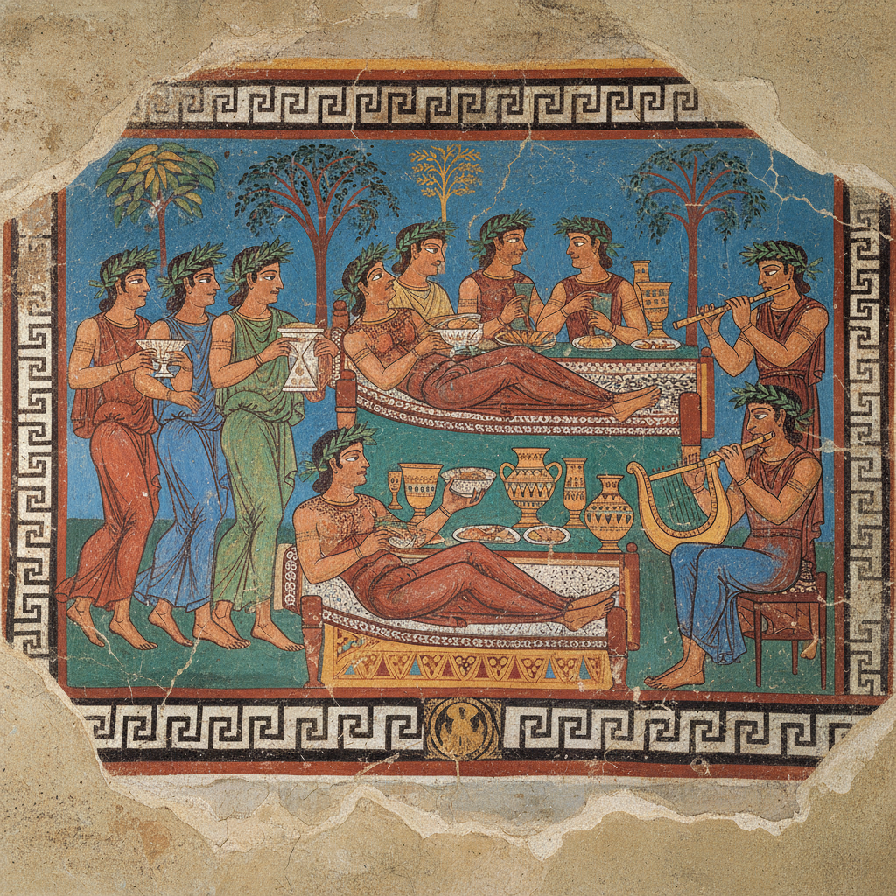

# 伊特鲁里亚艺术 · Etruscan Art

> "我们在墓室中描绘生命的欢乐，让死者在永恒中继续宴饮。" —— 伊特鲁里亚墓志

## 概述

伊特鲁里亚艺术（Etruscan Art）是公元前8世纪至前1世纪在意大利中部（今托斯卡纳、翁布里亚、拉齐奥北部）发展出的独特视觉艺术体系。伊特鲁里亚人是罗马文明的重要先驱，其艺术融合了希腊、腓尼基和本土意大利传统，以生动的墓室壁画、精美的青铜工艺和独特的陶塑棺盖闻名。与希腊艺术追求理想化不同，伊特鲁里亚艺术更注重生活的活力与情感的直接表达。

## 核心特征

| 特征 | 描述 |
|------|------|
| 时期 | 约前800年–前100年 |
| 地域 | 意大利中部（伊特鲁里亚） |
| 媒介 | 壁画、青铜、陶塑、金银工艺、石雕 |
| 核心理念 | 以生动的视觉叙事庆祝生命并陪伴死者 |
| 色彩 | 壁画中的鲜明红、蓝、绿、黄、黑 |

## 视觉特征

- **墓室壁画**：描绘宴饮、舞蹈、运动等生活场景
- **生动的表情**：人物面带微笑，充满生命活力
- **青铜工艺精湛**：镜面雕刻、小型铸像技艺高超
- **陶塑棺盖**：夫妻半卧像，表情安详亲密
- **金粒细工（Granulation）**：极精密的金珠焊接装饰技术

## 代表作品

| 作品 | 地点 | 年代 | 类型 |
|------|------|------|------|
| 塔尔奎尼亚"豹墓"壁画 | 塔尔奎尼亚 | 约前480 | 墓室壁画 |
| "夫妻棺"陶塑 | 切尔韦泰里 | 约前520 | 陶塑 |
| 卡皮托利诺母狼铜像 | 罗马 | 约前500 | 青铜 |
| 阿雷佐的奇美拉 | 阿雷佐 | 约前400 | 青铜 |
| 维伊的阿波罗像 | 维伊 | 约前510 | 陶塑 |

## 发展时间线

| 时期 | 事件 |
|------|------|
| 前900-700 | 维兰诺瓦文化，伊特鲁里亚文明萌芽 |
| 前700-500 | 东方化时期和古风时期，希腊影响增强 |
| 前600-400 | 伊特鲁里亚城邦鼎盛，艺术黄金时代 |
| 前500 | 塔尔奎尼亚墓室壁画创作高峰 |
| 前400-100 | 罗马逐步征服，伊特鲁里亚艺术融入罗马 |
| 前89 | 伊特鲁里亚人获罗马公民权，文化同化完成 |

## 中国语境

伊特鲁里亚艺术与中国春秋战国时期（前770-前221）大致同期。两者都发展出了精湛的青铜铸造技术和丰富的墓葬艺术传统。伊特鲁里亚墓室壁画描绘的宴饮场景与中国汉代画像石中的宴乐图在功能上异曲同工——都是为死者在来世重现生前的欢乐。两种文化都以墓葬艺术的丰富程度反映了对来世生活的重视。

## AI 概念图

*AI 生成概念图：伊特鲁里亚艺术风格*

## 关联词条

- [[greek-art]] - 古希腊艺术
- [[egyptian-art]] - 古埃及艺术
- [[romanesque-art]] - 罗马式艺术

---

*浮光艺志 · Chronicle of Artistry*
