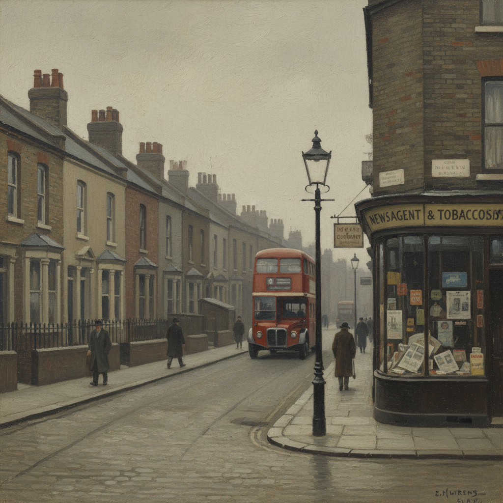

# Euston Road School 尤斯顿路画派

> **时期：** 1937年–1939年  
> **关键词：** 英国写实主义、反抽象、观察绘画、朴素美学、战前伦敦

## 概述

Euston Road School（尤斯顿路画派）是1937年在伦敦尤斯顿路成立的绘画学校和艺术运动，由威廉·科尔德斯特里姆、维克多·帕斯莫尔和克劳德·罗杰斯创立。在超现实主义和抽象艺术盛行的年代，他们坚持回归直接观察——用朴素、诚实的方式描绘眼前所见的伦敦街景、人物和静物。

## 风格特征

- **直接观察**：从生活中写生而非想象创作
- **朴素色调**：灰色、褐色、柔和的自然色
- **精确测量**：用标记点辅助比例和透视
- **日常题材**：街景、肖像、静物
- **反装饰**：拒绝华丽效果和理论教条

## 代表人物与作品

- 威廉·科尔德斯特里姆 肖像与风景
- 维克多·帕斯莫尔 早期写实作品
- 克劳德·罗杰斯 静物与人物
- 劳伦斯·高因 城市场景

## 概念图

