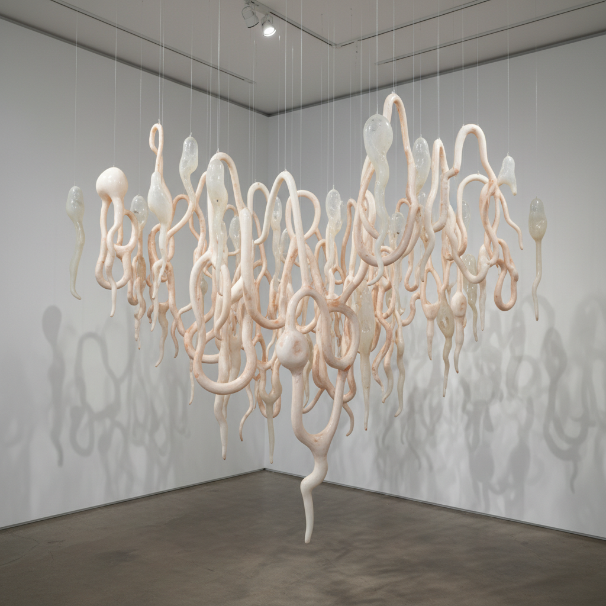

# Eva Hesse 伊娃·海塞

> **时期：** 1936–1970  
> **关键词：** 后极简主义、有机材料、荒诞形态、脆弱与坚韧

## 概述

Eva Hesse 是德裔美国雕塑家，在极短的创作生涯中（约5年成熟期）彻底改变了雕塑的可能性。她用乳胶、玻璃纤维、绳索和纱布等非传统材料创造出介于有机体和工业品之间的荒诞形态，将极简主义的重复性与身体的脆弱性和幽默感结合。她于34岁因脑瘤去世。

## 风格特征

- **非传统材料**：乳胶、玻璃纤维、绳索、纱布等会老化和变形的材料
- **有机荒诞**：形态暗示身体器官、触手或生长物，但拒绝明确指涉
- **重复与变异**：极简主义的序列性被注入手工的不规则和偶然
- **悬挂与垂坠**：作品常从天花板或墙壁悬挂，受重力影响而变形
- **脆弱的持久**：材料本身会降解，作品的短暂性成为其意义的一部分

## 代表作品

- *Hang Up*（1966）
- *Accession II*（1968）
- *Contingent*（1969）
- *Right After*（1969）

## 历史意义

Hesse 是后极简主义的奠基人之一，她证明了雕塑可以同时是严肃的形式探索和深刻的情感表达。她对非传统材料和有机形态的探索影响了此后数十年的雕塑和装置艺术。

## 概念图

