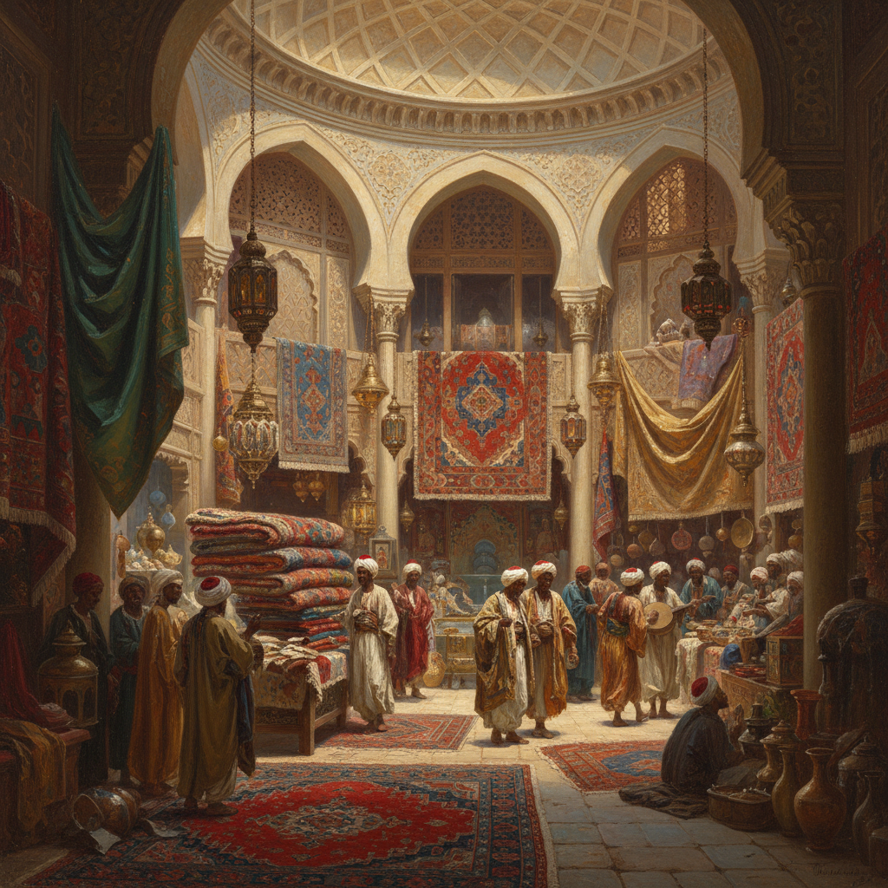

# Exoticism Art 异国情调艺术

> **时期：** 18世纪–20世纪初  
> **关键词：** 东方想象、殖民凝视、异域风情、浪漫化他者、视觉猎奇

## 概述

Exoticism Art（异国情调艺术）是欧洲艺术中对非西方文化——尤其是中东、北非、东亚和太平洋岛屿——的浪漫化再现。从洛可可时期的中国风（Chinoiserie）到19世纪的东方主义绘画，艺术家们将异域文化转化为视觉奇观：后宫、沙漠、宝塔、异兽。它既是审美探索，也是权力投射——用画笔将"他者"变为可消费的风景。

## 风格特征

- **异域场景**：后宫、集市、沙漠、热带丛林
- **丰富色彩**：金色、深红、宝蓝等饱和色调
- **装饰细节**：地毯、瓷器、丝绸的精细描绘
- **浪漫化**：美化或戏剧化异文化生活
- **混合元素**：不同文化符号的自由拼贴

## 代表人物与作品

- 让-莱昂·杰罗姆 东方主义场景
- 欧仁·德拉克洛瓦《阿尔及尔的女人》
- 弗雷德里克·莱顿 古典异域人物
- 中国风装饰艺术（瓷器、壁纸、家具）

## 概念图

