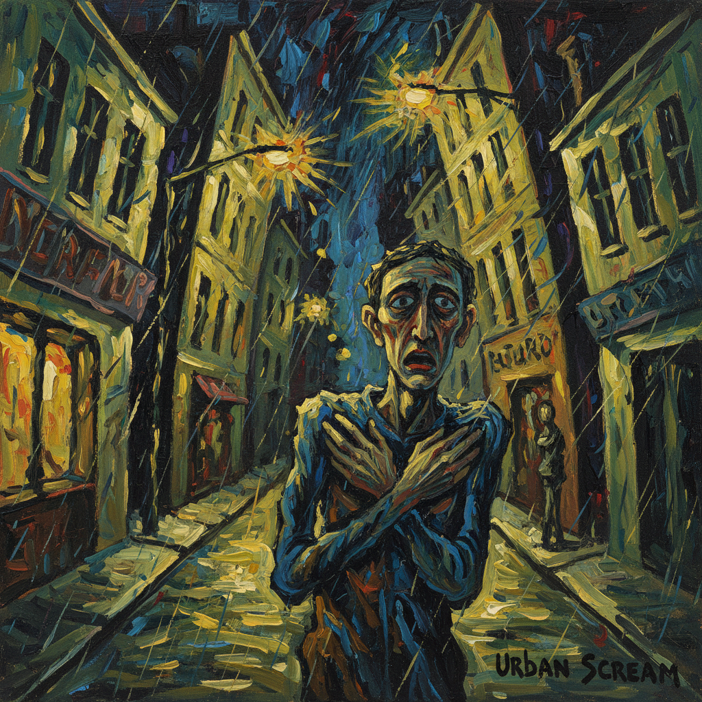

# Expressionism Painting 表现主义绘画

> **时期：** 1905年–1930年代  
> **关键词：** 内心焦虑、扭曲形式、强烈色彩、德国、精神危机

## 概述

Expressionism Painting（表现主义绘画）是20世纪初德国对现代生活焦虑的视觉呐喊——画家们不再描绘世界的外表，而是表达内心对世界的感受。蒙克的《呐喊》、基尔希纳的柏林街头、诺尔德的宗教狂热——他们用扭曲的形式、刺目的色彩和粗暴的笔触，将现代人的孤独、恐惧和疏离感直接倾倒在画布上。

## 风格特征

- **形式扭曲**：人物和空间的主观变形
- **强烈色彩**：不和谐的对比色制造不安
- **粗暴笔触**：急促有力的绘画动作
- **心理主题**：焦虑、孤独、疏离、死亡
- **木刻影响**：锐利的线条和黑白对比

## 代表人物与作品

- 爱德华·蒙克《呐喊》
- 恩斯特·路德维希·基尔希纳 柏林街景
- 埃米尔·诺尔德 宗教画
- 埃贡·席勒 扭曲自画像

## 概念图

