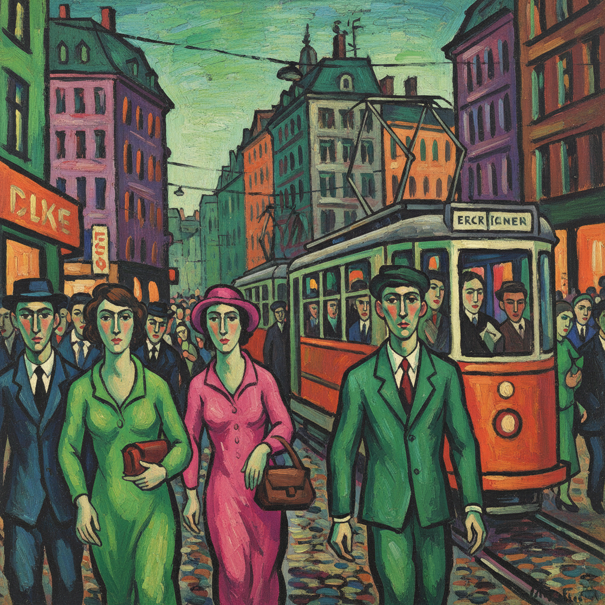

# Expressionism 表现主义

> "We do not want to reproduce nature. We want to create something new." — Ernst Ludwig Kirchner

## 概述

表现主义（Expressionism）是20世纪初（约1905–1930）起源于德国和奥地利的艺术运动，强调通过扭曲的形式、强烈的色彩和夸张的线条来表达内心的情感和精神状态，而非客观地再现外部世界。

表现主义不是一个统一的风格，而是一种态度——将主观情感置于客观描绘之上。它涵盖了桥社（Die Brücke）、蓝骑士（Der Blaue Reiter）等多个团体，影响了此后的抽象表现主义、新表现主义和当代艺术。

## 核心特征

| 特征 | 描述 |
|------|------|
| 情感优先 | 表达内心情感，而非描绘外部世界 |
| 形体扭曲 | 为表达情感而扭曲和夸张形体 |
| 强烈色彩 | 非自然的、情感性的色彩使用 |
| 粗犷线条 | 有力的、焦虑的线条和笔触 |
| 心理深度 | 揭示人类的焦虑、恐惧和孤独 |
| 反学院 | 拒绝学院派的美和技巧标准 |

## 视觉特征

- **色彩**：非自然的、情感性的强烈色彩
- **线条**：扭曲的、焦虑的、有力的线条
- **形体**：夸张变形的人物和风景
- **笔触**：粗犷的、可见的、有攻击性的笔触
- **空间**：扭曲的、不稳定的空间
- **氛围**：焦虑、孤独、恐惧、狂喜

## 主要团体

| 团体 | 时期 | 代表 | 特点 |
|------|------|------|------|
| Die Brücke 桥社 | 1905-13 | Kirchner, Heckel, Schmidt-Rottluff | 原始的、粗犷的 |
| Der Blaue Reiter 蓝骑士 | 1911-14 | Kandinsky, Marc, Macke | 精神性的、走向抽象 |
| Vienna 维也纳 | 1908-18 | Schiele, Kokoschka | 情色的、心理的 |

## 代表人物

| 画家 | 代表作 | 特点 |
|------|--------|------|
| Edvard Munch | *The Scream* (1893) | 表现主义的先驱——存在的焦虑 |
| Ernst Ludwig Kirchner | 柏林街景 | 桥社领袖——城市的焦虑 |
| Egon Schiele | 扭曲的自画像和裸体 | 情色与死亡的极端表达 |
| Oskar Kokoschka | 心理肖像 | "灵魂的X光" |
| Franz Marc | 蓝色马 | 动物的精神性 |
| Emil Nolde | 宗教画和花卉 | 最强烈的色彩 |

## 与其他风格的关系

- **Van Gogh** → 梵高是表现主义的直接先驱
- **Fauvism** → 野兽派的色彩解放启发了表现主义
- **Abstract Expressionism** → 美国抽象表现主义的欧洲根源
- **Neo-Expressionism** → 1980年代的新表现主义复兴
- **German Cinema** → 表现主义电影（《卡里加里博士》）
- **Existentialism** → 共享对人类存在的焦虑

## 概念图

---

*浮光艺志 | Chronicle of Artistry*
