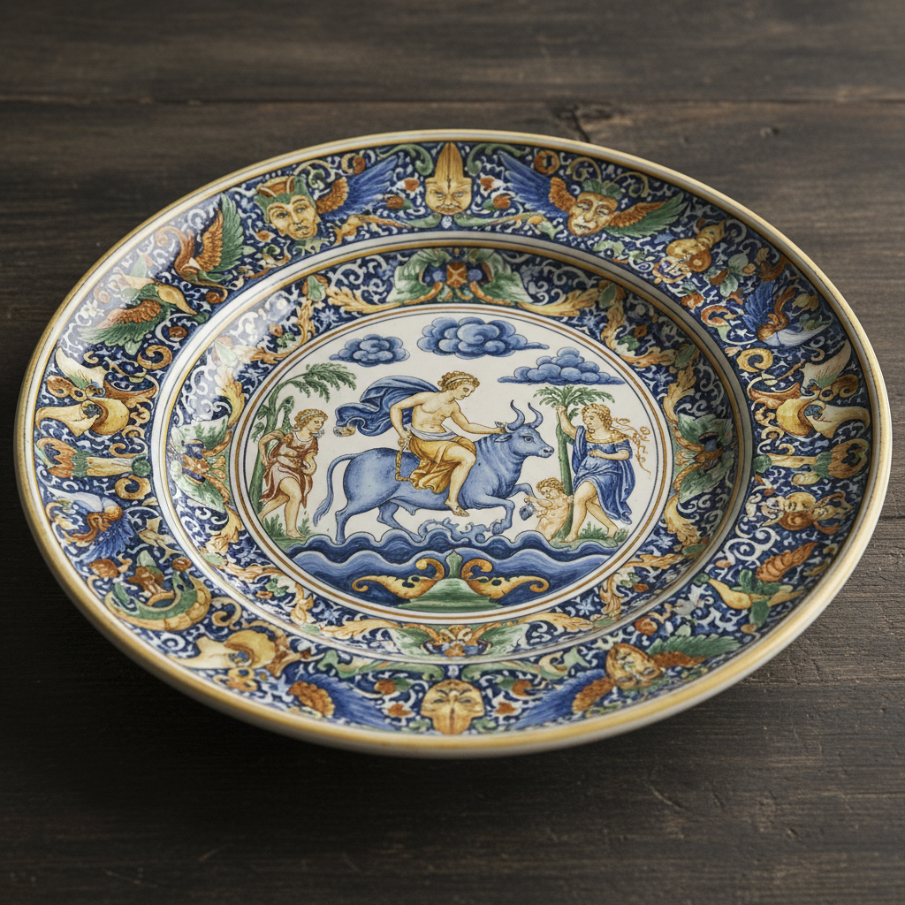

# Faenza Art 法恩扎艺术

> "Faience — the very word carries the memory of Faenza." — Italian ceramic tradition

## 概述

法恩扎艺术（Faenza Art）是意大利艾米利亚-罗马涅大区法恩扎市为中心的锡釉陶器（maiolica）艺术传统。法恩扎是意大利文艺复兴时期最重要的陶器生产中心之一——"faience"（法彩陶）这个词本身就源自法恩扎的城市名称。法恩扎陶器以其精美的彩绘装饰、丰富的叙事题材和独特的"白地"（bianco di Faenza）风格著称。

法恩扎陶器的黄金时代是15-16世纪——文艺复兴的精神渗透到了陶器艺术中，陶工们在盘碟上绑绘神话故事、圣经场景、肖像和纹章。16世纪中叶，法恩扎发展出了独特的"白地"风格——以简洁的白色釉面为主，配以少量精致的蓝色或黄色装饰，预示了后来巴洛克时期的简洁美学。法恩扎至今仍是意大利陶瓷艺术的重要中心——国际陶瓷博物馆（MIC）收藏了世界上最丰富的锡釉陶器。

法恩扎艺术的核心要素包括：1）锡釉彩绘——精美的锡釉陶器彩绘；2）叙事装饰——神话和圣经故事的绑绘；3）白地风格——bianco di Faenza的简洁美学；4）文艺复兴——文艺复兴精神的陶器表达；5）纹章装饰——贵族纹章的精美描绘；6）grotesque——怪诞装饰纹样；7）当代传承——持续至今的陶瓷传统。

## 核心特征

| 特征 | 描述 |
|------|------|
| 锡釉彩绘 | 精美锡釉陶器彩绘 |
| 叙事装饰 | 神话圣经故事绑绘 |
| 白地风格 | bianco di Faenza简洁美学 |
| 文艺复兴 | 文艺复兴精神陶器表达 |
| 纹章装饰 | 贵族纹章精美描绘 |
| 当代传承 | 持续至今陶瓷传统 |

## 视觉特征

- **多彩釉绘**：蓝、黄、绿、橙的丰富色彩
- **叙事画面**：盘面上的完整叙事场景
- **白色底釉**：纯净的白色锡釉底色
- **人物描绘**：文艺复兴风格的人物
- **边框纹样**：精美的几何和植物边框
- **怪诞装饰**：grotesque风格的装饰纹样

## 代表作品

| 作品 | 年代 | 意义 |
|------|------|------|
| *istoriato叙事盘* | 15-16世纪 | 叙事陶器巅峰 |
| *bianco di Faenza白地陶器* | 16世纪中叶 | 简洁美学 |
| *纹章药罐* (Albarello) | 15-16世纪 | 药房陶器 |
| *grotesque装饰盘* | 16世纪 | 怪诞装饰 |
| *当代法恩扎陶艺* | 20-21世纪 | 传统与创新 |
| *国际陶瓷博物馆藏品* | 各时期 | 世界级收藏 |

## 历史时间线

| 时期 | 事件 |
|------|------|
| 13世纪 | 法恩扎陶器生产开始 |
| 15世纪 | 文艺复兴时期繁荣 |
| 1500-1530年 | istoriato叙事风格鼎盛 |
| 1540年代 | bianco di Faenza风格出现 |
| 17-18世纪 | 逐渐衰落 |
| 1908年 | 国际陶瓷博物馆成立 |
| 当代 | 国际陶瓷艺术中心 |

## 中国语境

法恩扎陶器与中国陶瓷有着间接但重要的历史联系。意大利锡釉陶器的技术最初通过伊斯兰世界从中国传入——中国的釉彩技术经由丝绸之路传到中东，再由摩尔人带入西班牙和意大利。法恩扎的"faience"一词后来成为整个锡釉陶器的通称——这一语言学事实反映了法恩扎在欧洲陶瓷史上的核心地位。法恩扎的叙事陶器（istoriato）——在盘面上绑绘完整的故事场景——与中国瓷器上的故事画有某种功能上的相似性，都将陶瓷器物作为叙事的载体。当代法恩扎作为国际陶瓷艺术中心，也吸引了中国陶艺家前往交流和驻留创作。

## 概念图

## 与其他风格的关系

- **Majolica** → 马约利卡（同一传统）
- **Deruta** → 德鲁塔（意大利陶瓷中心）
- **Delft** → 代尔夫特（受影响的北欧传统）
- **Renaissance Art** → 文艺复兴艺术
- **Islamic Ceramics** → 伊斯兰陶瓷（技术来源）
- **Chinese Ceramics** → 中国陶瓷（间接影响）

---

*浮光艺志 | Chronicle of Artistry*
