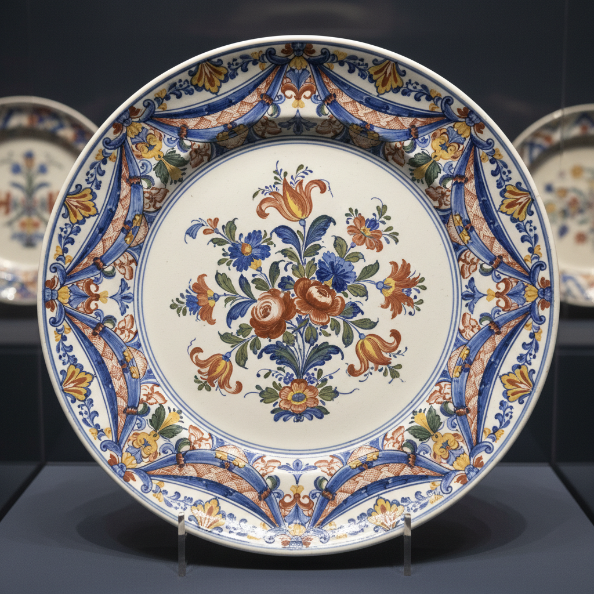

# Faience Art 彩陶艺术

> "Faience is clay dressed in glass — common earthenware is transformed by a coating of tin-opacified glaze into a surface as white and smooth as porcelain, ready to receive painted decoration in the full spectrum of high-fire colors, creating tableware, tiles, and architectural ornament that brought color and hygiene to kitchens and palaces alike across the Mediterranean world and beyond." — Unknown

## 概述

彩陶艺术（Faience Art）是一种以锡釉装饰的陶器传统的总称——faience一词来自意大利法恩扎（Faenza）城，泛指所有使用锡釉的彩绘陶器。彩陶在地中海世界、法国、北欧和中东都有丰富的传统，以其白色釉面上的彩色绘画装饰著称，是欧洲在瓷器普及之前最重要的精美餐具和装饰陶器。

彩陶艺术的实践包括：1）制坯——制作陶器坯体；2）素烧——初次烧制坯体；3）施锡釉——施加白色锡釉；4）彩绘——在釉面上用各色颜料绘画；5）釉烧——入窑烧制；6）地域风格——各地发展出独特的风格；7）当代彩陶——将传统技法与现代创作结合。

## 核心特征

| 特征 | 描述 |
|------|------|
| 锡釉 | 白色锡釉底 |
| 彩绘 | 多色彩绘装饰 |
| 地域 | 各地独特的风格 |
| 实用 | 实用器物的装饰 |
| 广泛 | 广泛的地理分布 |
| 历史 | 悠久的历史传统 |

## 视觉特征

- **白底**：白色锡釉的明亮底色
- **多彩**：丰富的色彩装饰
- **图案**：各地独特的装饰图案
- **光泽**：釉面的光泽
- **手绘**：手绘的装饰风格
- **地域**：地域特色的表现

## 代表作品

| 作品 | 艺术家/文化 | 年代 | 意义 |
|------|-------------|------|------|
| *French faience de Rouen* | 法国 | 17-18世纪 | 鲁昂彩陶 |
| *Strasbourg faience* | 法国 | 18世纪 | 斯特拉斯堡彩陶 |
| *Quimper faience* | 法国 | 17世纪起 | 坎佩尔彩陶 |
| *Portuguese azulejos* | 葡萄牙 | 15世纪起 | 葡萄牙彩釉瓷砖 |
| *Contemporary faience* | 国际 | 当代 | 当代彩陶 |

## 历史时间线

| 时期 | 事件 |
|------|------|
| 9世纪 | 锡釉陶从伊斯兰世界传入欧洲 |
| 14-15世纪 | 意大利马约利卡的发展 |
| 16-17世纪 | 法国彩陶的兴起 |
| 18世纪 | 欧洲各地彩陶的黄金时代 |
| 当代 | 彩陶传统的延续和创新 |

## 中国语境

彩陶与中国的陶瓷传统有一定的关联。中国的彩陶——虽然中国的"彩陶"通常指新石器时代的彩绘陶器，但锡釉彩陶的概念与中国的釉上彩有相似之处。中国的陶瓷出口——对欧洲彩陶的发展有间接的影响。中国的陶瓷教育中，欧洲彩陶作为世界陶瓷史的重要组成——在相关课程中介绍。中国当代的陶艺家——有一些学习和借鉴欧洲彩陶的装饰技法。中国的室内设计中，法国彩陶风格的装饰——在一些欧式空间中使用。

## AI生成概念图

## 与其他风格的关系

- **Majolica** → 马约利卡
- **Delftware** → 代尔夫特陶
- **Tin Glaze** → 锡釉
- **Azulejos** → 彩釉瓷砖
- **Ceramic Painting** → 陶瓷绘画
- **Folk Pottery** → 民间陶器

---

*浮光艺志 | Chronicle of Artistry*
