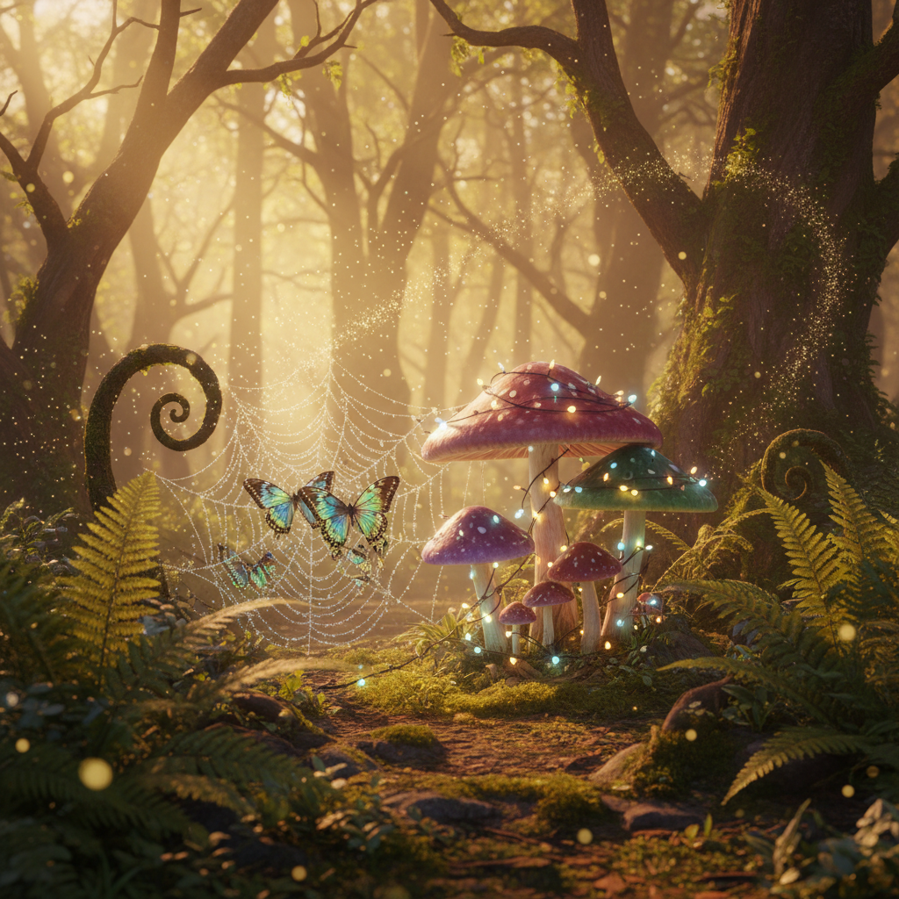

# Fairycore 仙女核



> **"蘑菇圈里的精灵、露珠上的蜻蜓翅膀——一个永远停留在黄昏的魔法森林。"**

## 概述

| 维度 | 描述 |
|------|------|
| 时期 | 2020–至今 |
| 别名 | Fairycore, Fairy Aesthetic, Pixiecore, Enchanted Forest |
| 核心色彩 | 薰衣草、薄荷绿、粉色、金色微光、露珠白 |
| 关键元素 | 蝴蝶翅膀、花冠、蘑菇、露珠、萤火虫 |
| 代表人物 | Studio Ghibli、Brian Froud、Cicely Mary Barker |
| 关联风格 | Cottagecore, Goblincore, Witchcore, Kidcore |

---

## 历史脉络

### 2020：从 Cottagecore 分化

Fairycore 在 2020 年从 Cottagecore 中分化出来，加入了更多**超自然和魔法元素**：

- **Cottagecore** = 现实中可能存在的田园生活
- **Fairycore** = 魔法森林中的精灵生活（明确是幻想）

两者共享自然崇拜的核心，但 Fairycore 拥抱了超自然维度。

### 文化基因

| 来源 | 贡献 |
|------|------|
| 维多利亚时代仙女画 | Cicely Mary Barker 的花仙子插画 |
| Brian Froud | 《The Dark Crystal》《Labyrinth》的精灵设计 |
| Studio Ghibli | 《龙猫》《幽灵公主》的森林精灵 |
| Celtic/Nordic 神话 | 精灵、仙女、自然精灵的传说 |
| Winx Club/W.I.T.C.H. | 2000s 的仙女动画 |
| Shakespeare | 《仲夏夜之梦》的仙境 |

### 核心哲学

Fairycore 的吸引力在于它提供了一种**完全脱离现实的幻想空间**：
- 不需要面对现实世界的问题
- 可以想象自己是一个森林精灵
- 自然是魔法的、友善的、美丽的
- 时间是静止的——永远是黄昏或黎明

---

## 视觉语法

### 色彩系统

```
主色（全部带有"微光"质感）：
  薰衣草 (#E6E6FA) — 黄昏天空
  薄荷绿 (#98FB98) — 苔藓、叶片
  粉色 (#FFB6C1) — 花瓣、翅膀
  金色微光 (#FFD700 + 透明度) — 仙尘、萤火虫
  露珠白 (#F0FFFF) — 晨露、蛛网

辅色：
  蘑菇棕 (#D2B48C) — 蘑菇伞盖
  蝴蝶蓝 (#6495ED) — 蝴蝶翅膀
  苔藓深绿 (#2E8B57) — 森林地面

质感：
  透明/半透明 — 翅膀、露珠
  微光/闪粉 — 仙尘
  柔软/蓬松 — 苔藓、花瓣
  丝绸/薄纱 — 精灵服装
```

### 标志性元素

| 类别 | 元素 |
|------|------|
| 生物 | 蝴蝶、蜻蜓、萤火虫、蜗牛、瓢虫 |
| 植物 | 蘑菇圈、苔藓、蕨类、花朵、藤蔓 |
| 魔法 | 仙尘、发光的瓶子、魔法阵、水晶 |
| 服装 | 薄纱裙、花冠、蝴蝶翅膀、赤脚 |
| 空间 | 蘑菇屋、树洞、花园深处、溪流边 |
| 时间 | 永远是黄昏或黎明（"magic hour"） |
| 光线 | 丁达尔效应（光束穿过树叶）、萤火虫光 |

---

## 与千禧怀旧的关系

### 2000s 的仙女记忆
- Winx Club (2004–) 的仙女变身
- W.I.T.C.H. (2001–) 的魔法少女
- 迪士尼 Tinker Bell 系列 (2008–)
- 这些是很多千禧一代/Z世代的童年动画

### 与 Kidcore 的交叉
- 两者都怀念童年的"魔法世界"
- Kidcore 更偏向玩具和彩虹
- Fairycore 更偏向自然和精灵

---

## 中国语境

- "仙女风"穿搭（小红书热门标签）
- 汉服中的"飞天""仙侠"元素
- 古风摄影中的森林精灵主题
- 与中国神话中的"花仙""树精"的平行
- 仙侠游戏/小说的视觉美学

---

## 设计应用

| 场景 | 应用方式 |
|------|----------|
| 品牌设计 | 薄荷+薰衣草+手绘插画+微光效果 |
| 包装 | 透明/半透明材质+花瓣+闪粉 |
| 摄影 | 丁达尔光+浅景深+微距+自然道具 |
| 游戏 | 魔法森林场景+精灵角色+发光粒子 |

---

## 延伸阅读

- Aesthetics Wiki: [Fairycore](https://aesthetics.fandom.com/wiki/Fairycore)
- Brian Froud 的精灵艺术
- Cicely Mary Barker《Flower Fairies》系列

---

## 相关风格

← [Cottagecore 田园核](cottagecore.md) | [Goblincore 哥布林核](goblincore.md) →

↑ [返回千禧怀旧目录](README.md) | [返回总目录](../README.md)
