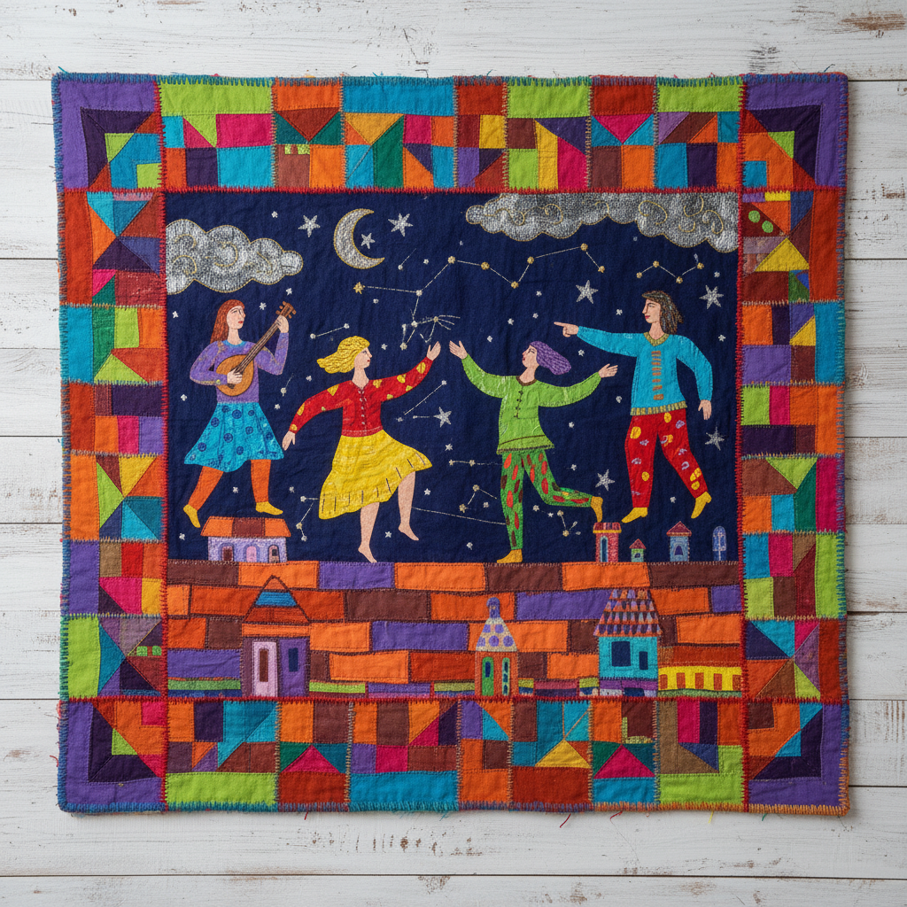

# Faith Ringgold 费丝·林戈尔德

> **时期：** 1930–2024  
> **关键词：** 故事被子、叙事织物、非裔美国女性主义、民间艺术与高雅艺术融合

## 概述

Faith Ringgold 是美国艺术家，以将绘画与缝制被子结合的"故事被子"（story quilts）闻名。她的作品将非裔美国女性的故事编织进传统手工艺的形式中，挑战了"高雅艺术"与"民间工艺"的等级划分，同时讲述了种族、性别和阶级交叉的复杂叙事。

## 风格特征

- **被子边框**：绘画被缝制的织物边框包围，如同传统被子的拼布结构
- **叙事文字**：画面边缘常包含手写的故事文字，如同图文并茂的书页
- **平面色彩**：人物和场景以鲜明的平面色彩呈现，具有民间艺术的直接性
- **社区场景**：描绘哈莱姆的屋顶派对、教堂聚会和家庭生活
- **女性视角**：故事始终以女性为中心，讲述她们的梦想、挣扎和胜利

## 代表作品

- *Tar Beach*（1988）
- *Who's Afraid of Aunt Jemima?*（1983）
- *The Sunflower Quilting Bee at Arles*（1991）
- *American People Series*（1963–67）

## 历史意义

Ringgold 打破了绘画、雕塑和工艺之间的等级壁垒，她的故事被子证明了"女性手工艺"可以承载最严肃的政治和历史内容。她的儿童绘本《Tar Beach》也将她的视觉语言带给了更广泛的公众。

## 概念图

