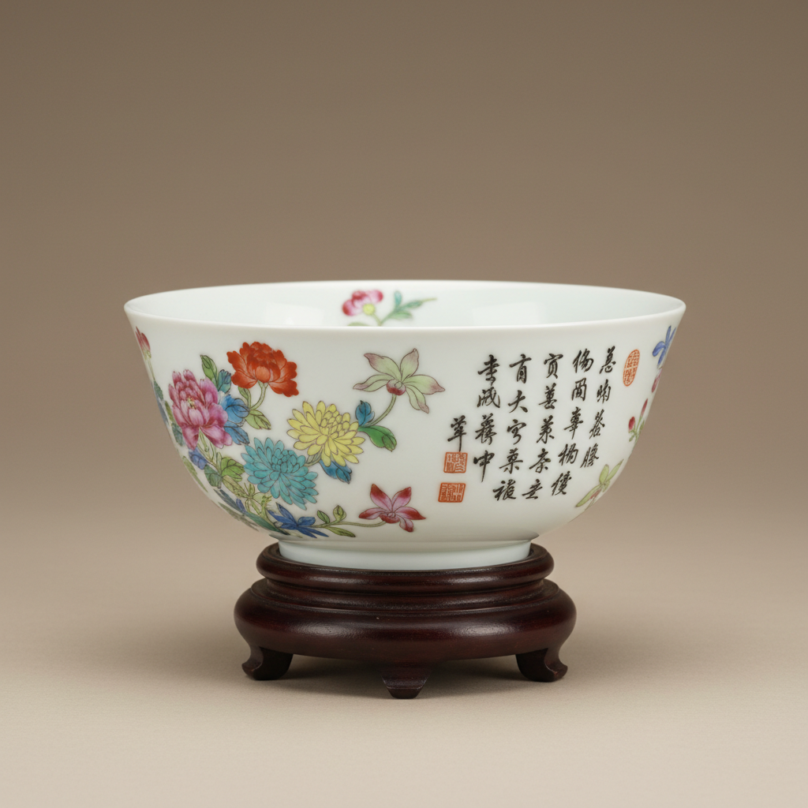

# Falangcai Art 珐琅彩艺术

> "Falangcai is the emperor's private palette — painted enamel on porcelain created exclusively within the Forbidden City's imperial workshops under the direct supervision of Kangxi, Yongzheng, and Qianlong emperors, the rarest and most refined of all Chinese ceramic decorations, where Western enamel technology meets Chinese poetic sensibility to produce objects of transcendent beauty meant for imperial eyes alone." — Unknown

## 概述

珐琅彩艺术（Falangcai Art）是中国清代宫廷独有的一种极其珍贵的陶瓷彩绘艺术。珐琅彩（又称"瓷胎画珐琅"）是在景德镇烧制的素白瓷胎上，使用进口或宫廷自制的珐琅彩料，在紫禁城内的造办处由宫廷画师绑定绘制的御用瓷器。珐琅彩是中国陶瓷中最稀有、最精美的品类——其生产完全在皇帝的直接监督下进行，产量极少，每一件都是绝世珍品。

珐琅彩艺术的核心要素包括：1）宫廷专属——仅在紫禁城内制作；2）珐琅彩料——使用进口珐琅彩料；3）皇帝监制——皇帝直接参与监制；4）宫廷画师——由顶级宫廷画师绑定绘制；5）极度稀有——产量极少极为珍贵；6）诗书画印——融合诗书画印四绝；7）中西融合——融合西方珐琅技法。

## 核心特征

| 特征 | 描述 |
|------|------|
| 宫廷专属 | 仅在紫禁城内制作 |
| 珐琅彩料 | 使用进口珐琅彩料 |
| 皇帝监制 | 皇帝直接参与监制 |
| 宫廷画师 | 顶级宫廷画师绑定绘制 |
| 极度稀有 | 产量极少极为珍贵 |
| 诗书画印 | 融合诗书画印四绝 |

## 视觉特征

- **色彩纯净**：极其纯净的色彩
- **画工精绝**：超凡的绑定绘画技艺
- **诗文题款**：配有诗文和印章
- **留白优雅**：大面积的优雅留白
- **西洋技法**：透视和明暗的运用
- **小巧精致**：多为小件精品

## 代表作品

| 作品 | 艺术家/文化 | 年代 | 意义 |
|------|-------------|------|------|
| *雍正珐琅彩题诗花卉碗* | 宫廷造办处 | 雍正 | 珐琅彩巅峰 |
| *康熙珐琅彩花卉碗* | 宫廷造办处 | 康熙 | 早期珐琅彩 |
| *乾隆珐琅彩花石锦鸡图瓶* | 宫廷造办处 | 乾隆 | 乾隆精品 |
| *雍正珐琅彩梅花碗* | 宫廷造办处 | 雍正 | 梅花题材 |
| *乾隆珐琅彩芦雁图杯* | 宫廷造办处 | 乾隆 | 花鸟题材 |

## 历史时间线

| 时期 | 事件 |
|------|------|
| 康熙 | 珐琅彩的创始 |
| 雍正 | 珐琅彩的巅峰 |
| 乾隆 | 珐琅彩的繁复化 |
| 嘉庆以后 | 珐琅彩的衰落 |
| 当代 | 珐琅彩成为天价收藏品 |

## 中国语境

珐琅彩是中国陶瓷艺术的最高成就，也是世界陶瓷史上最珍贵的品类之一。珐琅彩的诞生源于康熙帝对西方珐琅工艺的浓厚兴趣——他命令造办处将铜胎画珐琅的技法移植到瓷器上，由此创造了瓷胎画珐琅。雍正时期的珐琅彩被公认为历史最高水平——雍正帝亲自参与设计和审核，要求画师在瓷器上达到纸绢画的水平。珐琅彩的存世量极少——据统计全世界仅存约400余件，主要收藏在北京故宫和台北故宫。珐琅彩在拍卖市场上屡创天价——2006年一件雍正珐琅彩碗以1.51亿港元成交。珐琅彩代表了中国古代"集全国之力为一器"的极致工艺追求——从景德镇的素胎到紫禁城的彩绘，每一件珐琅彩都凝聚了帝国最顶级的资源和技艺。

## AI生成概念图

## 与其他风格的关系

- **Famille Rose** → 粉彩
- **Painted Enamel** → 画珐琅
- **Imperial Porcelain** → 御窑瓷器
- **Doucai** → 斗彩
- **Court Art** → 宫廷艺术
- **Qing Dynasty** → 清代艺术

---

*浮光艺志 | Chronicle of Artistry*
