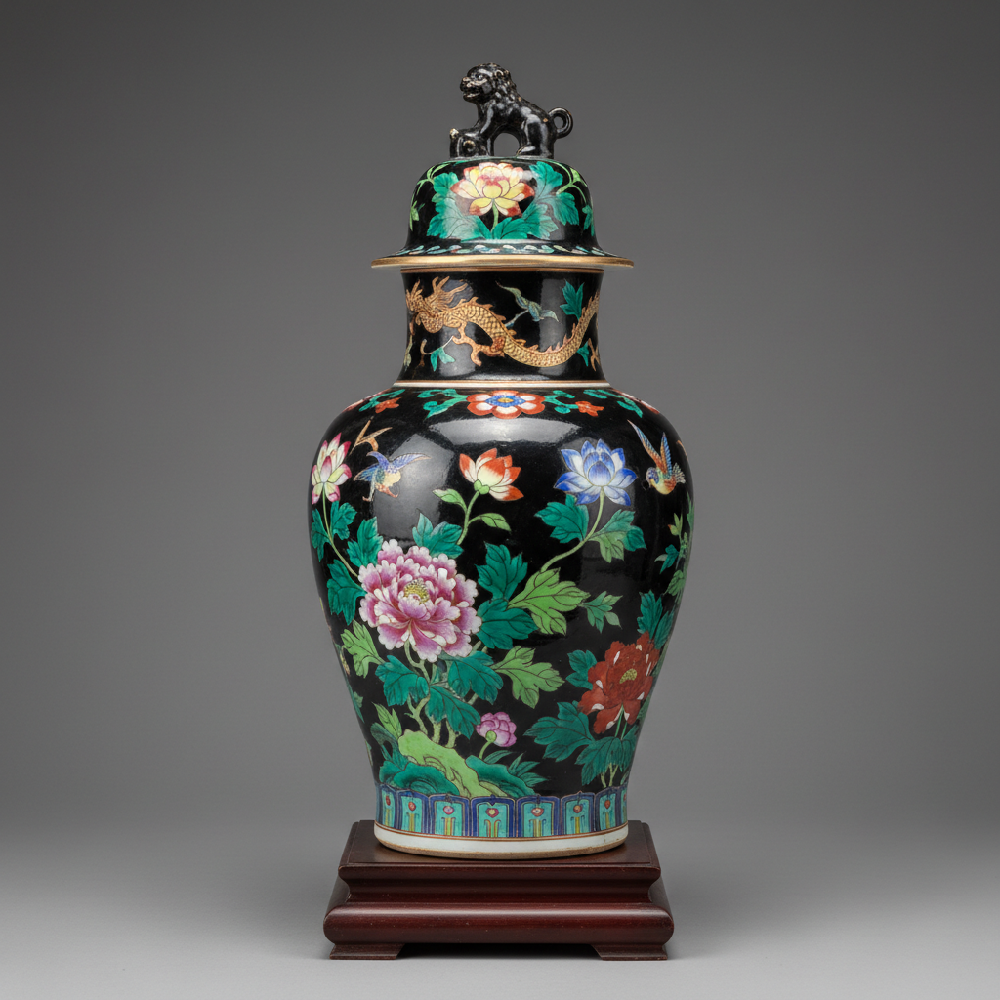

# Famille Noire Art 墨地彩瓷艺术

> "Famille noire is night made porcelain — a dramatic black ground achieved by washing the surface with manganese-black enamel before painting flowers and birds in vivid famille verte colors, creating the effect of a midnight garden where blossoms glow against darkness, the rarest and most theatrical of all Chinese export color families." — Unknown

## 概述

墨地彩瓷艺术（Famille Noire Art）是中国清代康熙时期（1662-1722年）发展的一种以黑色为底色的釉上彩瓷装饰艺术。Famille noire（法语"黑色家族"）以其戏剧性的黑色底色著称——在黑色底色上绘制鲜艳的花鸟图案，形成强烈的视觉对比。墨地彩瓷是所有"famille"系列中最稀有的品类——其生产数量远少于famille verte和famille rose。

墨地彩瓷艺术的核心要素包括：1）黑色底色——戏剧性的黑色背景；2）锰黑釉——锰氧化物形成的黑色；3）彩色装饰——鲜艳的花鸟装饰；4）强烈对比——黑底与彩色的对比；5）稀有珍贵——产量极少极为珍贵；6）康熙时期——主要产于康熙时期；7）视觉冲击——强烈的视觉冲击力。

## 核心特征

| 特征 | 描述 |
|------|------|
| 黑色底色 | 戏剧性黑色背景 |
| 锰黑釉 | 锰氧化物形成黑色 |
| 彩色装饰 | 鲜艳花鸟装饰 |
| 强烈对比 | 黑底与彩色对比 |
| 稀有珍贵 | 产量极少珍贵 |
| 视觉冲击 | 强烈视觉冲击力 |

## 视觉特征

- **纯黑底色**：深沉的纯黑色背景
- **花卉绽放**：黑底上绽放的花卉
- **色彩鲜艳**：在黑底上格外鲜艳
- **绿色主调**：花叶以绿色为主
- **金色点缀**：金彩的点缀装饰
- **戏剧效果**：如舞台灯光般的效果

## 代表作品

| 作品 | 艺术家/文化 | 年代 | 意义 |
|------|-------------|------|------|
| *康熙墨地花鸟瓶* | 景德镇 | 康熙 | 经典墨地彩 |
| *墨地五彩花卉罐* | 景德镇 | 康熙 | 花卉题材 |
| *墨地凤尾尊* | 景德镇 | 康熙 | 大型器物 |
| *墨地花鸟盘* | 景德镇 | 康熙 | 盘类精品 |
| *19世纪仿品* | 景德镇 | 19世纪 | 后期仿制 |

## 历史时间线

| 时期 | 事件 |
|------|------|
| 康熙早期 | 墨地彩瓷的出现 |
| 康熙中期 | 墨地彩瓷的成熟 |
| 康熙晚期 | 生产的减少 |
| 19世纪 | 大量仿制品出现 |
| 当代 | 成为顶级收藏品 |

## 中国语境

墨地彩瓷是中国陶瓷中最具戏剧性的装饰风格之一。其黑色底色的制作工艺较为复杂——需要先在白瓷上涂覆一层锰黑色釉料，再在其上绘制彩色图案，最后入窑低温烧成。由于工艺难度大、成品率低，墨地彩瓷的产量一直很少——这也使其成为收藏市场上最珍贵的品类之一。值得注意的是，19世纪出现了大量墨地彩瓷的仿品——一些商人将康熙时期的素白瓷器后加黑底和彩绘，冒充原装康熙墨地彩瓷。这些仿品虽然也有一定的工艺水平，但与真正的康熙原作在品质上有明显差距。墨地彩瓷在西方收藏界享有极高的声誉——一件精美的康熙墨地花鸟瓶在拍卖会上可以拍出数百万美元的天价。

## AI生成概念图

## 与其他风格的关系

- **Famille Verte** → 五彩
- **Famille Rose** → 粉彩
- **Kangxi Porcelain** → 康熙瓷器
- **Mirror Black** → 乌金釉
- **Overglaze Enamel** → 釉上彩
- **Chinese Export** → 中国外销瓷

---

*浮光艺志 | Chronicle of Artistry*
