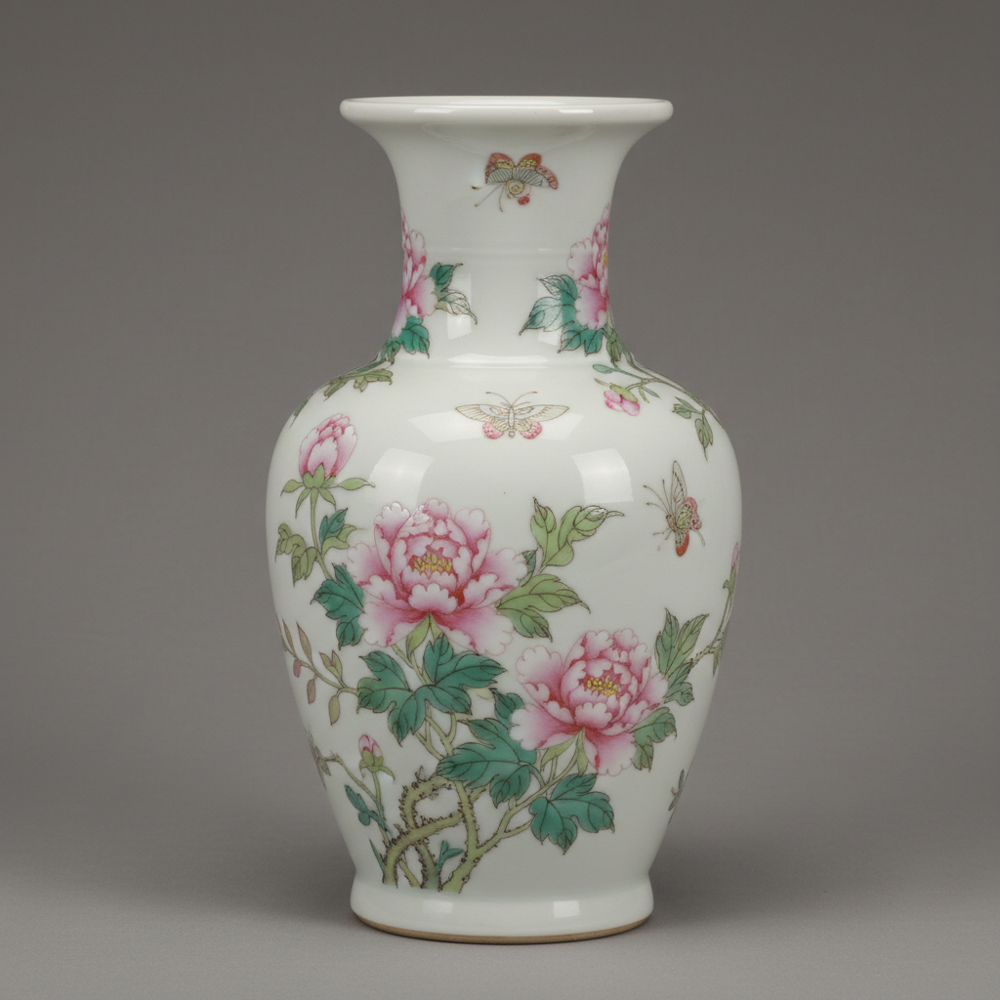

# Famille Rose Art 粉彩艺术

> "Famille rose is porcelain blushing — an opaque pink enamel introduced to China from Europe in the early eighteenth century that revolutionized ceramic decoration, allowing painters to shade and blend colors with the subtlety of watercolor on paper, transforming porcelain surfaces into canvases where flowers bloom with photographic delicacy and figures glow with lifelike warmth." — Unknown

## 概述

粉彩艺术（Famille Rose Art）是中国清代（18世纪起）发展的一种釉上彩瓷装饰艺术，以其标志性的粉红色调和柔和的色彩渐变效果著称。粉彩（法语"famille rose"意为"粉红家族"）因大量使用胭脂红（金红）颜料而得名——这种颜料以金为着色剂，能产生从浅粉到深玫瑰红的丰富色调。粉彩的革命性在于引入了"玻璃白"（砷酸铅）作为打底——使颜料可以像水彩一样进行渐变和晕染。

粉彩艺术的核心要素包括：1）胭脂红——标志性的粉红色调；2）玻璃白——用于打底和渐变；3）色彩渐变——柔和的色彩过渡；4）工笔细腻——精细的工笔画法；5）题材丰富——花鸟、人物、山水等；6）宫廷品质——雍正乾隆时期的巅峰；7）中西融合——融合了西方珐琅技法。

## 核心特征

| 特征 | 描述 |
|------|------|
| 胭脂红 | 标志性粉红色调 |
| 玻璃白 | 用于打底和渐变 |
| 色彩渐变 | 柔和色彩过渡 |
| 工笔细腻 | 精细工笔画法 |
| 题材丰富 | 花鸟人物山水 |
| 宫廷品质 | 雍正乾隆巅峰 |

## 视觉特征

- **粉红色调**：标志性的柔和粉红
- **渐变效果**：色彩的柔和渐变
- **细腻笔触**：精细的工笔画法
- **色彩丰富**：多种颜色的和谐搭配
- **留白构图**：适当的留白
- **立体感**：色彩渐变带来的立体感

## 代表作品

| 作品 | 艺术家/文化 | 年代 | 意义 |
|------|-------------|------|------|
| *雍正粉彩过枝花卉盘* | 景德镇御窑 | 雍正 | 粉彩的巅峰 |
| *乾隆粉彩百花不落地* | 景德镇御窑 | 乾隆 | 极致的装饰 |
| *粉彩九桃天球瓶* | 景德镇御窑 | 雍正 | 经典器形 |
| *粉彩蝠桃纹橄榄瓶* | 景德镇御窑 | 雍正 | 吉祥题材 |
| *粉彩花鸟纹碗* | 景德镇 | 清代 | 日用精品 |

## 历史时间线

| 时期 | 事件 |
|------|------|
| 康熙晚期 | 粉彩技法的引入 |
| 雍正 | 粉彩艺术的巅峰 |
| 乾隆 | 粉彩的繁复化发展 |
| 晚清 | 粉彩的民间普及 |
| 当代 | 粉彩的传承与创新 |

## 中国语境

粉彩是中国陶瓷彩绘艺术的最高成就之一。粉彩的出现得益于康熙时期中西文化交流——欧洲传教士将珐琅彩料和技法带入中国宫廷，中国工匠在此基础上发展出了独特的粉彩技法。雍正时期的粉彩被公认为历史最高水平——其构图疏朗、色彩淡雅、笔触精细，达到了"画必有意、意必吉祥"的境界。乾隆时期的粉彩则走向繁复华丽——"百花不落地"等满工风格体现了乾隆帝的审美偏好。粉彩在清代中后期逐渐从宫廷走向民间——成为景德镇最重要的彩瓷品类之一。今天，粉彩仍是景德镇陶瓷的代表性品类——当代粉彩艺术家在传承传统技法的同时，也在探索新的表现形式。

## AI生成概念图

## 与其他风格的关系

- **Famille Verte** → 五彩/素三彩
- **Falangcai** → 珐琅彩
- **Canton Ware** → 广彩
- **Doucai** → 斗彩
- **Overglaze Enamel** → 釉上彩
- **Qing Imperial** → 清代御窑

---

*浮光艺志 | Chronicle of Artistry*
