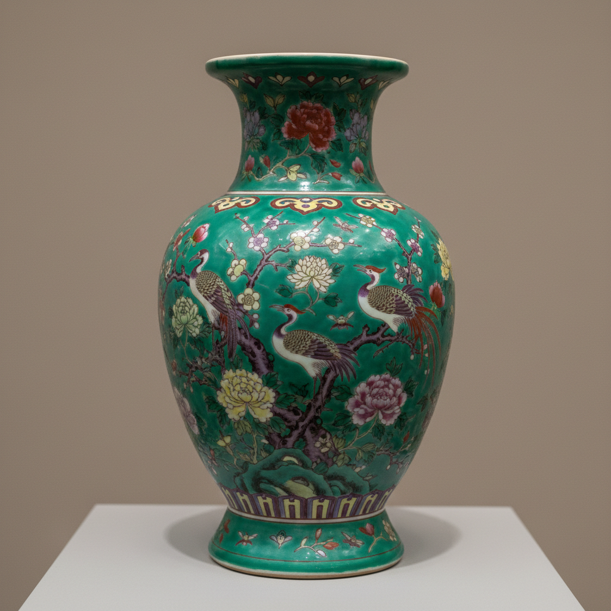

# Famille Verte Art 五彩/素三彩艺术

> "Famille verte is porcelain in full bloom — a palette of translucent green, iron red, aubergine purple, yellow, and blue enamels applied over the glaze with bold brushwork, the dominant decorative style of Kangxi reign porcelain, where every surface becomes a stage for warriors, scholars, gardens, and mythical beasts rendered in jewel-bright colors against pure white." — Unknown

## 概述

五彩/素三彩艺术（Famille Verte Art）是中国清代康熙时期（1662-1722年）达到巅峰的一种釉上彩瓷装饰艺术。Famille verte（法语"绿色家族"）因以绿色为主调而得名——其色彩包括翠绿、铁红、茄紫、黄色和蓝色等透明釉上彩料。五彩的特点是色彩鲜明、对比强烈、笔触奔放——与后来粉彩的柔和渐变形成鲜明对比。

五彩/素三彩艺术的核心要素包括：1）绿色主调——以翠绿色为主要色调；2）透明彩料——透明的釉上彩料；3）色彩鲜明——色彩对比强烈；4）笔触奔放——大胆奔放的笔触；5）康熙巅峰——康熙时期的最高成就；6）题材广泛——人物、花鸟、山水等；7）明代传承——从明代五彩发展而来。

## 核心特征

| 特征 | 描述 |
|------|------|
| 绿色主调 | 以翠绿色为主调 |
| 透明彩料 | 透明釉上彩料 |
| 色彩鲜明 | 色彩对比强烈 |
| 笔触奔放 | 大胆奔放笔触 |
| 康熙巅峰 | 康熙时期最高成就 |
| 题材广泛 | 人物花鸟山水 |

## 视觉特征

- **翠绿为主**：鲜明的翠绿色调
- **铁红点缀**：铁红色的点缀
- **色彩透明**：透明的彩料质感
- **对比强烈**：色彩对比鲜明
- **笔触有力**：有力的线条和笔触
- **满工构图**：密集的装饰构图

## 代表作品

| 作品 | 艺术家/文化 | 年代 | 意义 |
|------|-------------|------|------|
| *康熙五彩人物棒槌瓶* | 景德镇 | 康熙 | 经典器形 |
| *康熙五彩花鸟凤尾尊* | 景德镇 | 康熙 | 花鸟题材 |
| *康熙素三彩* | 景德镇 | 康熙 | 素三彩精品 |
| *万历五彩* | 景德镇 | 万历 | 明代五彩 |
| *康熙五彩战争图* | 景德镇 | 康熙 | 历史题材 |

## 历史时间线

| 时期 | 事件 |
|------|------|
| 明代成化 | 五彩技法的成熟 |
| 明代万历 | 万历五彩的繁荣 |
| 清代康熙 | 五彩艺术的巅峰 |
| 雍正以后 | 粉彩逐渐取代五彩 |
| 当代 | 五彩的收藏和研究 |

## 中国语境

五彩是中国陶瓷彩绘的重要传统之一。五彩的历史可追溯到明代成化时期——但真正达到巅峰是在清代康熙年间。康熙五彩以其色彩鲜明、画工精细、题材丰富而著称——特别是人物故事题材的五彩瓷器，如同一幅幅精美的中国画。康熙时期还发展出了"素三彩"——一种不使用红色的三彩装饰，以黄、绿、紫为主色调，风格更加素雅。五彩与粉彩的区别在于：五彩使用透明彩料，色彩鲜明对比强烈；粉彩使用不透明的玻璃白打底，色彩柔和有渐变效果。雍正以后，粉彩逐渐取代了五彩的主导地位——但五彩的艺术价值从未被否定，康熙五彩至今仍是收藏市场上的珍品。

## AI生成概念图

## 与其他风格的关系

- **Famille Rose** → 粉彩
- **Wucai** → 五彩
- **Doucai** → 斗彩
- **Kangxi Porcelain** → 康熙瓷器
- **Overglaze Enamel** → 釉上彩
- **Ming Dynasty Ceramics** → 明代陶瓷

---

*浮光艺志 | Chronicle of Artistry*
