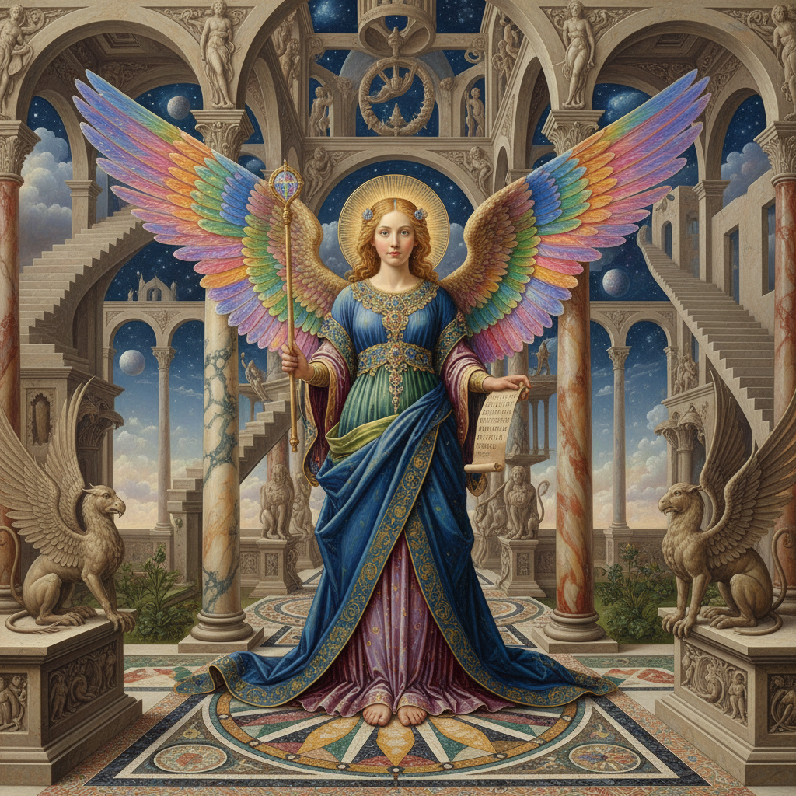

# Fantastic Realism 幻想现实主义

> **时期：** 1946年–至今  
> **关键词：** 维也纳、精密技法、梦幻主题、超自然、古典与幻想

## 概述

Fantastic Realism（幻想现实主义）是1946年在维也纳美术学院兴起的绘画流派，将文艺复兴大师的精密技法用于描绘梦境、神话和超自然主题。恩斯特·富克斯的天使、鲁道夫·豪斯纳的形而上空间——他们用照片般精确的笔触画出不可能存在的世界，让幻想获得了现实的质感和重量。

## 风格特征

- **精密技法**：古典大师级的写实功底
- **幻想主题**：神话、梦境、超自然场景
- **象征主义**：丰富的隐喻和符号系统
- **珠宝色彩**：宝石般的饱和色调
- **细节丰富**：每个角落都充满发现

## 代表人物与作品

- 恩斯特·富克斯 天使与神话
- 鲁道夫·豪斯纳 形而上风景
- 阿里克·布劳尔 自然幻想
- 沃尔夫冈·胡特尔 建筑幻境

## 概念图

