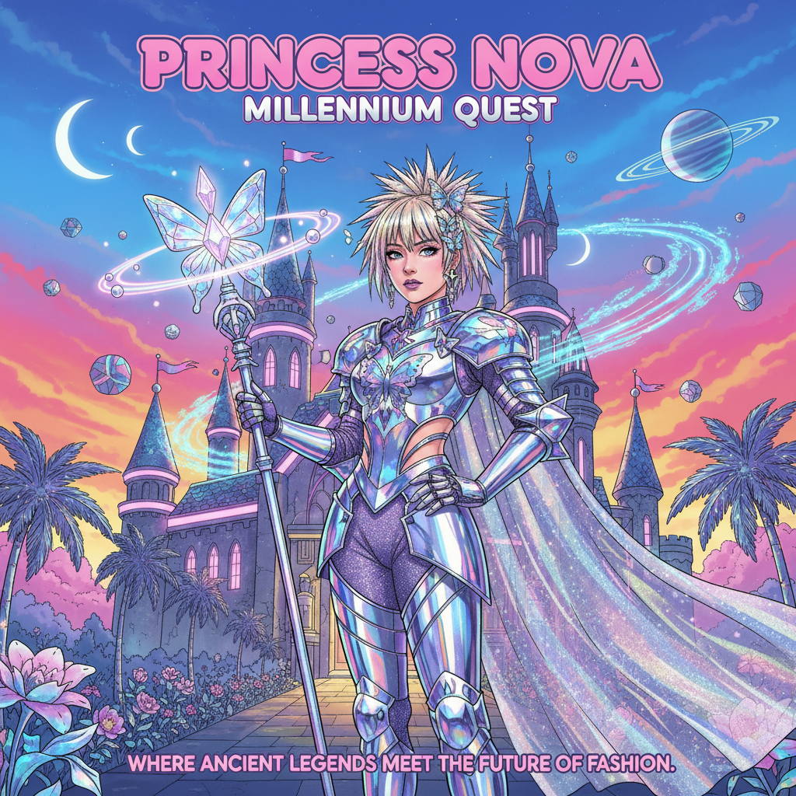
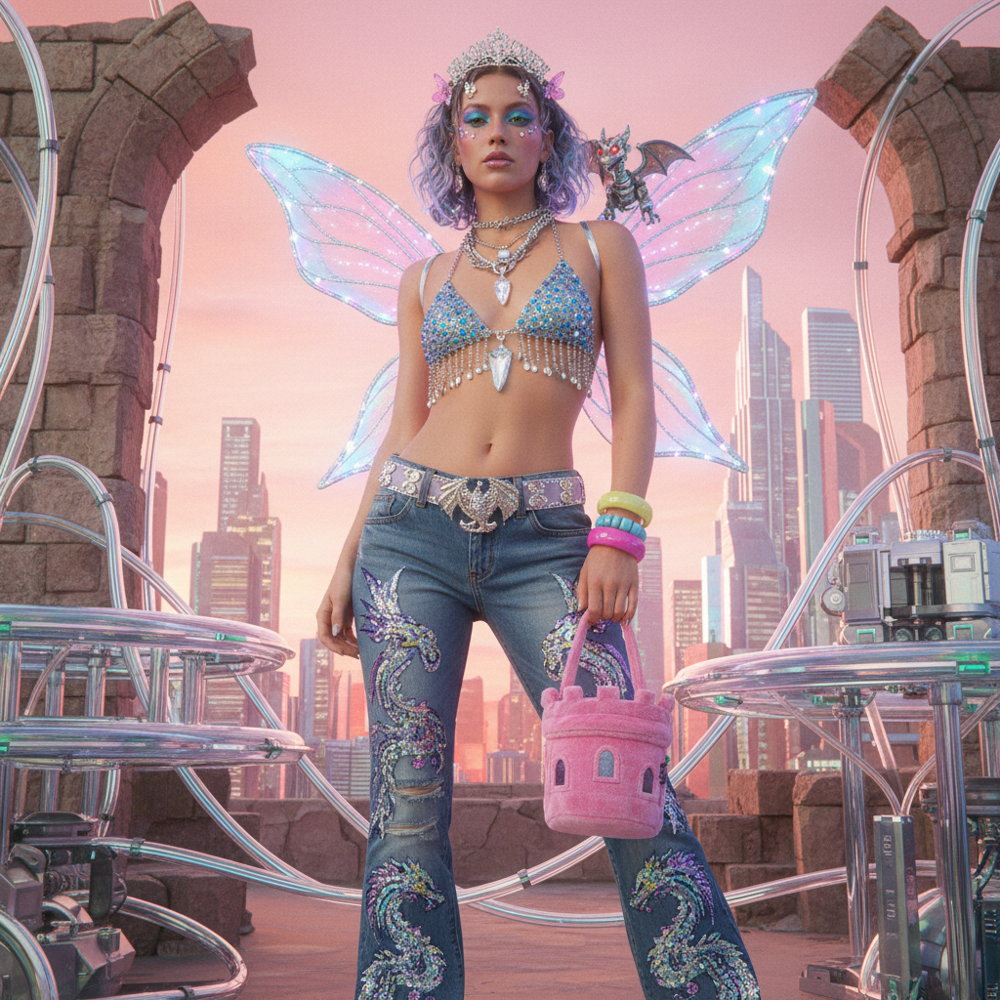

# FantasY2K | 奇幻千禧风

## 概述

- **时间跨度**：2000 – 2010（回潮：2020s）
- **发源地**：好莱坞电影、电视剧、高定时装秀
- **核心理念**：将中世纪奇幻元素用千禧年时尚重新诠释——历史不准确但视觉冲击力极强
- **别名**：Fantasy + Y2K 合成词

## 历史背景

FantasY2K 是"Fantasy"与"Y2K"的合成词，描述了2000年代将中世纪奇幻美学与当代时尚趋势混搭的视觉风格。这种风格在《圣战骑士》(A Knight's Tale, 2001)、《乖乖女是大明星》(Ella Enchanted, 2004) 等影视作品中表现得最为明显——角色穿着带有明显现代剪裁和发型的"中世纪"服装。

高定时装界也频繁出现这种混搭：Alexander McQueen 的中世纪盔甲礼服、John Galliano 为 Dior 设计的哥特公主系列，都带有强烈的 FantasY2K 气质。

### 为什么会出现？

2000年代初，《指环王》三部曲（2001-2003）和《哈利·波特》系列的全球成功，让奇幻题材从亚文化走向主流。与此同时，千禧年的时尚界正处于"什么都敢混搭"的巅峰——设计师们自然而然地将中世纪元素与当代剪裁结合，创造出一种既不属于过去也不属于未来的"时间错位"美学。

这种风格的核心矛盾——**历史不准确**——恰恰是它的魅力所在。它从不假装自己是严肃的历史重现，而是用一种自觉的kitsch态度，把骑士盔甲做成PVC材质，把公主裙配上现代高跟鞋。

## 视觉特征

### 核心元素
- **中世纪服饰的现代化**：盔甲、斗篷、束腰，但用PVC、金属色面料制作
- **奇幻生物与符号**：龙、独角兽、精灵耳、翅膀，但风格化为千禧审美
- **anachronism（时代错置）**：现代发型、妆容搭配"古代"服装
- **华丽与kitsch并存**：自觉的不严肃感，带有讽刺意味
- **蝴蝶与翅膀**：从精灵翅膀到蝴蝶发夹，飞行元素无处不在
- **宝石与水晶**：镶嵌在盔甲、王冠、腰带上的oversized宝石

### 色彩
- 金色、银色、宝石色（红宝石红、翡翠绿、蓝宝石蓝）
- 搭配Y2K标志性的粉色、紫色
- 金属光泽与丝绒质感
- 虹彩（iridescent）面料——像龙鳞一样变色

### 与相关风格的区别

| 风格 | 关键差异 |
|------|----------|
| FantasY2K | 自觉的kitsch，混搭是美学选择 |
| 中世纪复兴 | 追求历史准确性 |
| Dark Fantasy | 更暗、更严肃、更哥特 |
| Fairycore | 更柔和、更田园、更自然 |

## 代表案例

| 领域 | 代表 | 说明 |
|------|------|------|
| 电影 | A Knight's Tale (2001) | 中世纪骑士+摇滚乐+Nike赞助感 |
| 电影 | Ella Enchanted (2004) | 童话+购物中心美学 |
| 电影 | The Lord of the Rings (2001-03) | 精灵时装影响了整个时尚界 |
| 电视 | Xena: Warrior Princess | 皮革盔甲+90s发型 |
| 电视 | Charmed (1998-2006) | 女巫+千禧时尚 |
| 时装 | Alexander McQueen SS99 | 机械臂喷漆白裙 |
| 时装 | John Galliano for Dior | 哥特公主高定 |
| 时装 | Roberto Cavalli 2000s | 动物纹+中世纪剪裁 |
| 游戏 | Final Fantasy X (2001) | 奇幻+未来科技混搭 |
| 游戏 | Kingdom Hearts (2002) | 迪士尼童话+日式RPG |
| 音乐 | Enya - May It Be (2001) | 凯尔特+新世纪+电影配乐 |

## 文化内核

FantasY2K 的核心是一种**自觉的不严肃**——它知道自己在"犯错"（历史不准确），但这种错误本身就是美学选择。它代表了千禧年对"酷"的定义：什么都可以混搭，只要看起来够炫。

更深层地看，FantasY2K 反映了千禧年一代对"逃离现实"的渴望。在互联网刚刚普及、MMORPG（如《魔兽世界》）即将爆发的时代，人们对奇幻世界的向往达到了前所未有的高度。但他们不想完全离开现代——他们想把两个世界叠在一起。

### 2020s 回潮

近年来，FantasY2K 随着整体Y2K复兴而回归。TikTok上的"fantasy fashion"标签、《龙之家族》(2022) 的热播、以及Loewe等品牌的中世纪元素系列，都在重新激活这种美学。不同的是，当代版本更加自觉地拥抱了"cosplay日常化"的态度。

## 图片画廊

| | |
|:---:|:---:|
|  | |
| *奇幻千禧风 · 铬甲公主与蝴蝶* | |

## 延伸阅读

- [FantasY2K | Aesthetics Wiki](https://aesthetics.fandom.com/wiki/FantasY2K)
- [Y2K Aesthetics Wiki 总览](https://aesthetics.fandom.com/wiki/Y2K)

---

[← Bloghouse](bloghouse.md) | [→ Coquette Y2K](coquette-y2k.md) | [↑ 返回目录](README.md)
