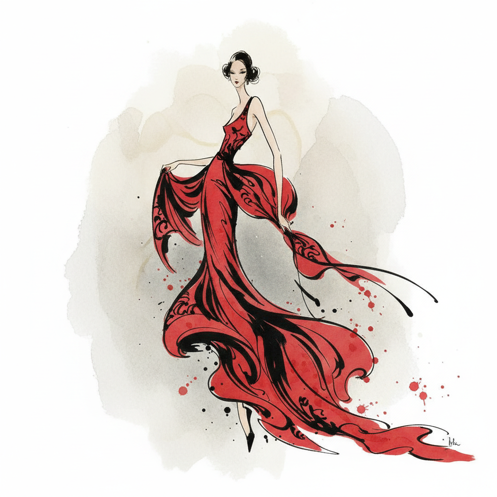

# Fashion Illustration 时装插画



> **"一笔勾勒出面料的垂坠、身体的姿态——比照片更能传达服装的灵魂。"**

## 概述

| 维度 | 描述 |
|------|------|
| 时期 | 1900s–至今 |
| 别名 | Fashion Illustration, Fashion Drawing, 时装画 |
| 核心色彩 | 无固定——服务于时装系列的色彩 |
| 关键元素 | 拉长人体比例(9-10头身)、面料质感表现、姿态动感、风格化 |
| 代表人物 | René Gruau, Antonio Lopez, David Downton, Megan Hess |
| 关联风格 | Editorial Illustration, Art Deco, Minimalism, Haute Couture |

---

## 历史脉络

| 年份 | 事件 |
|------|------|
| 1900s | Paul Poiret 时代——时装插画取代时装版画 |
| 1920s | Art Deco 时装插画黄金时代——Erté |
| 1950s | René Gruau 为 Dior 创作——时装插画巅峰 |
| 1960s | Antonio Lopez——打破传统的时装插画 |
| 1990s | 摄影取代插画——时装插画"死亡" |
| 2010s | 时装插画复兴——Instagram+独立插画师 |
| 2020s | 数字时装插画+AI辅助+NFT时装艺术 |

### 核心哲学

时装插画的精神是**"不是画衣服——是画穿衣服的感觉"**：
- 夸张 = 本质（"9头身不是不准确——是更准确地表达时装的精神"）
- 省略 = 力量（"不画的部分比画的部分更重要"）
- 动态 = 生命（"衣服是死的——穿上身体才活"）
- 风格 = 签名（"每个时装插画家都有自己的'人体'"）
- "时装插画比照片更'真实'——因为它画的是感觉而不是事实"

---

## 视觉语法

### 色彩系统

```
无固定规则——服务于时装

常见策略：
  黑白 — 经典、优雅
  限定色 — 突出面料色彩
  水彩晕染 — 柔和、梦幻
  马克笔 — 鲜明、快速

经典组合：
  黑+红 — Gruau经典
  全黑 — 剪影、轮廓
  肤色+服装色 — 突出设计
  水彩透明 — 面料质感

质感：
  水彩 — 面料垂坠
  墨线 — 轮廓、结构
  马克笔 — 快速、鲜明
  数字 — 精确、可编辑
```

### 标志性元素

| 类别 | 元素 |
|------|------|
| 人体 | 拉长比例、夸张姿态、风格化面部 |
| 面料 | 垂坠、褶皱、透明、光泽 |
| 线条 | 流畅、自信、一笔到位 |
| 构图 | 全身/半身、动态姿态、留白 |
| 细节 | 配饰、鞋、包、发型 |
| 态度 | 优雅、自信、时尚、风格化 |

---

## 与千禧怀旧的关系

### Instagram时代的复兴
- 时装插画在社交媒体上的爆发
- Megan Hess, Hayden Williams——百万粉丝时装插画师
- "时装插画从'被摄影取代'到'比摄影更受欢迎'"
- 品牌重新拥抱时装插画——Dior, Chanel

### 与数字时装的交叉
- 数字时装+时装插画 = 虚拟时尚的视觉语言
- NFT时装艺术
- "在元宇宙里——时装插画就是时装本身"

---

## 中国语境

- 中国时装插画师的国际化
- 中国时尚品牌对插画的需求
- 中国传统服饰(汉服)的时装插画
- 中国时尚媒体中的插画应用

---

## 设计应用

| 场景 | 应用方式 |
|------|----------|
| 时尚 | 品牌视觉+秀场邀请+杂志+社交 |
| 品牌 | 奢侈品+美妆+香水+生活方式 |
| 出版 | 时尚杂志+书籍+画册 |
| 数字 | NFT+虚拟时装+社交媒体+动画 |

---

## 相关风格

← [Art Deco 装饰艺术](art-deco.md) | [Editorial Illustration 编辑插画](editorial-illustration.md) →

↑ [返回千禧怀旧目录](README.md) | [返回总目录](../README.md)
