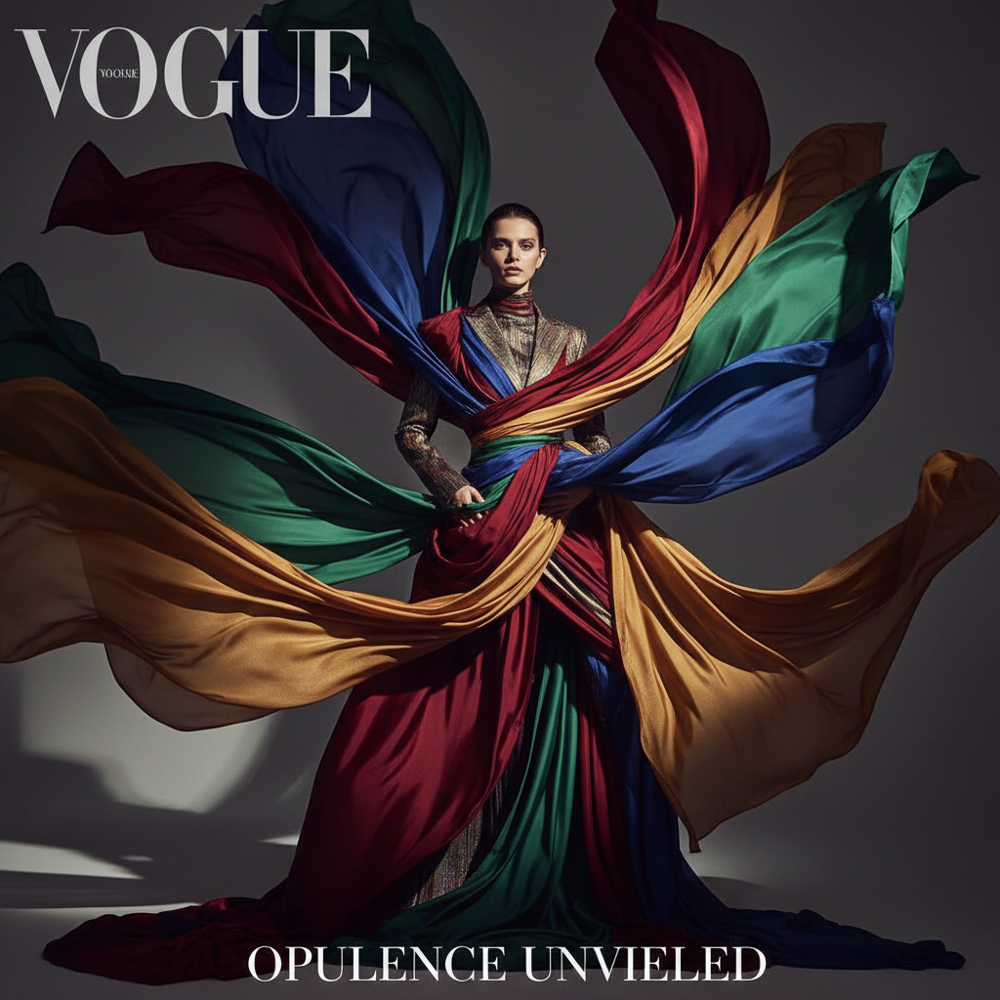

# Fashion Photography 时尚摄影

> **时期：** 1910年代–至今  
> **关键词：** 造型叙事、光影塑形、杂志美学、身体政治、视觉奢华

## 概述

Fashion Photography（时尚摄影）是将服装、身体和视觉叙事融为一体的商业艺术形式。从爱德华·斯泰肯为《Vogue》拍摄的早期时装照到当代的概念性时尚大片，时尚摄影不仅展示服装，更创造欲望、定义美的标准、构建品牌神话——它是商业与艺术之间最紧密的交汇点。

## 风格特征

- **光影塑形**：精密的布光雕塑人体和面料
- **造型叙事**：通过场景和姿态讲述故事
- **色彩控制**：精确的色调营造品牌氛围
- **后期精修**：皮肤、色彩、构图的完美化
- **跨界融合**：与艺术、电影、建筑的对话

## 代表人物与作品

- 理查德·阿维顿（动态时尚摄影）
- 赫尔穆特·牛顿（挑衅性时尚）
- 蒂姆·沃克（梦幻叙事）
- 尼克·奈特（数字实验时尚）

## 概念图

