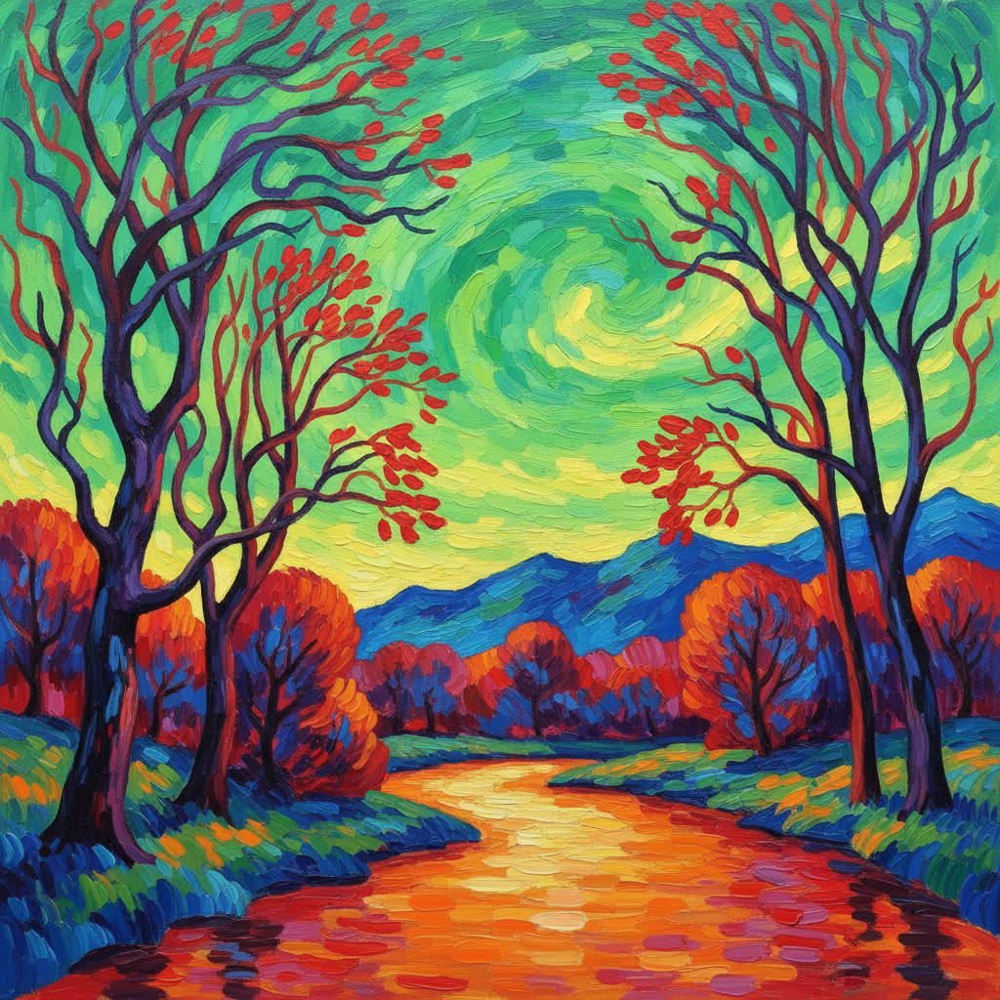

# Fauvism Painting 野兽派绘画

> **时期：** 1904年–1908年  
> **关键词：** 纯色爆发、反自然色彩、马蒂斯、情感直觉、解放色彩

## 概述

Fauvism（野兽派）是20世纪初最短暂却最具爆发力的绘画运动——1905年巴黎秋季沙龙上，马蒂斯、德兰和弗拉芒克的画作因其"野兽般"的大胆用色而得名。他们将色彩从描述现实的义务中彻底解放：树可以是红色的，脸可以是绿色的，天空可以是橙色的——因为色彩的唯一职责是表达情感。

## 风格特征

- **纯色直涂**：不混合、不渐变的饱和色块
- **反自然色彩**：情感驱动而非视觉忠实
- **简化形式**：去除细节，保留本质
- **平面化**：减少透视和立体感
- **笔触可见**：粗犷有力的绘画痕迹

## 代表人物与作品

- 亨利·马蒂斯《戴帽子的女人》
- 安德烈·德兰 伦敦风景
- 莫里斯·德·弗拉芒克 乡村风景
- 劳尔·杜飞 海滨场景

## 概念图

