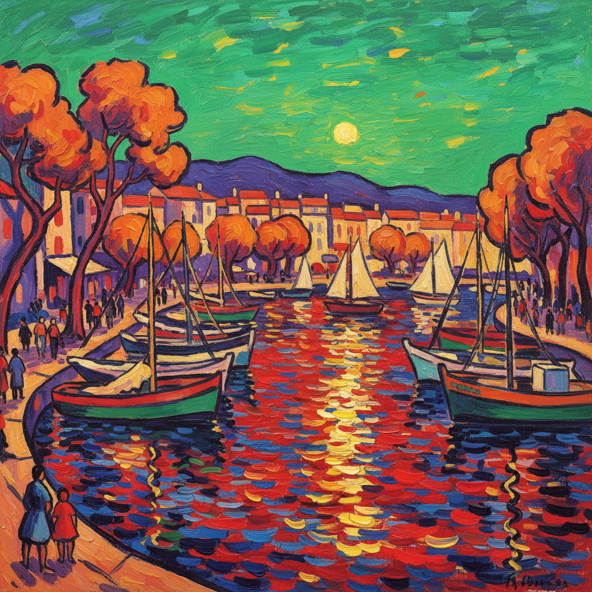

# Fauvism 野兽派

> "Fauve!" (Wild beast!) — Louis Vauxcelles, 1905

## 概述

野兽派（Fauvism，法语 fauve"野兽"之意）是1904–1908年活跃于巴黎的短暂但影响深远的绘画运动。1905年秋季沙龙上，评论家路易·沃克塞尔看到马蒂斯、德兰、弗拉芒克等人用极端鲜艳的纯色描绘的风景和人物，惊呼"野兽！"——这个贬称反而成为了运动的名称。

野兽派是20世纪第一个前卫艺术运动——它将色彩从描述性功能中彻底解放出来，为此后的表现主义、抽象艺术和一切"色彩自由"的绘画开辟了道路。

## 核心特征

| 特征 | 描述 |
|------|------|
| 色彩解放 | 色彩不再描述物体——绿色的脸、红色的树 |
| 纯色直涂 | 直接从颜料管挤出的纯色 |
| 简化形式 | 形体极度简化 |
| 平面化 | 拒绝明暗建模和传统透视 |
| 情感表达 | 色彩表达情感而非描述现实 |
| 短暂爆发 | 仅持续约3年，但影响深远 |

## 视觉特征

- **色彩**：极端饱和的纯色——直接从管中挤出
- **笔触**：粗犷的、可见的大笔触
- **轮廓**：强烈的深色轮廓线
- **空间**：扁平化，拒绝传统透视
- **光影**：用色彩对比代替明暗
- **题材**：风景、肖像、室内——但色彩完全主观

## 代表人物

| 画家 | 代表作 | 特点 |
|------|--------|------|
| Henri Matisse | *Woman with a Hat* (1905) | 野兽派领袖 |
| André Derain | *The Turning Road, L'Estaque* | 最纯粹的野兽派风景 |
| Maurice de Vlaminck | 塞纳河风景 | 最狂野的色彩——"我想用纯色烧毁美术学院" |
| Raoul Dufy | 海滨风景 | 轻快的装饰性 |
| Georges Braque | 早期风景 | 后转向立体主义 |
| Kees van Dongen | 肖像画 | 荷兰籍成员 |

## 历史背景

1. **1904年**：马蒂斯在圣特罗佩与西涅克一起工作
2. **1905年**：秋季沙龙"野兽笼"——运动命名
3. **1906年**：德兰在伦敦创作野兽派风景
4. **1907年**：布拉克转向立体主义，运动开始瓦解
5. **1908年**：野兽派作为运动基本结束

## 与其他风格的关系

- **Post-Impressionism** → 从梵高和高更的色彩发展而来
- **Pointillism** → 马蒂斯早期受点彩派影响
- **Expressionism** → 德国表现主义的色彩灵感
- **Abstract Art** → 色彩解放为抽象铺平道路
- **Cubism** → 布拉克从野兽派转向立体主义
- **Color Field** → 色域绘画的远祖

## 概念图

---

*浮光艺志 | Chronicle of Artistry*
