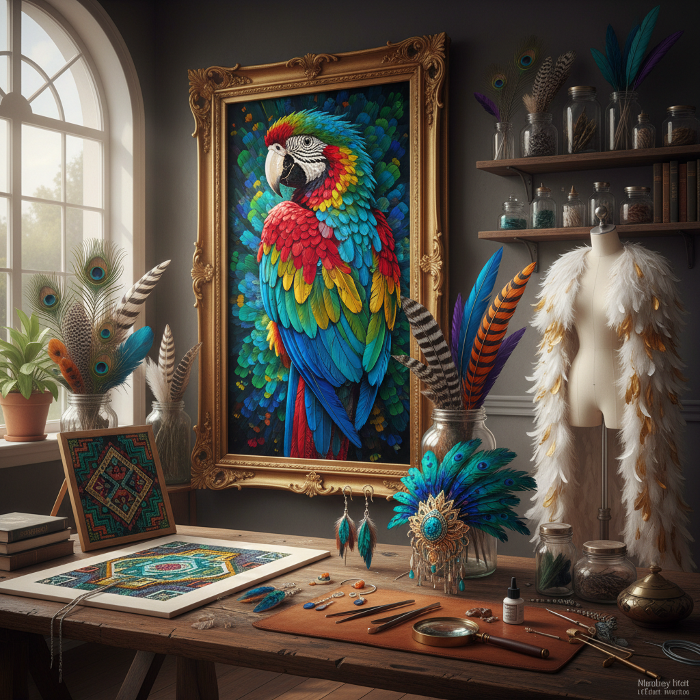

# Feather Art 羽毛艺术

> "A feather is an engineering miracle — lighter than air yet strong enough for flight, simple in structure yet infinitely complex in its barbs and barbules, monochrome at one angle yet iridescent at another. When an artist works with feathers, they work with flight itself, with the dream of weightlessness, with color that changes as you move around it." — Unknown

## 概述

羽毛艺术（Feather Art）是以鸟类羽毛为主要材料进行艺术创作的实践——利用羽毛的天然色彩、纹理、形态和虹彩效果创造视觉艺术品。羽毛艺术是人类最古老的装饰艺术形式之一，在世界各地的原住民文化中都有重要地位。

羽毛艺术的实践包括：1）羽毛镶嵌画——用不同颜色的羽毛拼贴成图画（阿兹特克传统）；2）羽毛头饰——用羽毛制作的仪式性头饰；3）羽毛首饰——用羽毛制作的耳环、项链等饰品；4）羽毛扇——用羽毛制作的装饰扇；5）羽毛服装——用羽毛装饰的高级时装；6）羽毛书法——用羽毛笔书写的书法艺术；7）当代羽毛雕塑——用羽毛创作的当代装置和雕塑。

## 核心特征

| 特征 | 描述 |
|------|------|
| 轻盈 | 极致的轻盈感 |
| 虹彩 | 结构色的虹彩效果 |
| 柔软 | 柔软的触感 |
| 多彩 | 自然界最丰富的色彩 |
| 飞翔 | 飞翔的象征 |
| 脆弱 | 需要精心保存 |

## 视觉特征

- **虹彩**：孔雀羽等的虹彩光泽
- **渐变**：羽毛的天然色彩渐变
- **纹理**：羽毛的精细纹理
- **轻盈**：视觉上的轻盈感
- **流动**：羽毛的流动形态
- **层叠**：多层羽毛的层叠效果

## 代表作品

| 作品 | 艺术家 | 年代 | 意义 |
|------|--------|------|------|
| *Moctezuma's Headdress* | 阿兹特克 | 约1520 | 羽毛镶嵌杰作 |
| *Feather cloaks* | 夏威夷传统 | 古代至今 | 羽毛斗篷 |
| *Feather fans* | 欧洲/中国传统 | 古代至今 | 羽毛扇 |
| *Feather installations* | Various | 当代 | 当代羽毛装置 |
| *Haute couture feathers* | Various | 20世纪至今 | 高级时装羽毛 |

## 历史时间线

| 时期 | 事件 |
|------|------|
| 史前 | 羽毛作为装饰和仪式用品 |
| 阿兹特克 | 羽毛镶嵌画的高峰 |
| 18-19世纪 | 欧洲羽毛时尚热潮 |
| 20世纪 | 鸟类保护运动 |
| 当代 | 可持续羽毛艺术 |

## 中国语境

羽毛艺术在中国有独特的文化传统。中国古代的"点翠"工艺——将翠鸟羽毛镶嵌在金属底座上制作首饰——是世界上最精美的羽毛艺术形式之一，其蓝绿色的虹彩效果历经百年不褪色。中国传统的羽毛扇（如诸葛亮的鹅毛扇）既是实用品也是文化符号。中国的"绒花"工艺——用蚕丝和羽毛制作的装饰花——是南京的非物质文化遗产。中国当代的一些艺术家在探索羽毛艺术：用可持续来源的羽毛创作当代装置、将传统点翠工艺的美学与现代首饰设计结合、以及用羽毛的轻盈质感表达当代主题。

## AI生成概念图

## 与其他风格的关系

- **Textile Art** → 纺织艺术
- **Jewelry Art** → 首饰艺术
- **Fashion Art** → 时尚艺术
- **Installation Art** → 装置艺术
- **Indigenous Art** → 原住民艺术
- **Nature Art** → 自然艺术

---

*浮光艺志 | Chronicle of Artistry*
