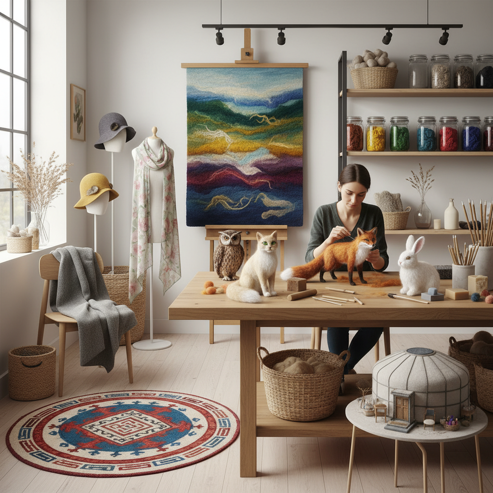

# Felt Art 毛毡艺术

> "Felt is the oldest textile known to humanity — older than weaving, older than knitting, older than spinning. It requires no loom, no needles, no thread. It is made simply by persuading animal fibers to entangle with each other through moisture, heat, and pressure — a process so ancient that legend attributes its invention to the hooves of horses and the sweat of nomads. Felt is textile reduced to its most elemental: fiber becoming fabric through friction alone." — Unknown

## 概述

毛毡艺术（Felt Art）是以毛毡为主要材料进行艺术创作的实践——通过湿毡（用水、肥皂和摩擦使纤维缠结）或针毡（用带倒刺的针反复刺入纤维使其缠结）技法创造各种艺术形式。毛毡是人类最古老的纺织品，有超过八千年的历史。

毛毡艺术的实践包括：1）湿毡——用水和摩擦制作平面或立体毛毡；2）针毡——用毡针雕塑立体造型；3）毡画——用彩色羊毛纤维"绘制"的画面；4）毡雕塑——用毛毡制作的立体雕塑；5）毡服装——用毛毡制作的服装和配饰；6）毡建筑——用毛毡覆盖的建筑（如蒙古包）；7）当代毡艺术——用毛毡创作的当代装置和雕塑。

## 核心特征

| 特征 | 描述 |
|------|------|
| 古老 | 最古老的纺织品 |
| 无织 | 不需要编织 |
| 温暖 | 极好的保暖性 |
| 可塑 | 可塑造任何形态 |
| 柔软 | 柔软的触感 |
| 游牧 | 游牧文化的象征 |

## 视觉特征

- **柔和**：柔和的表面质感
- **色彩**：可染成任何颜色
- **厚实**：厚实的体量感
- **模糊**：边缘的模糊感
- **温暖**：视觉上的温暖感
- **有机**：有机的形态

## 代表作品

| 作品 | 艺术家 | 年代 | 意义 |
|------|--------|------|------|
| *Felt suits* | Joseph Beuys | 1970 | 毛毡在当代艺术中 |
| *Needle felted sculptures* | Various | 当代 | 针毡雕塑 |
| *Felt installations* | Various | 当代 | 毛毡装置 |
| *Nomadic felt art* | 中亚传统 | 古代至今 | 游牧毛毡艺术 |
| *Contemporary felt fashion* | Various | 当代 | 当代毛毡时装 |

## 历史时间线

| 时期 | 事件 |
|------|------|
| 公元前6000年 | 最早的毛毡证据 |
| 古代 | 中亚游牧民族的毛毡文化 |
| 中世纪 | 欧洲毡帽产业 |
| 1970 | 博伊斯的毛毡艺术 |
| 当代 | 针毡和湿毡的艺术复兴 |

## 中国语境

毛毡艺术在中国有独特的文化传统。中国的蒙古族、哈萨克族、藏族等游牧民族有悠久的毛毡制作传统——蒙古包（毡房）本身就是毛毡建筑艺术的杰出代表。中国新疆的毛毡地毯和壁挂以其鲜艳的色彩和几何图案著称。中国内蒙古的毛毡工艺——包括毡靴、毡帽、毡画——已被列入非物质文化遗产。中国当代的毛毡艺术家将传统游牧毛毡文化与当代艺术结合，创作出融合民族美学与现代设计的作品。中国的针毡（羊毛毡）手工艺近年来在年轻人中非常流行，大量手工爱好者用针毡制作可爱的动物和人物造型。

## AI生成概念图

## 与其他风格的关系

- **Textile Art** → 纺织艺术
- **Fiber Art** → 纤维艺术
- **Sculpture** → 雕塑
- **Fashion Art** → 时尚艺术
- **Nomadic Art** → 游牧艺术
- **Installation Art** → 装置艺术

---

*浮光艺志 | Chronicle of Artistry*
