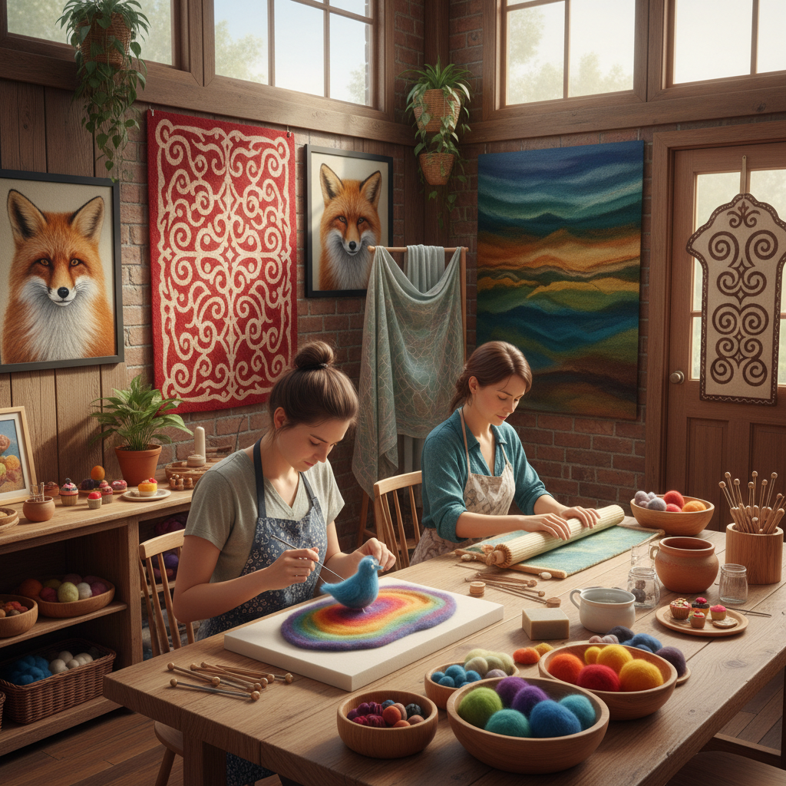

# Felting Art 毡艺

> "Felting is alchemy in fiber — loose wool transformed by water, heat, and agitation into a solid fabric without spinning, weaving, or stitching, the scales of each fiber interlocking with their neighbors in an irreversible embrace, creating cloth from chaos through the oldest textile process known to humanity." — Unknown

## 概述

毡艺（Felting Art）是一种通过使羊毛纤维（或其他动物纤维）相互缠结、压缩形成密实织物的纺织技法。毡（felt）是人类最古老的纺织品之一——比编织和针织都要古老。毡的形成原理是：动物纤维表面的鳞片（scales）在湿度、热量和摩擦的作用下相互钩连、缠结，形成不可逆的密实结构。

毡艺的主要类型包括：湿毡（wet felting——使用热水、肥皂和摩擦）、针毡（needle felting——使用带倒刺的特殊针反复刺入纤维使其缠结）和Nuno毡（将羊毛纤维与薄织物结合的技法）。毡艺在中亚游牧民族（蒙古、哈萨克、吉尔吉斯等）有极其悠久的传统——毡房（yurt/ger）、毡毯、毡靴等都是游牧生活的必需品。当代毡艺从实用品发展为独立的艺术形式。

## 核心特征

| 特征 | 描述 |
|------|------|
| 缠结 | 纤维相互缠结 |
| 不可逆 | 不可逆的结构 |
| 无纺 | 无需纺织编织 |
| 古老 | 极其古老的技法 |
| 雕塑 | 可塑性强 |
| 保暖 | 极其保暖 |

## 视觉特征

- **柔软**：柔软的毛毡质感
- **密实**：密实的纤维结构
- **色彩**：羊毛的丰富色彩
- **有机**：有机的形态
- **温暖**：温暖的视觉感受
- **雕塑**：可塑的雕塑感

## 代表作品

| 作品 | 艺术家 | 年代 | 意义 |
|------|--------|------|------|
| *Central Asian felt yurts* | 游牧民族 | 传统 | 中亚毡房 |
| *Shyrdak felt rugs* | 吉尔吉斯工匠 | 传统 | 吉尔吉斯毡毯 |
| *Contemporary felt sculpture* | Various | 当代 | 当代毡雕塑 |
| *Nuno felt fashion* | Various | 当代 | Nuno毡时装 |
| *Needle felted art* | Various | 当代 | 针毡艺术 |

## 历史时间线

| 时期 | 事件 |
|------|------|
| 史前 | 毡的起源（可能6000年前） |
| 古代 | 中亚游牧民族的毡文化 |
| 中世纪 | 毡在欧亚大陆的广泛使用 |
| 20世纪后期 | 毡艺的艺术化发展 |
| 当代 | 针毡和Nuno毡的流行 |

## 中国语境

毡艺在中国有重要的传统——中国北方和西部的游牧民族（蒙古族、哈萨克族、藏族等）有悠久的毡制品传统。蒙古包（毡房）是中国北方草原文化的象征。新疆的毡毯（花毡）是国家级非物质文化遗产。当代中国的毡艺在两个方向发展：一是传统毡制品的保护和创新，二是针毡（羊毛毡）作为手工爱好的流行——中国的社交媒体上有大量的针毡教程和作品分享。

## AI生成概念图

## 与其他风格的关系

- **Wet Felting** → 湿毡
- **Needle Felting** → 针毡
- **Fiber Art** → 纤维艺术
- **Textile Sculpture** → 纺织雕塑
- **Nomadic Art** → 游牧艺术
- **Sustainable Textile** → 可持续纺织

---

*浮光艺志 | Chronicle of Artistry*
