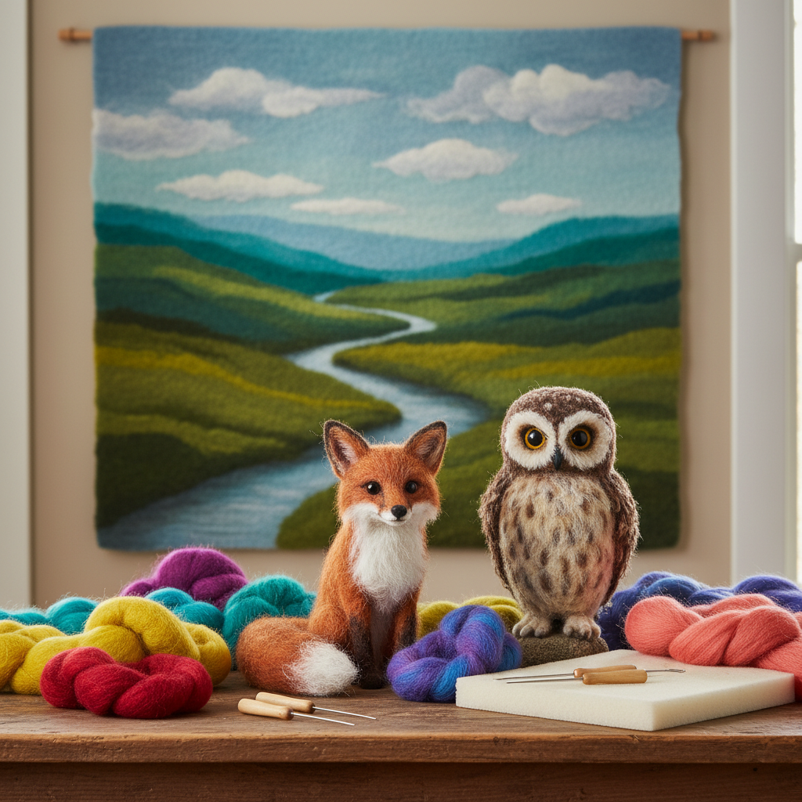

# Felting 毡艺

> "Felting is the oldest textile — no loom, no needle, just fiber, water, and the patience of hands." — Unknown

## 概述

毡艺（Felting）是将动物纤维（主要是羊毛）通过湿润、摩擦和压缩使其纤维相互缠结，形成不需要纺织的非织造布（毡）的古老工艺。毡是人类最早的"布料"——比纺织早数千年。从中亚游牧民族的毡房（蒙古包）到北欧的毡帽，从日本的毡艺术到当代的针毡雕塑，毡艺以其温暖、柔软和无限的可塑性持续吸引着创作者。

毡艺的哲学在于：混沌中的秩序——无数根独立的纤维通过摩擦和压力自发地缠结在一起，从混乱中诞生出坚固的整体。

## 核心特征

| 特征 | 描述 |
|------|------|
| 非织造 | 不需要纺织的布料 |
| 缠结 | 纤维的自然缠结 |
| 羊毛 | 主要使用羊毛纤维 |
| 温暖 | 极好的保暖性 |
| 可塑 | 可塑造三维形态 |
| 古老 | 比纺织更古老 |

## 视觉特征

- **柔软**：柔软的表面质感
- **温暖**：视觉上的温暖感
- **色彩**：可染色的丰富色彩
- **质感**：毛毡的独特质感
- **有机**：有机的自然形态
- **厚实**：厚实的材料感

## 代表作品

| 作品 | 艺术家 | 年代 | 意义 |
|------|--------|------|------|
| *Central Asian yurts* | 匿名 | 传统 | 游牧民族的毡房 |
| *Pazyryk felt* | 匿名 | 公元前5世纪 | 最古老的装饰毡 |
| *Joseph Beuys felt* | Joseph Beuys | 1960s-80s | 毡在当代艺术中 |
| *Needle felted sculptures* | Various | 当代 | 针毡雕塑 |
| *Contemporary felt art* | Various | 当代 | 当代毡艺术 |

## 历史时间线

| 时期 | 事件 |
|------|------|
| 公元前6000年 | 最早的毡制品（推测） |
| 公元前5世纪 | 帕兹雷克古墓的装饰毡 |
| 传统 | 中亚游牧民族的毡文化 |
| 中世纪 | 欧洲的毡帽和毡靴 |
| 1960s | Beuys将毡引入当代艺术 |
| 当代 | 针毡和湿毡的艺术复兴 |

## 中国语境

中国的毡艺传统主要在北方游牧民族中——蒙古族、哈萨克族、藏族等都有丰富的毡制品传统。蒙古包（格尔）的覆盖物就是毡。中国传统的毡制品包括毡帽、毡靴、毡毯等。新疆和内蒙古是中国毡艺的主要产地。当代中国的纤维艺术家也在探索毡在当代艺术中的可能性，针毡（羊毛毡）作为手工爱好在中国年轻人中非常流行。

## AI生成概念图

## 与其他风格的关系

- **Fiber Art** → 纤维艺术
- **Textile Art** → 纺织艺术的非织造版本
- **Nomadic Art** → 游牧艺术
- **Sculpture** → 针毡雕塑
- **Wearable Art** → 可穿戴毡艺术
- **Eco Art** → 天然材料的生态艺术

---

*浮光艺志 | Chronicle of Artistry*
