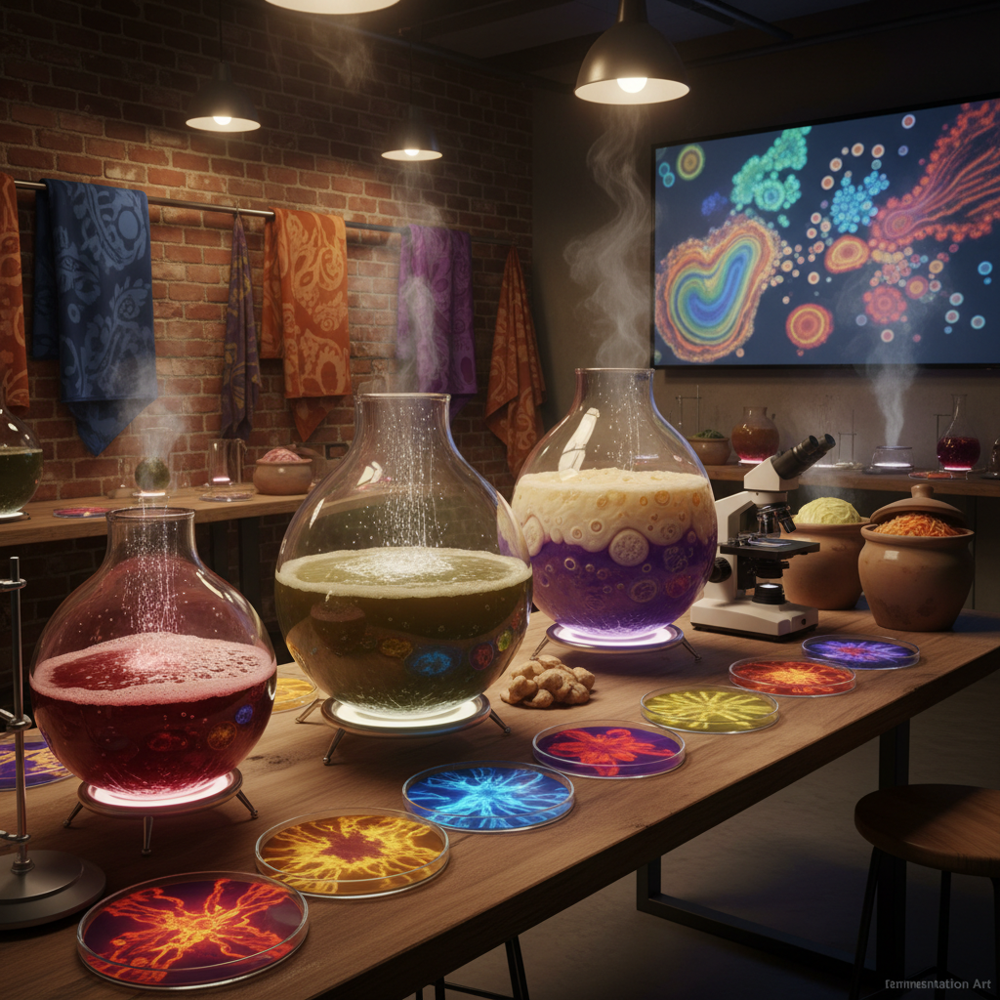

# Fermentation Art 发酵艺术

> "Fermentation art celebrates the oldest biotechnology — the ancient partnership between humans and microbes that gave us bread, wine, cheese, and civilization itself. To ferment is to collaborate with the invisible, to surrender control to bacterial and fungal processes that transform the ordinary into the extraordinary, the raw into the cultured, the dead into the living. Fermentation art makes visible this hidden alchemy, revealing that culture in both senses — biological and human — begins with the same act of patient transformation." — Sandor Katz

## 概述

发酵艺术（Fermentation Art）是以发酵过程为媒介、主题和方法论的艺术实践。发酵——微生物将有机物质转化为新物质的过程——是人类最古老的生物技术之一，也是文化（culture）一词的双重含义的来源（细菌培养和人类文化共用同一个词）。

发酵艺术的实践包括：1）以发酵为创作媒介——用酵母、乳酸菌、醋酸菌等微生物创作活体作品；2）发酵过程的美学化——将发酵的气泡、颜色变化、气味和质地转化为感官体验；3）发酵作为隐喻——用发酵来思考社会变革、文化混合和缓慢转化；4）发酵的政治性——探索发酵与食物主权、传统知识和反工业化的关系。发酵艺术与生物艺术、食物艺术和慢文化运动密切相关。

## 核心特征

| 特征 | 描述 |
|------|------|
| 转化 | 物质的转化 |
| 微生物 | 微生物的合作 |
| 时间 | 缓慢的时间 |
| 感官 | 多感官体验 |
| 活体 | 活的作品 |
| 文化 | 文化的双重含义 |

## 视觉特征

- **气泡**：发酵产生的气泡
- **颜色**：发酵的颜色变化
- **质地**：发酵物的独特质地
- **容器**：发酵罐和容器
- **菌膜**：SCOBY等菌膜
- **生长**：微生物的生长

## 代表作品

| 作品 | 艺术家 | 年代 | 意义 |
|------|--------|------|------|
| *Fermentation installations* | Various | 2010年代 | 发酵装置 |
| *SCOBY art* | Various | 2010年代 | 红茶菌艺术 |
| *Sourdough culture* | Various | 2020年代 | 酸面团文化 |
| *Kimchi art* | Various | 2010年代 | 泡菜艺术 |
| *Microbial dyeing* | Various | 当代 | 微生物染色 |

## 历史时间线

| 时期 | 事件 |
|------|------|
| 2003 | Sandor Katz《Wild Fermentation》 |
| 2010年代 | 发酵复兴运动 |
| 2010年代 | 发酵艺术的兴起 |
| 2020 | 疫情期间的酸面团热潮 |
| 当代 | 发酵与可持续设计 |

## 中国语境

发酵艺术在中国有极其深厚的文化基础。中国是世界上发酵文化最丰富的文明之一——从酱油、醋、豆腐乳、臭豆腐到白酒、黄酒、普洱茶，发酵渗透了中国饮食文化的方方面面。中国的发酵传统不仅是技术，更是美学——普洱茶的"越陈越香"、白酒的"窖藏"、酱缸的"百年老卤"都体现了对时间和微生物转化的深刻欣赏。中国当代的一些艺术家在探索发酵艺术的可能性——将传统的发酵美学与当代艺术实践结合，用发酵来思考中国文化的"慢转化"特质，以及探索发酵作为一种可持续的创作方式。

## AI生成概念图

## 与其他风格的关系

- **Bio Art** → 生物艺术
- **Food Art** → 食物艺术
- **Process Art** → 过程艺术
- **Slow Art** → 慢艺术
- **Mycological Art** → 真菌艺术
- **Material Art** → 材料艺术

---

*浮光艺志 | Chronicle of Artistry*
