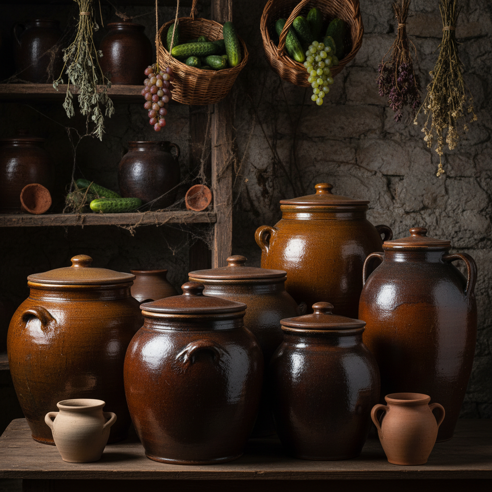

# Fermentation Vessel Art 发酵容器艺术

> "Fermentation vessels are time made tangible in clay — pots and jars designed to hold the slow magic of microbes transforming grain into beer, grapes into wine, milk into cheese, and cabbage into kimchi, each vessel a controlled environment where temperature, porosity, and shape conspire with biology to create flavors that no other material can produce, the original biotechnology housed in earth." — Unknown

## 概述

发酵容器艺术（Fermentation Vessel Art）是一种专门设计用于食品和饮料发酵的陶瓷器具艺术。发酵容器将陶瓷的透气性、保温性和化学稳定性与发酵过程的特殊需求结合——从中国的酒缸、酱缸到格鲁吉亚的Qvevri、韩国的泡菜坛，陶瓷发酵容器是人类食品文化的重要载体。陶瓷的微孔结构为微生物提供了理想的栖息环境，使发酵过程更加稳定和丰富。

发酵容器艺术的核心要素包括：1）透气性——陶瓷微孔的透气功能；2）保温性——稳定的温度环境；3）化学稳定——不与食品反应；4）微生物栖息——为微生物提供环境；5）密封设计——适当的密封结构；6）大容量——满足发酵量的需求；7）文化传承——各文化的发酵传统。

## 核心特征

| 特征 | 描述 |
|------|------|
| 透气性 | 陶瓷微孔透气 |
| 保温性 | 稳定温度环境 |
| 化学稳定 | 不与食品反应 |
| 微生物栖息 | 为微生物提供环境 |
| 密封设计 | 适当密封结构 |
| 大容量 | 满足发酵量需求 |

## 视觉特征

- **圆腹造型**：便于发酵的圆腹形
- **宽口设计**：便于投料和取用
- **密封结构**：水封或盖密封设计
- **厚实器壁**：保温的厚实壁体
- **质朴外观**：功能导向的质朴外观
- **使用痕迹**：长期使用的发酵痕迹

## 代表作品

| 作品 | 艺术家/文化 | 年代 | 意义 |
|------|-------------|------|------|
| *格鲁吉亚Qvevri* | 格鲁吉亚 | 各时期 | 世界非遗酿酒缸 |
| *中国酒缸* | 中国 | 各时期 | 中国酿酒传统 |
| *韩国泡菜坛* | 韩国 | 各时期 | 韩国泡菜文化 |
| *中国酱缸* | 中国 | 各时期 | 中国酱文化 |
| *当代发酵容器* | 各地陶艺家 | 当代 | 当代发酵复兴 |

## 历史时间线

| 时期 | 事件 |
|------|------|
| 前6000年 | 最早的陶制发酵容器 |
| 各时期 | 各文化发酵容器的发展 |
| 工业化 | 金属和塑料容器的替代 |
| 当代 | 传统陶瓷发酵容器的复兴 |
| 2013年 | 格鲁吉亚Qvevri列入非遗 |

## 中国语境

中国有世界上最丰富的陶瓷发酵容器传统。中国的白酒、黄酒、酱油、醋、豆瓣酱、腐乳等发酵食品都依赖陶瓷容器——陶缸的微孔结构为发酵微生物提供了理想的栖息环境，使发酵产品获得独特的风味。四川的泡菜坛是中国发酵容器的经典——其独特的水封设计既能隔绝空气又能排出发酵气体。中国的酱缸文化更是源远流长——郫县豆瓣的露天晒缸、绍兴黄酒的陶坛陈化、茅台酒的陶缸储存等都是陶瓷发酵容器的典型应用。中国当代的发酵食品复兴运动正在重新认识传统陶瓷容器的价值——越来越多的手工食品生产者选择回归传统陶缸发酵。

## AI生成概念图

## 与其他风格的关系

- **Storage Vessel** → 储存器
- **Functional Ceramics** → 功能陶瓷
- **Food Culture** → 食品文化
- **Biotechnology** → 生物技术
- **Traditional Craft** → 传统工艺
- **Qvevri** → 格鲁吉亚酒缸

---

*浮光艺志 | Chronicle of Artistry*
