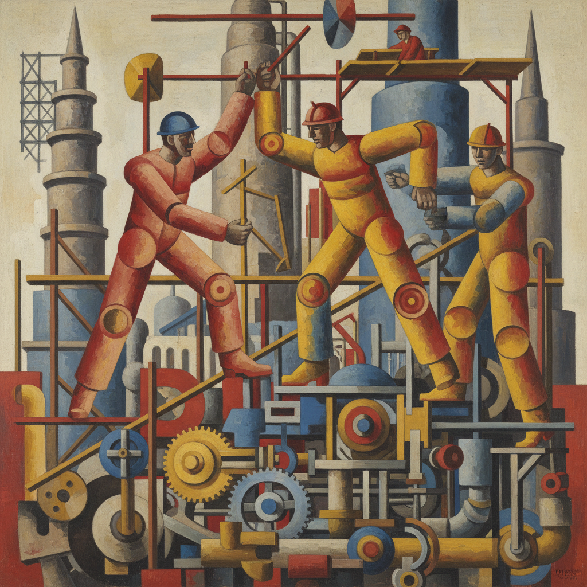

# Fernand Léger 费尔南·莱热

> "The modern painter must find the pictorial equivalent of the modern world." — Fernand Léger

## 概述

费尔南·莱热（Fernand Léger，1881–1955）是法国画家，以将立体主义与机械美学融合闻名。他的画面充满管状的人体、齿轮般的形式和工业色彩——将现代城市生活的节奏、工人阶级的力量和机器时代的乐观转化为大胆的视觉语言，被称为"管子的立体主义者"。

## 核心特征

| 特征 | 描述 |
|------|------|
| 管状形体 | 圆柱体般的人物和物体 |
| 机械美学 | 齿轮、管道、工业形式 |
| 原色对比 | 红黄蓝的大胆平涂 |
| 工人阶级 | 建筑工人、杂技演员 |
| 城市节奏 | 现代都市生活的视觉翻译 |
| 壁画规模 | 公共艺术的宏大尺幅 |

## 代表作品

| 作品 | 年代 | 意义 |
|------|------|------|
| *The City* | 1919 | 现代都市的视觉交响 |
| *Three Women (Le Grand Déjeuner)* | 1921 | 机械化的古典人体 |
| *The Builders* | 1950 | 工人阶级的纪念碑 |
| *Ballet Mécanique* | 1924 | 实验电影的先驱 |

## AI生成概念图

## 与其他风格的关系

- **Cubism** → 立体主义的机械分支
- **Purism** → 与勒·柯布西耶的纯粹主义对话
- **Pop Art** → 预示了波普的大众美学
- **Muralism** → 公共壁画的现代主义版本
