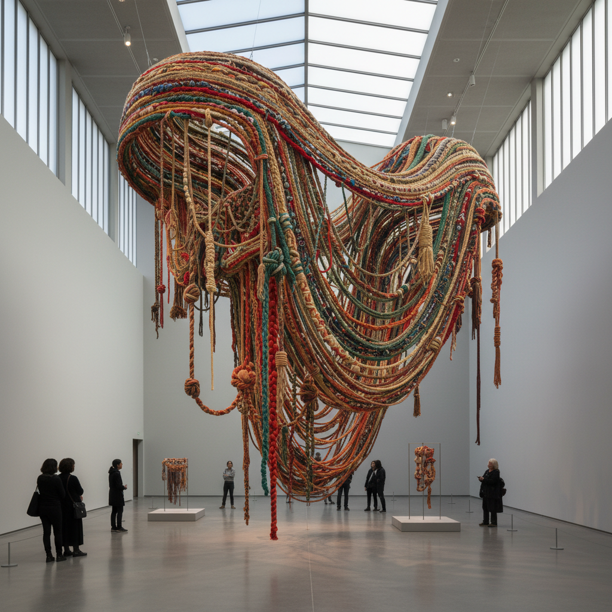

# Fiber Art 纤维艺术

> "Fiber is the thread that connects us to our ancestors and to each other." — Sheila Hicks

## 概述

纤维艺术（Fiber Art）是以纤维材料——线、绳、布、毛、丝——为主要媒介的当代艺术形式。它从传统的编织、刺绣、针织等手工艺中发展而来，但超越了功能性和装饰性，成为独立的艺术表达。从1960年代的"新挂毯运动"到当代的大型纤维装置，纤维艺术打破了工艺与纯艺术的等级界限。

纤维艺术的独特之处在于它的触觉性和劳动性——每一根线都承载着时间和手的温度。

## 核心特征

| 特征 | 描述 |
|------|------|
| 纤维媒介 | 以线、绳、布等纤维材料为主 |
| 手工性 | 强调手工劳动的价值 |
| 触觉性 | 丰富的触觉质感 |
| 时间性 | 创作过程漫长——编织的时间 |
| 女性传统 | 与女性手工艺传统的对话 |
| 跨界性 | 打破工艺与纯艺术的界限 |

## 视觉特征

- **质感**：柔软的、有弹性的、温暖的
- **结构**：编织、打结、缠绕的结构
- **色彩**：染色纤维的丰富色彩
- **尺度**：从微型到建筑尺度
- **重力**：悬挂、垂坠、堆积
- **透明**：纤维的疏密创造透明度变化

## 代表作品

| 作品 | 艺术家 | 年代 | 意义 |
|------|--------|------|------|
| *Abakans* | Magdalena Abakanowicz | 1960s-70s | 纤维雕塑的先驱 |
| *Minimes* | Sheila Hicks | 1950s-至今 | 纤维的色彩和形式探索 |
| *Installations* | Ernesto Neto | 1990s-至今 | 纤维的沉浸式空间 |
| *Tapestries* | El Anatsui | 2000s+ | 回收材料的纤维壁挂 |
| *Crochet Coral Reef* | Institute for Figuring | 2005+ | 钩针编织的珊瑚礁 |
| *Works* | Chiharu Shiota | 2000s+ | 红线/黑线的空间装置 |

## 历史时间线

| 时期 | 事件 |
|------|------|
| 远古 | 编织是人类最古老的技术之一 |
| 1960s | "新挂毯运动"——纤维脱离墙面 |
| 1962 | Lausanne双年展——纤维艺术的国际平台 |
| 1970s | 女性主义——重新评价"女性手工艺" |
| 1980s-90s | 纤维艺术进入美术馆体系 |
| 2000s | 大型纤维装置的兴起 |
| 2010s-至今 | 纤维艺术的全球复兴 |

## 中国语境

中国有深厚的纤维艺术传统——丝绸、刺绣、织锦、缂丝、扎染、蜡染等。中国的"四大名绣"（苏绣、湘绣、蜀绣、粤绣）是纤维艺术的瑰宝。当代中国纤维艺术在杭州中国美术学院等机构的推动下蓬勃发展，"从洛桑到北京"国际纤维艺术双年展是重要的国际平台。

## AI生成概念图

## 与其他风格的关系

- **Textile Art** → 纺织艺术是纤维艺术的近亲
- **Installation Art** → 纤维装置是当代的重要形式
- **Feminist Art** → 女性主义重新评价了纤维手工艺
- **Sculpture** → 纤维雕塑是软雕塑的重要形式
- **Tapestry** → 挂毯是纤维艺术的传统形式
- **Craft** → 纤维艺术挑战了工艺与艺术的界限

---

*浮光艺志 | Chronicle of Artistry*
