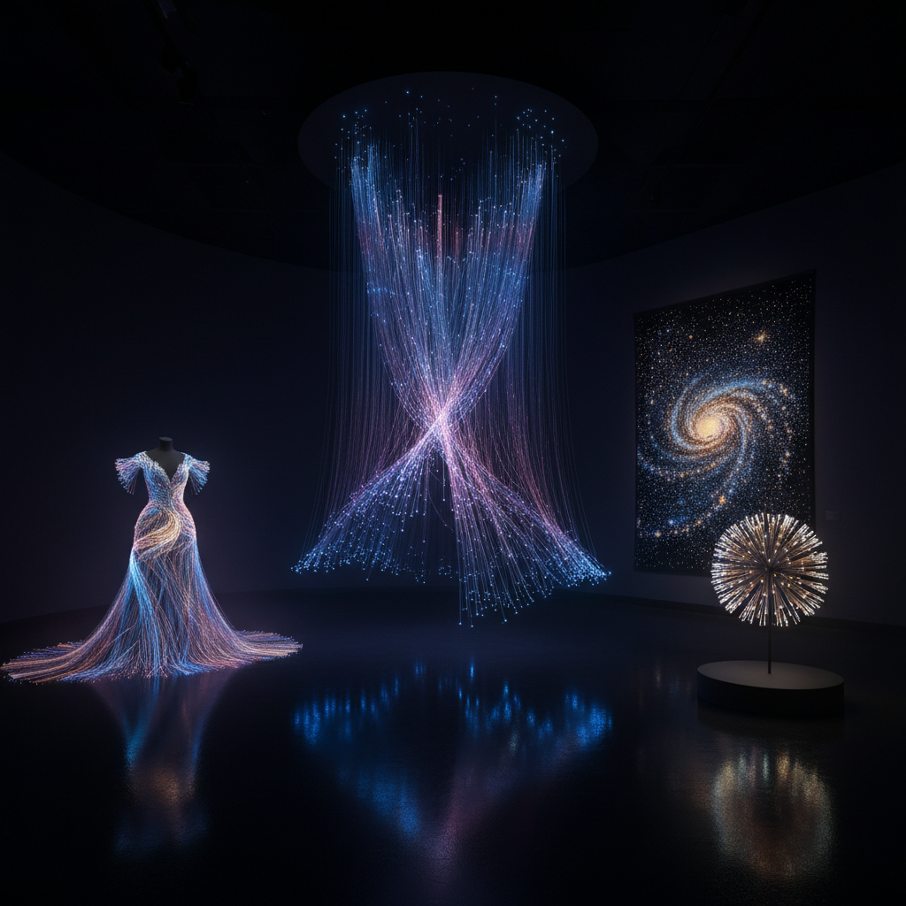

# Fiber Optic Art 光纤艺术

> "Fiber optics carry light the way rivers carry water — bending it around corners, splitting it into tributaries, delivering it precisely where it is needed. When an artist takes these hair-thin glass threads and weaves them into sculptures, curtains, and constellations of light, they create works that seem to defy physics: light that flows like fabric, glows from within like bioluminescence, and changes color as if breathing." — Unknown

## 概述

光纤艺术（Fiber Optic Art）是以光纤（光导纤维）为主要媒介进行艺术创作的实践——利用光纤传导光线的特性，将光从光源传输到光纤末端，创造出星空般的点光效果、流动的光线瀑布和发光的织物。光纤艺术将通信技术转化为诗意的视觉体验。

光纤艺术的实践包括：1）光纤雕塑——用大量光纤束创造的发光雕塑；2）光纤织物——将光纤编织入面料创造发光服装；3）光纤装置——大型光纤空间装置；4）光纤灯具——艺术化的光纤照明设计；5）光纤星空——模拟星空效果的光纤天花板；6）光纤瀑布——模拟水流的光纤悬挂装置；7）互动光纤——响应触摸或声音的光纤作品。

## 核心特征

| 特征 | 描述 |
|------|------|
| 点光 | 末端的点状发光 |
| 柔软 | 柔软可弯曲 |
| 变色 | 可变换颜色 |
| 精细 | 极其精细的光线 |
| 密集 | 大量光纤的密集效果 |
| 科技 | 科技与艺术结合 |

## 视觉特征

- **星点**：如星空般的点状光
- **流动**：光线的流动感
- **渐变**：颜色的渐变过渡
- **密集**：大量光纤的密集排列
- **柔和**：柔和的光线质感
- **梦幻**：梦幻般的视觉效果

## 代表作品

| 作品 | 艺术家 | 年代 | 意义 |
|------|--------|------|------|
| *Fiber optic curtains* | Various | 当代 | 光纤帘幕装置 |
| *Fiber optic dresses* | Various | 当代 | 发光服装 |
| *Starfield ceilings* | Various | 当代 | 光纤星空天花板 |
| *Light sculptures* | Various | 当代 | 光纤雕塑 |
| *Interactive fiber* | Various | 当代 | 互动光纤装置 |

## 历史时间线

| 时期 | 事件 |
|------|------|
| 1960年代 | 光纤技术的发明 |
| 1970年代 | 光纤用于通信 |
| 1980年代 | 光纤装饰灯的出现 |
| 2000年代 | 光纤艺术的发展 |
| 当代 | 光纤与智能技术结合 |

## 中国语境

光纤艺术在中国有快速的发展。中国是世界上最大的光纤生产国——这为光纤艺术提供了丰富的材料基础。中国的一些当代艺术家和设计师将光纤技术融入艺术创作——用光纤创造沉浸式装置、将光纤编织入传统工艺品、以及用光纤技术重新诠释中国传统的"灯"文化。中国的光纤装饰产业非常发达——从光纤星空天花板到光纤瀑布灯，中国制造的光纤装饰产品出口到全世界。中国的一些时装设计师也在探索光纤面料——创造在黑暗中发光的服装和配饰。中国的大型活动和展览中，光纤装置越来越常见——如各种灯光节和科技展览中的光纤艺术作品。

## AI生成概念图

## 与其他风格的关系

- **Light Art** → 光艺术
- **Textile Art** → 纺织艺术
- **Installation Art** → 装置艺术
- **Kinetic Art** → 动态艺术
- **Digital Art** → 数字艺术
- **Wearable Art** → 可穿戴艺术

---

*浮光艺志 | Chronicle of Artistry*
