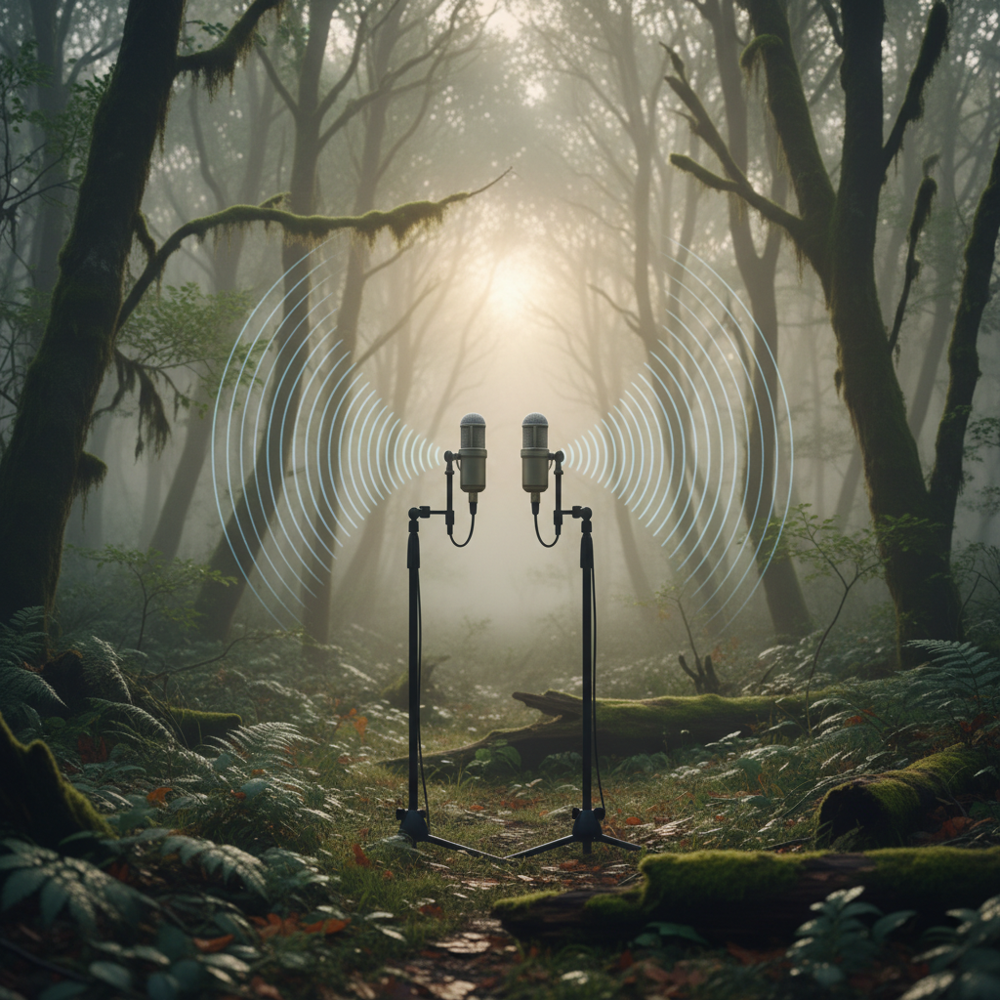

# Field Recording Art 田野录音艺术

> **时期：** 1960年代–至今  
> **关键词：** 环境声景、深度聆听、声音生态学、地方感、声音纪录

## 概述

田野录音艺术将环境中的自然和人工声音——鸟鸣、城市噪音、冰川融化、森林深处的寂静——作为创作材料和最终作品。它源于声音生态学和R. Murray Schafer的"声景"概念，艺术家们用录音设备作为"耳朵的延伸"，记录和呈现那些通常被忽略的声音世界。

## 风格特征

- **环境声景**：完整记录特定地点的声音环境
- **深度聆听**：训练对微小声音的感知能力
- **时间记录**：声音作为时间和变化的证据
- **空间感**：通过声音重建三维空间体验
- **生态意识**：记录正在消失的声音环境

## 代表人物与作品

- R. Murray Schafer 世界声景项目
- Chris Watson 自然声景录音
- Francisco López 极端田野录音
- Jana Winderen 水下声音
- Toshiya Tsunoda 振动录音

## 概念图

