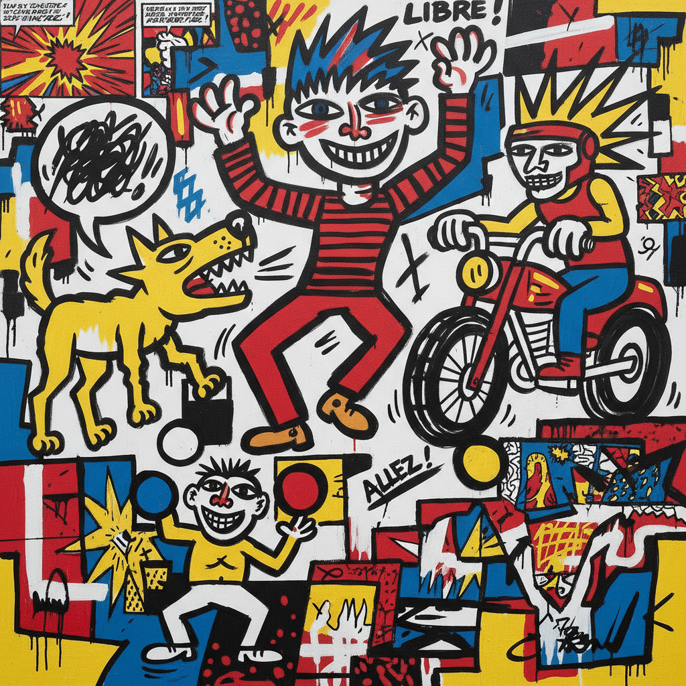

# Figuration Libre 自由具象

> **时期：** 1981年–1980年代末  
> **关键词：** 法国新具象、街头文化、漫画影响、反学院、即兴创作

## 概述

Figuration Libre（自由具象）是1981年在法国兴起的绘画运动，与美国的涂鸦艺术和新表现主义同步。年轻画家们从漫画、电视、广告和街头文化中汲取图像，用鲜艳的色彩和粗犷的线条创作大尺幅绘画——拒绝学院派的严肃和观念艺术的晦涩，追求一种直接、快乐、民主的视觉语言。

## 风格特征

- **漫画语言**：粗黑轮廓线和平涂色块
- **流行文化**：电视、广告、摇滚乐的图像
- **鲜艳色彩**：纯色的大面积使用
- **即兴创作**：快速、直觉、不修饰
- **大尺幅**：墙面和画布的自由占领

## 代表人物与作品

- 罗伯特·孔巴斯 战斗场景
- 埃尔韦·迪罗萨 卡通人物
- 弗朗索瓦·布瓦龙 流行图像
- 雷米·布朗夏尔 街头叙事

## 概念图

