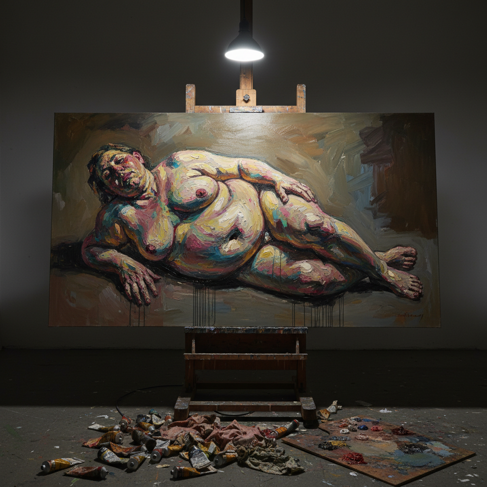

# Figurative Expressionism Art 具象表现主义艺术

> "Figurative Expressionism is painting that screams through the body — where the human figure becomes a vehicle for emotional extremity, where flesh is not rendered but attacked, where the portrait is not a likeness but a psychological excavation, where paint itself becomes a metaphor for the vulnerability and violence of embodied existence, and where the artist's hand leaves traces of urgency that no photograph or concept can replicate, proving that the oldest subject in art — the human body — remains the most inexhaustible." — Unknown

## 概述

具象表现主义（Figurative Expressionism）是一种将表现主义的情感强度和笔触自由与人物形象结合的绘画传统。它不是一个严格定义的运动，而是一条贯穿20世纪至今的持续线索——从早期表现主义（Kirchner、Schiele）到战后的弗朗西斯·培根（Francis Bacon）和卢西安·弗洛伊德（Lucian Freud），到当代的珍妮·萨维尔（Jenny Saville）和塞西莉·布朗（Cecily Brown）。

具象表现主义的核心张力在于：它既要保持人物的可辨识性（具象），又要通过变形、夸张和笔触的自由来表达内在的情感和心理状态（表现）。这种张力产生了一些20世纪最有力量的绘画——培根扭曲的教皇、弗洛伊德沉重的裸体、萨维尔巨大的肉体。具象表现主义证明了绘画在摄影时代仍然有不可替代的力量——它能够表达照片无法捕捉的内在真实。

## 核心特征

| 特征 | 描述 |
|------|------|
| 人体 | 人体作为核心主题 |
| 变形 | 情感驱动的变形 |
| 笔触 | 表现性的笔触 |
| 心理 | 心理深度的挖掘 |
| 肉体 | 肉体的物质性 |
| 张力 | 具象与抽象的张力 |

## 视觉特征

- **肉体**：厚重的肉体描绘
- **变形**：扭曲和变形的身体
- **笔触**：粗犷的表现性笔触
- **色彩**：肉色和土色的丰富变化
- **尺度**：大尺幅的画布
- **凝视**：直接的心理凝视

## 代表作品

| 作品 | 艺术家 | 年代 | 意义 |
|------|--------|------|------|
| *Three Studies for Figures at the Base of a Crucifixion* | Francis Bacon | 1944 | 战后具象表现主义 |
| *Benefits Supervisor Sleeping* | Lucian Freud | 1995 | 肉体的真实 |
| *Strategy (South Face/Front Face/North Face)* | Jenny Saville | 1993-94 | 女性身体的力量 |
| *The Triumph of Death* | Cecily Brown | 2019 | 当代具象表现 |
| *Self-portraits* | Alice Neel | 1980 | 心理肖像 |

## 历史时间线

| 时期 | 事件 |
|------|------|
| 1910年代 | 早期表现主义的人物画 |
| 1944 | 培根的突破性作品 |
| 1950-80年代 | 弗洛伊德的成熟期 |
| 1990年代 | 萨维尔等新一代 |
| 当代 | 具象绘画的全球复兴 |

## 中国语境

具象表现主义在中国有重要的影响。弗朗西斯·培根和卢西安·弗洛伊德对中国当代画家有深远的影响——从曾梵志早期的"肉联"系列到刘小东的现实主义大画，从毛焰的肖像到段建宇的人物。中国的美术学院传统强调写实基础，这为具象表现主义提供了技术基础——许多中国画家在扎实的写实训练基础上发展出个人的表现性语言。中国当代具象绘画的一个特点是将社会现实的观察与表现性的绘画语言结合——不是纯粹的内在表达，而是对中国社会变迁的具身见证。

## AI生成概念图

## 与其他风格的关系

- **Expressionism** → 表现主义
- **New Figuration** → 新具象
- **Neo-Expressionism** → 新表现主义
- **Realism** → 现实主义
- **Portraiture** → 肖像画
- **Body Art** → 身体艺术

---

*浮光艺志 | Chronicle of Artistry*
