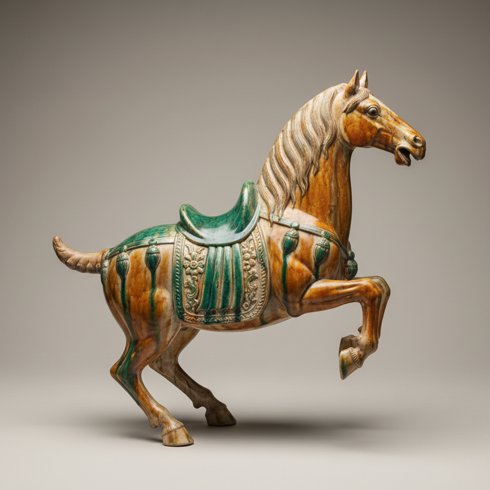

# Figurine Art 陶瓷人偶艺术

> "The ceramic figurine is sculpture's most democratic form — small enough to hold in one hand yet capable of capturing the full drama of human gesture, from Tang dynasty tomb guardians frozen in eternal vigilance to Meissen shepherdesses caught mid-curtsy, each figure a three-dimensional story told in fired clay, portable theater for the mantelpiece, mythology made tangible at domestic scale." — Unknown

## 概述

陶瓷人偶艺术（Figurine Art）是一种以人物或动物形象的小型陶瓷雕塑为核心的艺术形式。陶瓷人偶的历史几乎与陶瓷本身一样悠久——从史前的母神像到唐代的三彩俑，从欧洲的迈森瓷偶到日本的博多人形，陶瓷人偶跨越了所有文化和时代。人偶艺术将雕塑的表现力浓缩在小巧的尺寸中，使艺术可以进入日常生活空间。

陶瓷人偶艺术的核心要素包括：1）人物造型——以人物或动物为主题；2）小型尺寸——通常可手持的大小；3）叙事性——讲述故事或表达情感；4）装饰性——作为室内装饰品；5）工艺精湛——精细的雕塑和彩绑；6）文化载体——反映时代和文化特征；7）收藏传统——长期的收藏传统。

## 核心特征

| 特征 | 描述 |
|------|------|
| 人物造型 | 以人物或动物为主题 |
| 小型雕塑 | 可手持的小型尺寸 |
| 叙事表达 | 讲述故事或表达情感 |
| 装饰功能 | 室内装饰品 |
| 工艺精细 | 精细的雕塑和上色 |
| 文化反映 | 反映时代文化特征 |

## 视觉特征

- **人物姿态**：生动的人物动态
- **精细面部**：细致的面部表情
- **服饰细节**：精确的服装细节
- **彩绑装饰**：丰富的色彩装饰
- **动态造型**：充满动感的姿态
- **底座设计**：精心设计的底座

## 代表作品

| 作品 | 艺术家/文化 | 年代 | 意义 |
|------|-------------|------|------|
| *唐三彩俑* | 中国唐代 | 7-10世纪 | 中国陶俑的巅峰 |
| *迈森瓷偶* | 德国迈森 | 18世纪起 | 欧洲瓷偶传统 |
| *德化白瓷观音* | 中国德化 | 明代 | 宗教人偶经典 |
| *博多人形* | 日本博多 | 17世纪起 | 日本人偶传统 |
| *当代陶瓷人偶* | 各地艺术家 | 当代 | 人偶的当代表达 |

## 历史时间线

| 时期 | 事件 |
|------|------|
| 史前 | 最早的陶制人像 |
| 秦汉 | 中国兵马俑和陶俑传统 |
| 唐代 | 唐三彩俑的辉煌 |
| 18世纪 | 欧洲瓷偶的黄金时代 |
| 当代 | 陶瓷人偶的艺术化和当代化 |

## 中国语境

中国的陶瓷人偶传统极为丰富——从新石器时代的陶制人像到秦始皇兵马俑，从汉代的说唱俑到唐代的三彩俑，中国创造了世界上最壮观的陶瓷人偶群。中国的陶俑传统与丧葬文化密切相关——作为明器（随葬品）的陶俑记录了各时代的服饰、生活和信仰。德化窑的白瓷观音和人物雕塑是中国陶瓷人偶的另一高峰——以"象牙白"瓷质和精湛的雕塑技艺闻名世界。中国当代陶艺家正在重新探索人偶创作——将传统陶俑的造型语言与当代艺术观念结合，创造出具有当代精神的陶瓷人偶作品。

## AI生成概念图

## 与其他风格的关系

- **Tang Sancai** → 唐三彩
- **Meissen Porcelain** → 迈森瓷器
- **Dehua White** → 德化白瓷
- **Sculpture** → 雕塑
- **Tomb Art** → 墓葬艺术
- **Decorative Arts** → 装饰艺术

---

*浮光艺志 | Chronicle of Artistry*
