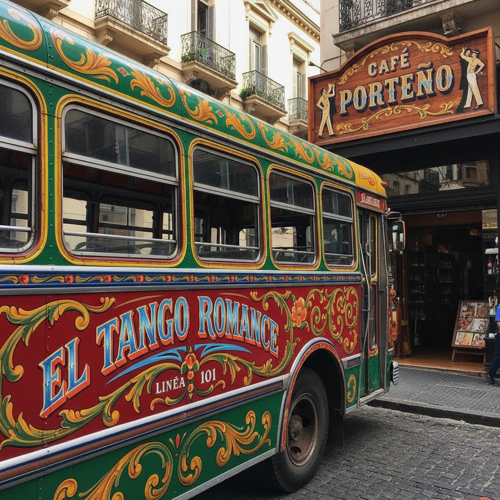

# Fileteado 阿根廷花体彩绘 | Fileteado Porteño

> **"布宜诺斯艾利斯的视觉探戈——卡车和店铺招牌上的花体字与藤蔓是这座城市的签名。"**

## 概述

阿根廷花体彩绘（Fileteado / Fileteado Porteño）是布宜诺斯艾利斯独有的装饰绘画艺术，起源于20世纪初意大利移民的马车和卡车装饰。"Fileteado"源自西班牙语"filete"（细线），指其标志性的精细线条装饰。这种风格以华丽的花体字、对称的藤蔓卷草、鲜艳的色彩和金色描边为特征，装饰在公共汽车、店铺招牌、酒吧和探戈舞厅中。2015年，Fileteado Porteño被列入联合国教科文组织非物质文化遗产名录。

## 核心特征

- **花体字**：华丽的装饰性字体
- **藤蔓卷草**：对称的Acanthus卷草
- **鲜艳色彩**：红、蓝、黄、绿+金色
- **对称构图**：严格的左右对称
- **阴影效果**：立体感的阴影描绘
- **格言谚语**：阿根廷俚语和智慧

## 常见元素

| 元素 | 含义 |
|------|------|
| 藤蔓卷草 | 生命力、繁荣 |
| 龙 | 力量 |
| 马蹄铁 | 好运 |
| 太阳 | 阿根廷国旗 |
| 丝带 | 装饰和连接 |
| 花朵 | 美丽 |

## 视觉特征

- 华丽的花体字母
- 对称的藤蔓装饰
- 鲜艳饱和的色彩
- 金色描边和高光
- 立体感的阴影
- 布宜诺斯艾利斯的城市气质

## 与其他风格的关系

| 风格 | 关系 |
|------|------|
| Truck Art巴基斯坦 | 共享车辆装饰传统 |
| Sign Painting | 共享招牌绘画传统 |
| Art Nouveau | 共享藤蔓卷草美学 |
| 探戈文化 | Fileteado是探戈的视觉伴侣 |
| 当代街头艺术 | Fileteado的城市传承 |

## 概念图

---

*浮光艺志 | Chronicle of Artistry*
