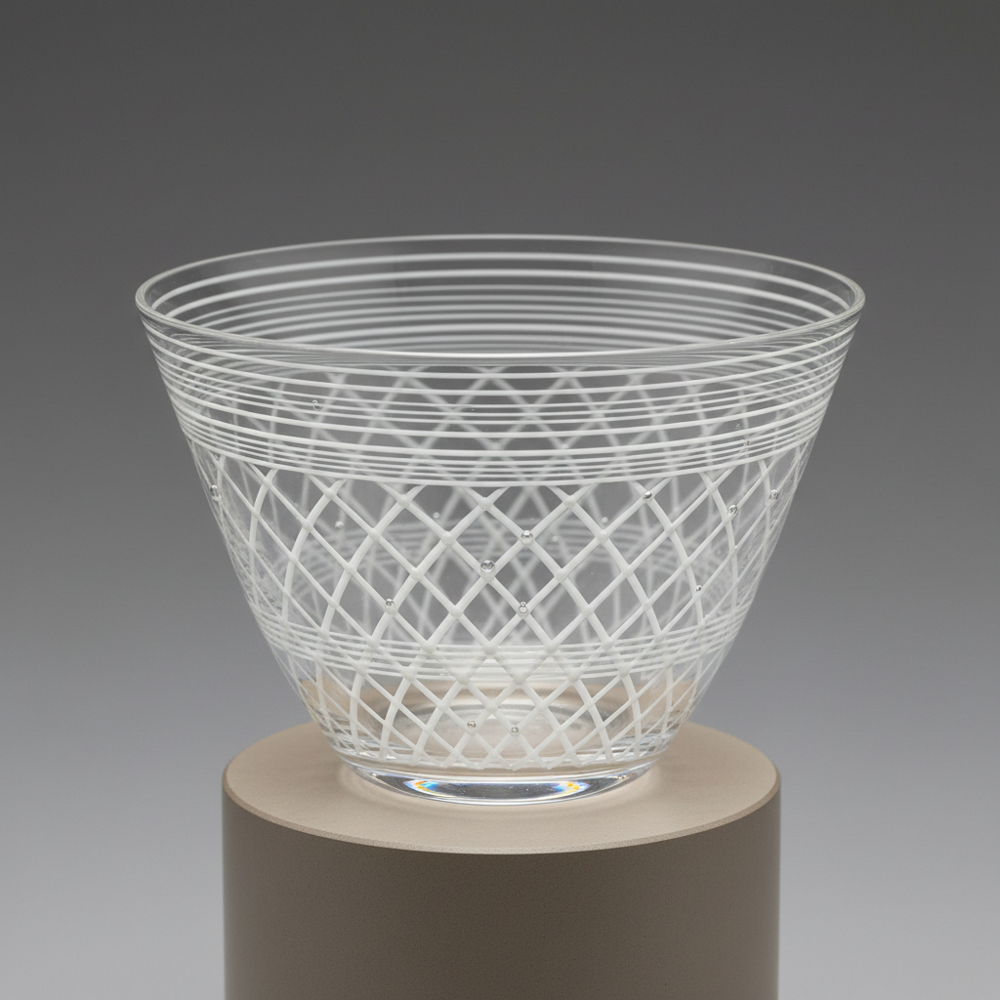

# Filigrana Art 玻璃丝装饰艺术

> "Filigrana is drawing with threads of glass — thin canes containing colored or white filaments are arranged side by side, heated until they fuse, then blown into vessels whose walls become a cage of parallel or crossing lines, as if the glassblower had woven a basket of light and then inflated it into a bowl." — Unknown

## 概述

玻璃丝装饰艺术（Filigrana Art）是一种威尼斯传统玻璃技法的总称——将含有彩色或白色丝线的玻璃棒排列、融合并吹制成器物，使器物的壁面呈现出平行线条、交叉网格或螺旋图案。Filigrana是一个技法家族，包括vetro a fili（平行线）、vetro a reticello（网格）和vetro a retortoli（扭曲线/赞菲里科）等多种变体。

玻璃丝装饰艺术的实践包括：1）丝线棒制作——制作含有丝线的玻璃棒；2）排列——将棒平行排列在平板上；3）卷起——将排列好的棒卷成圆筒；4）吹制——将圆筒吹制成器物；5）平行线——vetro a fili的平行线效果；6）网格——vetro a reticello的交叉网格；7）当代玻璃丝装饰——将传统技法与现代创作结合。

## 核心特征

| 特征 | 描述 |
|------|------|
| 丝线 | 嵌入的玻璃丝线 |
| 平行 | 平行的线条排列 |
| 网格 | 交叉形成网格 |
| 透明 | 透明壁面中的线条 |
| 威尼斯 | 威尼斯的传统技法 |
| 轻盈 | 轻盈精致的效果 |

## 视觉特征

- **线条**：清晰的平行或交叉线条
- **透明**：透明玻璃中的白色丝线
- **网格**：精美的网格图案
- **轻盈**：轻盈通透的质感
- **规律**：规律的线条排列
- **优雅**：优雅精致的整体效果

## 代表作品

| 作品 | 艺术家/文化 | 年代 | 意义 |
|------|-------------|------|------|
| *Vetro a fili vessels* | 意大利 | 16世纪 | 平行线玻璃器 |
| *Vetro a reticello* | 意大利 | 16世纪 | 网格玻璃器 |
| *Venini filigrana* | 意大利 | 20世纪 | 维尼尼玻璃丝装饰 |
| *Lino Tagliapietra filigrana* | 意大利 | 当代 | 塔利亚皮耶特拉作品 |
| *Contemporary filigrana* | 国际 | 当代 | 当代玻璃丝装饰 |

## 历史时间线

| 时期 | 事件 |
|------|------|
| 16世纪初 | 玻璃丝装饰在穆拉诺发展 |
| 16-17世纪 | 技法的成熟和多样化 |
| 18-19世纪 | 威尼斯玻璃的衰落和复兴 |
| 20世纪 | 维尼尼等工厂的现代化 |
| 当代 | 全球工作室玻璃的实践 |

## 中国语境

玻璃丝装饰与中国的传统玻璃工艺有一定的关联。中国的料器——传统的玻璃制作中有类似的多色技法。中国当代的玻璃艺术教育中，filigrana作为威尼斯玻璃的核心技法——在相关课程中教授。中国的玻璃艺术家——有一些前往穆拉诺学习filigrana技法。中国的工艺美术展览中，filigrana风格的作品——在国际交流中展示。中国的玻璃收藏界——对威尼斯filigrana玻璃有深入的了解。

## AI生成概念图

## 与其他风格的关系

- **Zanfirico** → 赞菲里科
- **Murrine** → 穆里尼
- **Latticino** → 乳白丝玻璃
- **Reticello** → 网格玻璃
- **Murano Glass** → 穆拉诺玻璃
- **Studio Glass** → 工作室玻璃

---

*浮光艺志 | Chronicle of Artistry*
