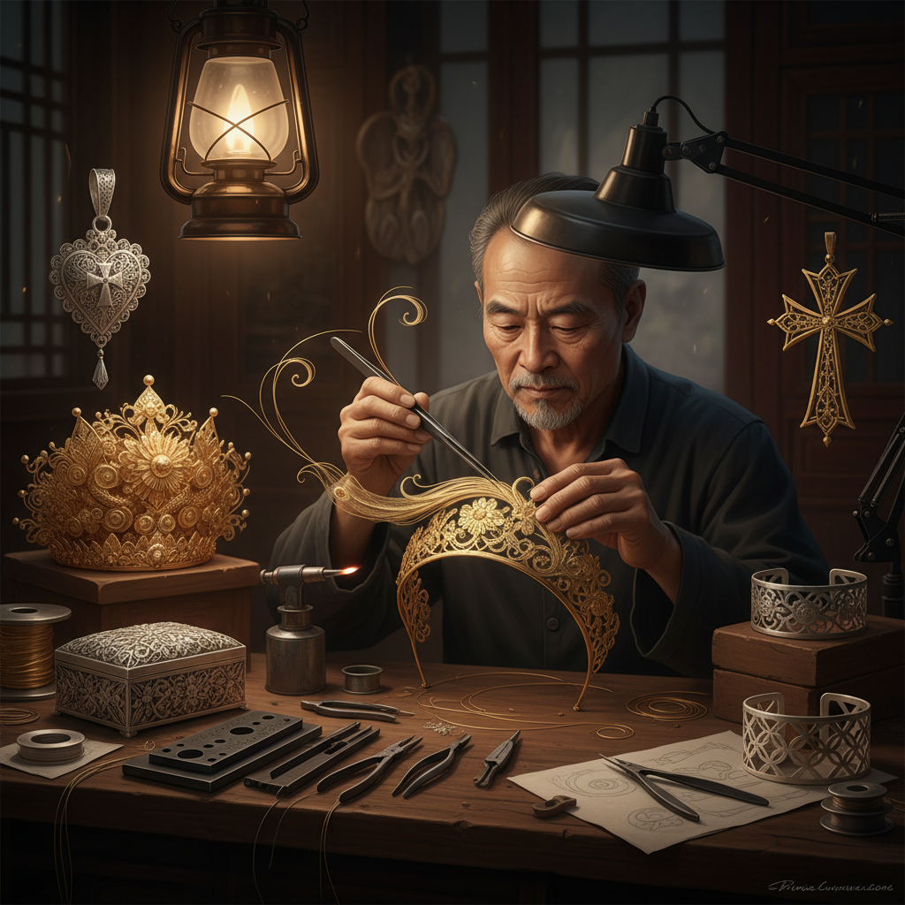

# Filigree Art 花丝工艺

> "Filigree is lace made from metal — threads of gold or silver twisted, curled, and soldered into patterns of impossible delicacy, creating jewelry and ornaments that seem to weigh nothing at all. The filigree master works with wire thinner than human hair, building structures that are more air than metal, more light than substance — proof that strength can come from pattern rather than mass." — Unknown

## 概述

花丝工艺（Filigree Art）是将极细的金属丝（通常为金丝或银丝）通过扭绞、编织、盘绕和焊接等技法制作成精美的镂空装饰图案的金属工艺——花丝作品以其极致的精细度和轻盈感著称，是世界各文化中最精美的金属装饰技法之一。

花丝工艺的实践包括：1）平填花丝——在平面框架内填充花丝图案；2）立体花丝——制作三维立体的花丝造型；3）花丝镶嵌——花丝与宝石镶嵌的结合；4）花丝器物——花丝制作的器物和容器；5）花丝首饰——花丝制作的各种首饰；6）建筑花丝——建筑装饰中的花丝元素；7）当代花丝——将传统技法与现代设计结合的创作。

## 核心特征

| 特征 | 描述 |
|------|------|
| 精细 | 极其精细的金属丝 |
| 镂空 | 通透的镂空效果 |
| 轻盈 | 极其轻盈的质感 |
| 复杂 | 极其复杂的结构 |
| 耐心 | 需要极大耐心 |
| 华丽 | 华丽的装饰效果 |

## 视觉特征

- **丝线**：极细的金属丝线
- **镂空**：通透的镂空结构
- **卷曲**：优美的卷曲图案
- **光影**：丝线间的光影
- **对称**：精确的对称图案
- **层次**：多层叠加的深度

## 代表作品

| 作品 | 艺术家/文化 | 年代 | 意义 |
|------|-------------|------|------|
| *Chinese filigree* | 中国传统 | 古代至今 | 中国花丝镶嵌 |
| *Portuguese filigree* | 葡萄牙 | 中世纪至今 | 葡萄牙花丝 |
| *Maltese filigree* | 马耳他 | 古代至今 | 马耳他花丝 |
| *Indian filigree* | 印度 | 古代至今 | 印度花丝 |
| *Scandinavian filigree* | 北欧 | 维京时代至今 | 北欧花丝 |

## 历史时间线

| 时期 | 事件 |
|------|------|
| 公元前3000年 | 最早的花丝工艺（美索不达米亚） |
| 古典时代 | 希腊罗马的花丝 |
| 中世纪 | 花丝在各文化中的发展 |
| 明清 | 中国花丝镶嵌的巅峰 |
| 当代 | 花丝工艺的现代传承 |

## 中国语境

花丝工艺是中国最精美的传统金属工艺之一——中国的"花丝镶嵌"被列入国家级非物质文化遗产名录。中国的花丝镶嵌以北京为中心——历史上是宫廷御用工艺，专门为皇室制作冠冕、首饰和器物。中国花丝工艺的特点是将极细的金银丝（最细可达0.16毫米）通过掐、填、攒、焊、堆、垒、织、编等技法制作成精美的作品。中国的花丝镶嵌代表作品包括明代万历皇帝的金丝翼善冠——被誉为"中国古代工艺美术的巅峰之作"。中国当代的花丝镶嵌大师（如白静宜等）继承和发展了传统技法——将花丝工艺与现代珠宝设计相结合。中国的花丝镶嵌也是重要的外交礼品——经常作为国礼赠送给外国元首。中国的花丝工艺面临传承挑战——由于工艺极其复杂耗时，年轻传承人较少。

## AI生成概念图

## 与其他风格的关系

- **Granulation** → 珠粒工艺
- **Goldsmithing** → 金器艺术
- **Silversmithing** → 银器艺术
- **Jewelry Art** → 珠宝艺术
- **Lace Art** → 蕾丝艺术
- **Chinese Art** → 中国艺术

---

*浮光艺志 | Chronicle of Artistry*
