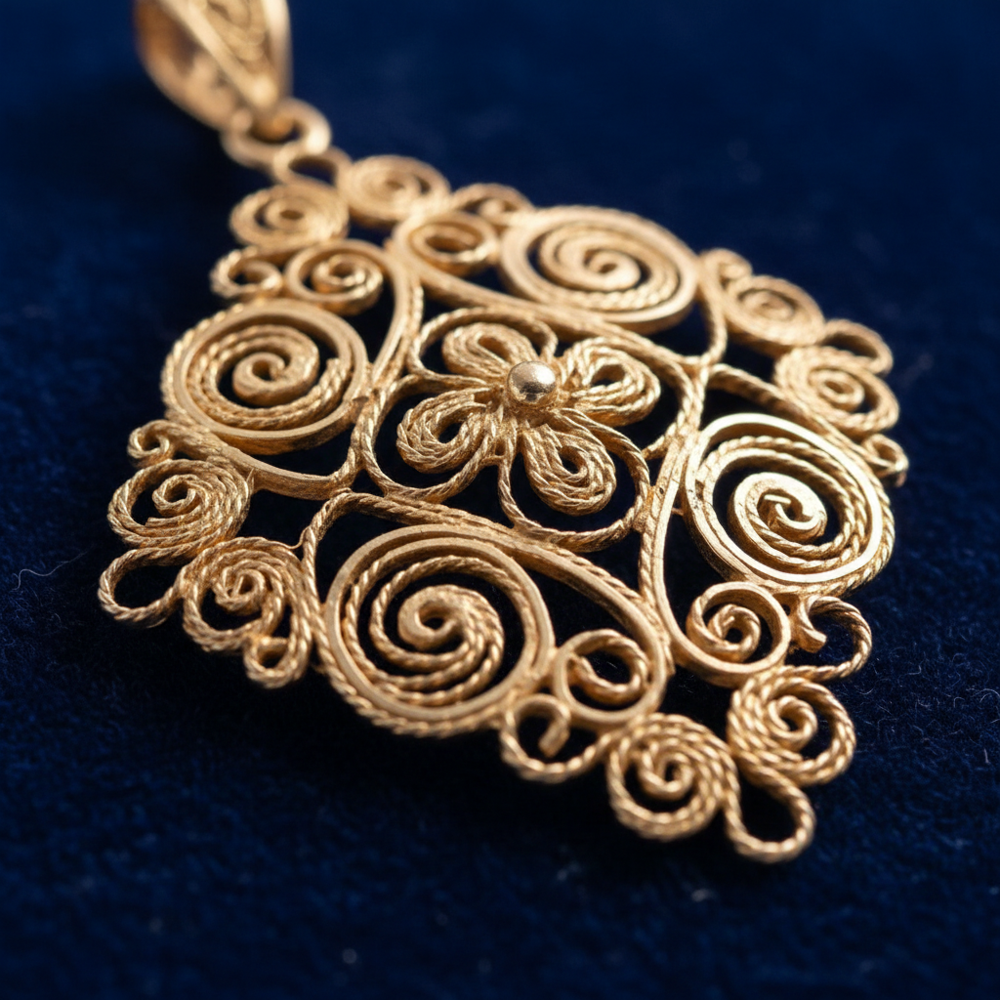

# Filigree Jewelry Art 金银丝细工珠宝艺术

> "Filigree is lace made from metal — impossibly thin wires of gold or silver are twisted, curled, and soldered into openwork patterns of such delicacy that they seem to defy the nature of metal itself. Light passes through the gaps between the wires as through a spider's web jeweled with morning dew. It is metalwork at its most ethereal, where strength is achieved not through mass but through the geometry of interlocking curves." — Unknown

## 概述

金银丝细工珠宝艺术（Filigree Jewelry Art）是一种将极细的金属丝（通常是金丝或银丝）扭转、卷曲并焊接成精致的镂空图案的传统金属装饰工艺。Filigree（源自拉丁语"filum"丝线和"granum"颗粒）以其极致的精细度和蕾丝般的通透效果著称，是世界上最古老和最精致的金属工艺之一。

金银丝细工珠宝艺术的实践包括：1）拉丝——将金属拉成极细的丝线；2）搓丝——将两根细丝搓成麻花状；3）造型——将金属丝弯曲成各种图案；4）焊接——将各部分精确焊接；5）镂空——创造通透的镂空效果；6）镶嵌——在丝工框架中镶嵌宝石；7）当代金银丝细工——将传统技法与现代设计结合的创作。

## 核心特征

| 特征 | 描述 |
|------|------|
| 极细 | 极细的金属丝 |
| 镂空 | 通透的镂空效果 |
| 精致 | 极致的精细度 |
| 古老 | 数千年的传统 |
| 全球 | 全球性的工艺传统 |
| 蕾丝 | 蕾丝般的金属 |

## 视觉特征

- **通透**：镂空通透的效果
- **精细**：极其精细的丝线
- **卷曲**：优美的卷曲图案
- **光影**：光线穿透的效果
- **轻盈**：轻盈精致的质感
- **华丽**：华丽精美的整体感

## 代表作品

| 作品 | 艺术家/文化 | 年代 | 意义 |
|------|-------------|------|------|
| *Etruscan filigree* | 伊特鲁里亚 | 公元前7世纪 | 最早的金银丝细工 |
| *Portuguese filigree* | 葡萄牙 | 传统 | 葡萄牙金银丝传统 |
| *Maltese filigree* | 马耳他 | 传统 | 马耳他银丝工艺 |
| *Indian filigree* | 印度 | 传统 | 印度金银丝工艺 |
| *Contemporary filigree* | 国际 | 当代 | 当代金银丝设计 |

## 历史时间线

| 时期 | 事件 |
|------|------|
| 公元前3000年 | 美索不达米亚最早的金银丝工艺 |
| 古代 | 伊特鲁里亚和希腊的发展 |
| 中世纪 | 伊斯兰世界和欧洲的传播 |
| 17-19世纪 | 各地金银丝传统的成熟 |
| 当代 | 金银丝工艺的艺术化发展 |

## 中国语境

金银丝细工在中国有极其悠久和精湛的传统。中国的花丝镶嵌是国家级非物质文化遗产——以其极致的精细度和华丽的效果著称。中国明清宫廷的花丝镶嵌作品代表了金银丝工艺的最高水平——如定陵出土的万历皇帝金丝翼善冠。中国北京的花丝镶嵌是"燕京八绝"之一——是中国传统工艺美术的瑰宝。中国当代的花丝镶嵌艺术家将传统技法与现代设计结合——创造出具有当代感的金银丝珠宝。中国的珠宝教育中，花丝镶嵌是重要的传统工艺课程——培养新一代的金银丝工艺师。中国的一些品牌将花丝镶嵌定位为高端国潮珠宝——展示中国传统工艺的精湛水平。

## AI生成概念图

## 与其他风格的关系

- **Granulation** → 金珠工艺
- **Jewelry Design** → 珠宝设计
- **Metalwork** → 金属工艺
- **Lace** → 蕾丝工艺
- **Goldsmithing** → 金匠工艺
- **Wirework** → 金属丝工艺

---

*浮光艺志 | Chronicle of Artistry*
