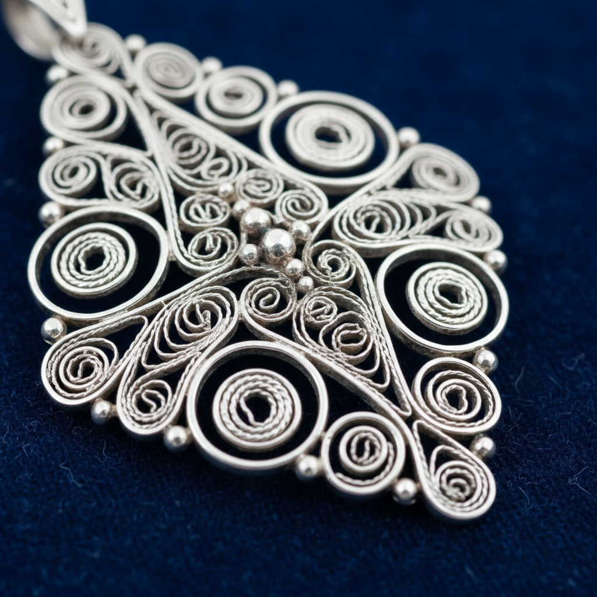

# Filigree Metalwork Art 金属丝细工艺术

> "Filigree is lace made of metal — fine wires of gold or silver are twisted, curled, and soldered into openwork patterns of extraordinary delicacy, creating jewelry and ornamental objects that seem impossibly light and intricate, as if a spider had spun its web in precious metal and frozen it forever in place." — Unknown

## 概述

金属丝细工艺术（Filigree Metalwork Art）是一种将极细的金属丝（通常为金丝或银丝）扭曲、卷曲并焊接成精美的镂空图案的传统金属工艺——filigree一词来自拉丁语filum（丝）和granum（粒），指的是用细丝和小珠组成的装饰。金属丝细工以其极其精细的工艺和蕾丝般的轻盈效果著称，是世界各地都有传统的古老工艺。

金属丝细工艺术的实践包括：1）拉丝——将金属拉成极细的丝；2）扭曲——将细丝扭曲成绳状；3）卷曲——将丝卷曲成各种图案；4）焊接——将各部分焊接在一起；5）镂空——创造镂空的效果；6）填充——在框架内填充细丝图案；7）当代金属丝细工——将传统技法与现代设计结合。

## 核心特征

| 特征 | 描述 |
|------|------|
| 细丝 | 极细的金属丝 |
| 镂空 | 镂空的图案效果 |
| 精细 | 极其精细的工艺 |
| 轻盈 | 蕾丝般的轻盈感 |
| 贵金属 | 通常使用金银 |
| 古老 | 古老的世界性工艺 |

## 视觉特征

- **精细**：极其精细的丝线
- **镂空**：通透的镂空效果
- **卷曲**：优美的卷曲图案
- **光泽**：贵金属的光泽
- **轻盈**：蕾丝般的轻盈
- **对称**：对称的装饰图案

## 代表作品

| 作品 | 艺术家/文化 | 年代 | 意义 |
|------|-------------|------|------|
| *Etruscan filigree* | 古代意大利 | 公元前7世纪 | 伊特鲁里亚金丝细工 |
| *Portuguese filigree* | 葡萄牙 | 传统 | 葡萄牙银丝细工 |
| *Maltese filigree* | 马耳他 | 传统 | 马耳他银丝细工 |
| *Indian filigree (tarkashi)* | 印度 | 传统 | 印度银丝细工 |
| *Contemporary filigree* | 国际 | 当代 | 当代金属丝细工 |

## 历史时间线

| 时期 | 事件 |
|------|------|
| 公元前3000年 | 美索不达米亚的早期金丝细工 |
| 公元前7世纪 | 伊特鲁里亚金丝细工的高峰 |
| 中世纪 | 欧洲各地的发展 |
| 16-18世纪 | 葡萄牙和西班牙的黄金时代 |
| 当代 | 金属丝细工的全球传承 |

## 中国语境

金属丝细工在中国有悠久的传统。中国的花丝镶嵌——是中国传统的金属丝细工，是国家级非物质文化遗产。中国的花丝工艺——以北京花丝最为著名，清代宫廷的花丝作品达到了极高的水平。中国的银丝细工——在贵州、云南等少数民族地区有丰富的传统。中国当代的花丝艺术家——在传统基础上进行创新。中国的工艺美术大师——在花丝镶嵌领域有多位国家级传承人。中国的花丝作品——作为国礼赠送给外国元首。

## AI生成概念图

## 与其他风格的关系

- **Granulation** → 金珠工艺
- **Jewelry Art** → 珠宝艺术
- **Metalwork** → 金属工艺
- **Lace** → 蕾丝
- **Openwork** → 镂空工艺
- **Chinese Huasi** → 中国花丝

---

*浮光艺志 | Chronicle of Artistry*
