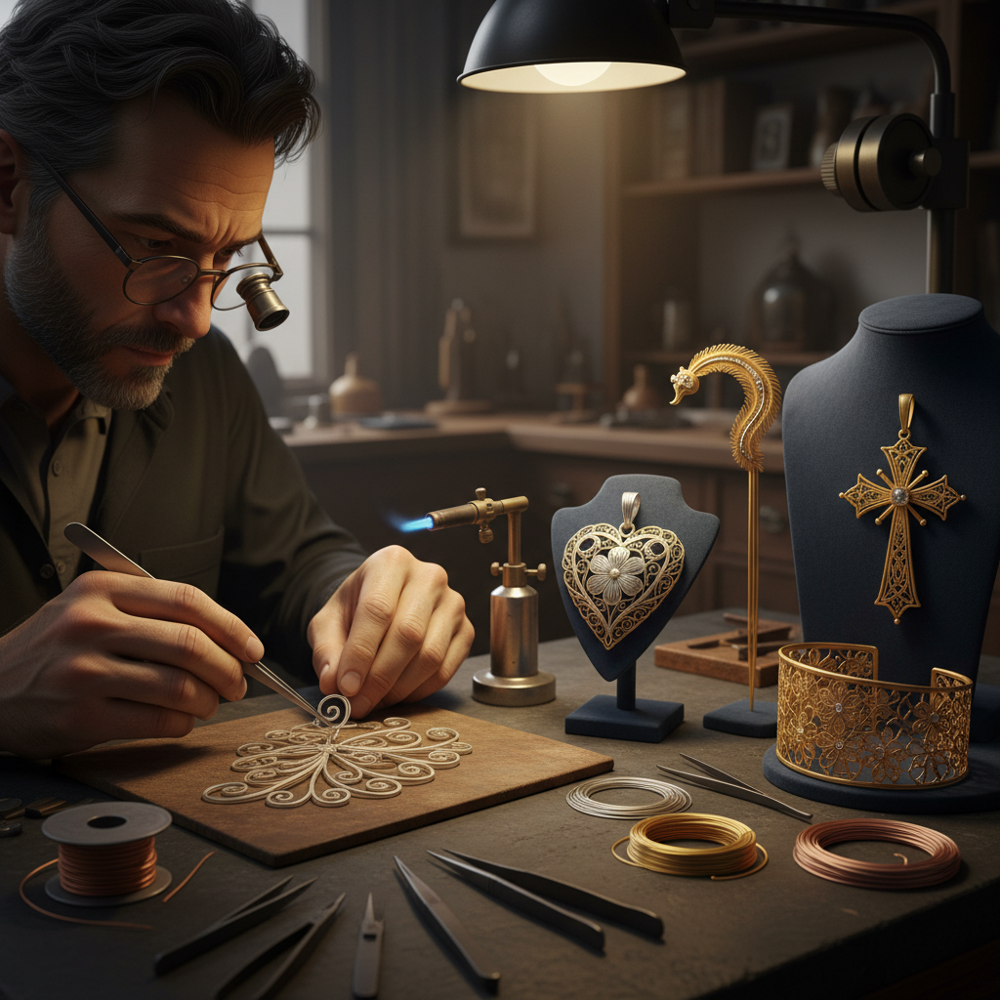

# Filigree 花丝工艺

> "Filigree is lace made of metal — threads of gold and silver twisted and soldered into patterns so delicate they seem to float, defying the weight of their material." — Unknown

## 概述

花丝工艺（Filigree）是将极细的金属丝（金丝或银丝）通过扭绞、编织、盘曲和焊接等方式，制作成精美的镂空装饰图案的金属工艺。花丝的金属丝通常只有0.2-0.5mm粗，经过扭绞后形成绳状纹理，然后弯曲成各种花卉、卷草、几何图案，最后焊接固定。花丝工艺的独特之处在于它的"轻盈"——虽然使用的是金属，但成品看起来如同蕾丝般轻盈通透。花丝工艺广泛存在于世界各地——从葡萄牙的银花丝到印度的金花丝、从中国的花丝镶嵌到马耳他的十字花丝。

花丝工艺的哲学在于：金属的蕾丝——将最坚硬的材料变成最轻盈的形态，在力量中展现柔美。

## 核心特征

| 特征 | 描述 |
|------|------|
| 细丝 | 极细的金属丝 |
| 扭绞 | 丝线的扭绞纹理 |
| 镂空 | 镂空的通透效果 |
| 焊接 | 精密的焊接固定 |
| 轻盈 | 轻盈如蕾丝 |
| 精细 | 极其精细的工艺 |

## 视觉特征

- **轻盈**：蕾丝般的轻盈感
- **镂空**：通透的镂空效果
- **卷曲**：优美的卷曲线条
- **精细**：极其精细的细节
- **光泽**：金属丝的光泽
- **对称**：对称的图案设计

## 代表作品

| 作品 | 艺术家 | 年代 | 意义 |
|------|--------|------|------|
| *Portuguese filigree* | Various | 17世纪+ | 葡萄牙银花丝 |
| *Chinese filigree* | 匿名 | 明清 | 中国花丝镶嵌 |
| *Indian filigree* | Various | 传统 | 印度金花丝 |
| *Maltese filigree cross* | Various | 传统 | 马耳他花丝十字 |
| *Contemporary filigree* | Various | 当代 | 当代花丝艺术 |

## 历史时间线

| 时期 | 事件 |
|------|------|
| 公元前3000年 | 美索不达米亚最早的花丝 |
| 古希腊罗马 | 古典花丝珠宝 |
| 中世纪 | 欧洲教堂花丝装饰 |
| 明清 | 中国花丝镶嵌的巅峰 |
| 17世纪+ | 葡萄牙花丝传统 |
| 当代 | 当代花丝工艺的复兴 |

## 中国语境

花丝工艺在中国称为"花丝镶嵌"——是中国最精细的传统金属工艺之一，被列为国家级非物质文化遗产。北京是花丝镶嵌的主要产地。中国的花丝镶嵌不仅使用花丝技法，还结合宝石镶嵌、点翠等工艺。故宫博物院收藏的明清花丝镶嵌作品（如凤冠、金累丝器物）展现了极高的工艺水平。当代中国的花丝镶嵌大师如白静宜等在传承和创新方面做出了重要贡献。花丝镶嵌也被应用于国礼和高端定制珠宝。

## AI生成概念图

## 与其他风格的关系

- **Jewelry Making** → 珠宝制作
- **Metalwork** → 金属工艺
- **Wirework** → 金属丝工艺
- **Lace** → 蕾丝（视觉类比）
- **Cloisonné** → 掐丝珐琅（丝线类比）
- **Granulation** → 金珠粒

---

*浮光艺志 | Chronicle of Artistry*
