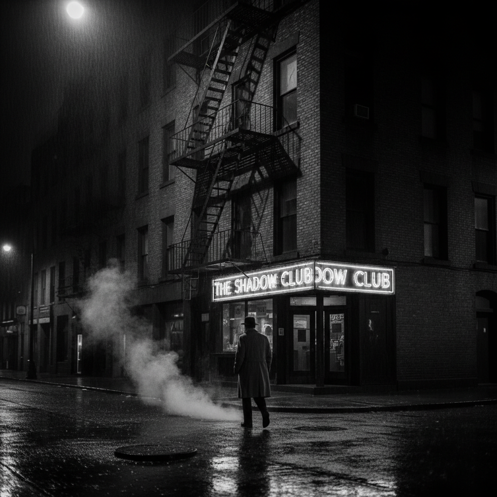

# Film Noir 黑色电影



> **"雨夜、霓虹、香烟的烟雾——光与影的极端对比中，每个人都有秘密。"**

## 概述

| 维度 | 描述 |
|------|------|
| 时期 | 1940s–1950s/影响至今 |
| 别名 | Film Noir, Noir, 黑色电影, Neo-Noir |
| 核心色彩 | 黑白灰、深阴影、高对比、偶尔霓虹 |
| 关键元素 | 极端光影、威尼斯百叶窗光线、雨夜街道、香烟烟雾、蛇蝎美人 |
| 代表人物 | Billy Wilder, Fritz Lang, John Huston, Humphrey Bogart |
| 关联风格 | Dark Deco, Expressionism, Baroque, Cyberpunk, Neo-Noir |

---

## 历史脉络

| 年份 | 事件 |
|------|------|
| 1941 | 《马耳他之鹰》——黑色电影开端 |
| 1944 | 《双重赔偿》——经典Noir叙事 |
| 1946 | 法国评论家命名"Film Noir" |
| 1950 | 《日落大道》——Noir的巅峰 |
| 1958 | 《历劫佳人》——经典Noir的终结 |
| 1982 | 《银翼杀手》——Neo-Noir+科幻 |
| 2005 | 《罪恶之城》——数字时代的Noir复兴 |

### 核心哲学

黑色电影的精神是**"世界不是黑白分明的——每个人都在灰色地带"**：
- 阴影 = 秘密（"光照不到的地方——才是真相"）
- 雨 = 孤独（"雨夜的城市——每个人都是陌生人"）
- 烟雾 = 模糊（"烟雾中看不清脸——也看不清道德"）
- 蛇蝎美人 = 危险（"最美的女人最危险——这是Noir的核心"）
- "在Noir的世界里——没有英雄，只有幸存者"

---

## 视觉语法

### 色彩系统

```
经典Noir（黑白）：
  纯黑 (#000000) — 阴影、秘密、深渊
  纯白 (#FFFFFF) — 高光、暴露、真相
  灰色梯度 — 道德的灰色地带

Neo-Noir（彩色）：
  深蓝 (#000033) — 夜晚
  霓虹红 (#FF0000) — 危险、欲望
  霓虹蓝 (#00FFFF) — 城市、冷
  琥珀黄 (#FFBF00) — 街灯、威士忌

规则：
  - 70%以上画面是阴影
  - 光源明确且戏剧化
  - 百叶窗条纹光线 = 标志
  - 烟雾中的光 = 氛围

质感：
  湿润 — 雨后街道反光
  烟雾 — 香烟、雾气
  金属 — 枪、汽车
  丝绸 — 蛇蝎美人的裙子
```

### 标志性元素

| 类别 | 元素 |
|------|------|
| 光影 | 百叶窗光线、单灯源、极端对比、剪影 |
| 场景 | 雨夜街道、私家侦探办公室、酒吧、小巷 |
| 人物 | 硬汉侦探、蛇蝎美人、腐败警察、黑帮 |
| 道具 | 香烟、威士忌、手枪、风衣、礼帽 |
| 叙事 | 倒叙、画外音、道德模糊、悲剧结局 |
| 态度 | 悲观、宿命、孤独、危险、性感 |

---

## 与千禧怀旧的关系

### Neo-Noir的持续影响
- 《银翼杀手》= Noir + 科幻 = Cyberpunk的视觉基础
- 《罪恶之城》= 数字时代的Noir美学极致
- 《黑暗骑士》= 超级英雄电影的Noir化
- "每一部'黑暗'的电影——都欠Noir一笔债"

### 对摄影和设计的影响
- Noir光影 = 人像摄影的经典技法
- "Moody lighting" = Noir的当代名字
- 黑白街头摄影 = Noir精神的延续
- Dark Deco = Noir + Art Deco的融合

---

## 中国语境

- 中国黑色电影传统（张艺谋《血迷宫》等）
- 中国犯罪电影中的Noir美学
- 中国城市夜景摄影中的Noir元素
- 中国游戏中的Neo-Noir世界观

---

## 设计应用

| 场景 | 应用方式 |
|------|----------|
| 影视 | 光影+叙事+氛围+角色 |
| 摄影 | 人像+街头+黑白+戏剧光 |
| 品牌 | 神秘+高端+男性+威士忌+香水 |
| 游戏 | 侦探+犯罪+城市+氛围 |

---

## 相关风格

← [Dark Deco 暗黑装饰艺术](dark-deco.md) | [Cyberpunk 赛博朋克](cyberpunk.md) →

↑ [返回千禧怀旧目录](README.md) | [返回总目录](../README.md)
