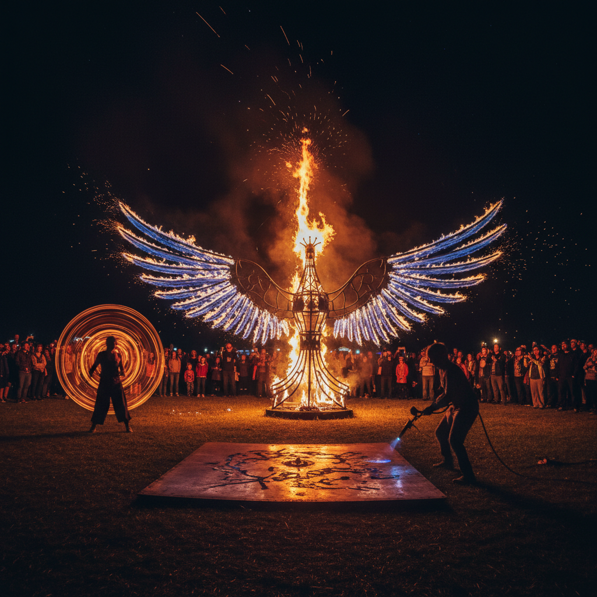

# Fire Art 火艺术

> "Fire art works with humanity's oldest technology and oldest fear — the same force that cooked our food, lit our caves, forged our metals, and burned our cities. Fire is simultaneously the most creative and the most destructive force available to human hands, and the fire artist walks the line between control and chaos, between warmth and danger, between light and annihilation. Every flame is alive — it breathes, it dances, it consumes, it transforms, and it dies." — Unknown

## 概述

火艺术（Fire Art）是以火——燃烧的化学反应产生的光、热和火焰——为主要创作媒介的艺术实践。火是人类最古老的工具之一，也是最危险和最壮观的自然现象之一。火艺术将火的破坏性和创造性统一在艺术表达中。

火艺术的实践包括：1）火焰雕塑——用可控火焰创造三维形态的装置；2）火绘画——用火焰在材料表面留下烧痕创作（pyrography）；3）火舞/火表演——将火作为表演艺术的元素；4）火药艺术——用火药爆炸创作绘画和装置；5）篝火艺术——大型篝火和火祭的艺术化；6）熔融艺术——利用火的高温熔化和塑造材料（玻璃、金属）。

## 核心特征

| 特征 | 描述 |
|------|------|
| 危险 | 内在的危险性 |
| 光 | 火焰的光芒 |
| 热 | 极端的热量 |
| 短暂 | 燃烧的短暂性 |
| 转化 | 物质的转化 |
| 原始 | 原始的力量 |

## 视觉特征

- **橙红**：火焰的橙红色
- **动态**：火焰的持续运动
- **光芒**：黑暗中的光芒
- **烟雾**：伴随的烟雾
- **灰烬**：燃烧后的灰烬
- **变形**：热量造成的变形

## 代表作品

| 作品 | 艺术家 | 年代 | 意义 |
|------|--------|------|------|
| *Sky Ladder* | Cai Guo-Qiang | 2015 | 火药天梯 |
| *Fire sculptures* | Various | 2000年代 | 火焰雕塑 |
| *Burning Man* | 集体创作 | 1986至今 | 火人节 |
| *Pyrography* | Various | 古代至今 | 烙画艺术 |
| *Fire performances* | Various | 古代至今 | 火舞表演 |

## 历史时间线

| 时期 | 事件 |
|------|------|
| 远古 | 人类控制火的使用 |
| 古代 | 火祭、烟火仪式 |
| 唐代 | 中国烟花的发展 |
| 1986 | Burning Man创立 |
| 当代 | 蔡国强的火药艺术 |

## 中国语境

火艺术在中国有极其深厚的文化传统。中国是火药的发明国，烟花艺术有超过千年的历史。蔡国强是当代最重要的火艺术家之一——他的火药绘画和大型烟火表演（如2008年北京奥运会开幕式的"大脚印"烟火、2015年的"天梯"）将中国火药传统推向了当代艺术的最前沿。中国传统的"烙画"（用烧热的铁笔在木板或竹片上作画）有数百年历史。中国传统节日中火有重要地位——元宵节的花灯、中元节的放河灯、除夕的爆竹。中国当代的一些艺术家在探索火艺术：蔡国强的火药系列、将中国传统烙画与当代艺术结合、以及将中国传统的"火文化"（窑火、炉火、灶火）与当代装置艺术对话。

## AI生成概念图

## 与其他风格的关系

- **Smoke Art** → 烟雾艺术
- **Light Art** → 光艺术
- **Performance Art** → 行为艺术
- **Volcanic Art** → 火山艺术
- **Ephemeral Art** → 短暂艺术
- **Pyrotechnics** → 烟火艺术

---

*浮光艺志 | Chronicle of Artistry*
