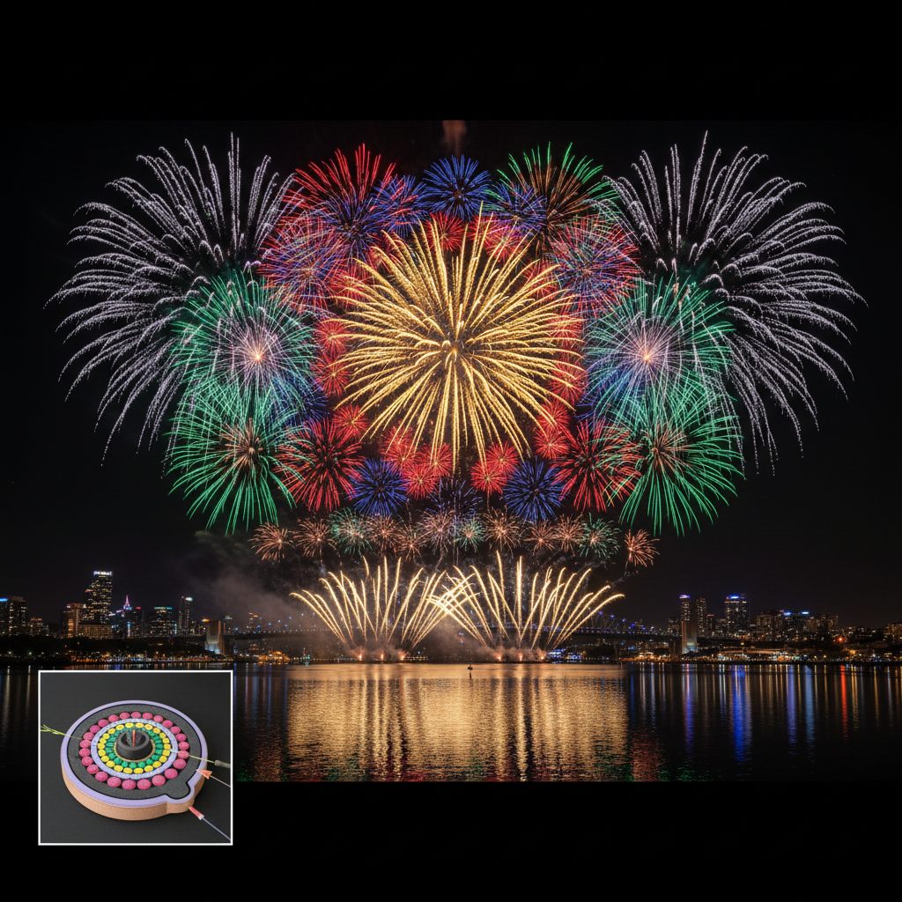

# Fireworks Art 烟花艺术

> "Fireworks are painting with fire on the canvas of the night sky — each shell a brushstroke of light that blooms, spreads, and fades in seconds. The fireworks artist composes in four dimensions: the two dimensions of the sky, the depth of layered effects, and the relentless forward march of time. Unlike any other art form, a fireworks display can never be paused, rewound, or corrected. It is performance art at the scale of the heavens." — Unknown

## 概述

烟花艺术（Fireworks Art）是以烟火为媒介在夜空中创造视觉奇观的艺术形式——通过精确的化学配方、发射时序和空间编排，在黑暗的天空中绘制出壮观的光、色、形和声的交响。烟花艺术是化学、物理、工程和美学的完美结合。

烟花艺术的实践包括：1）传统烟花——节庆和庆典中的烟花表演；2）音乐烟花——与音乐精确同步的烟花编排；3）艺术烟花——以艺术表达为目的的烟花创作；4）日间烟花——使用彩色烟雾的白天烟花；5）室内烟花——安全的室内冷焰火效果；6）烟花摄影——以烟花为主题的艺术摄影；7）数字烟花——用数字技术模拟和设计烟花效果。

## 核心特征

| 特征 | 描述 |
|------|------|
| 壮观 | 天空尺度的壮观 |
| 短暂 | 极其短暂的存在 |
| 多感 | 视觉、听觉、触觉 |
| 精确 | 精确的时序控制 |
| 化学 | 化学配方的艺术 |
| 集体 | 集体观赏的体验 |

## 视觉特征

- **爆发**：从中心向外的爆发
- **色彩**：鲜艳的化学色彩
- **轨迹**：光点的运动轨迹
- **层次**：多层次的空间效果
- **对称**：球形对称的图案
- **夜空**：以黑暗夜空为背景

## 代表作品

| 作品 | 艺术家 | 年代 | 意义 |
|------|--------|------|------|
| *Sky Ladder* | 蔡国强 | 2015 | 500米火梯 |
| *Transient Rainbow* | 蔡国强 | 2002 | MoMA烟花彩虹 |
| *悉尼跨年烟花* | Various | 年度 | 世界级烟花表演 |
| *国庆烟花* | Various | 年度 | 中国国庆烟花 |
| *花火大会* | Various | 年度 | 日本花火大会 |

## 历史时间线

| 时期 | 事件 |
|------|------|
| 唐代 | 中国发明烟花 |
| 宋代 | 烟花技术的成熟 |
| 14世纪 | 烟花传入欧洲 |
| 19世纪 | 化学烟花的发展 |
| 当代 | 电脑控制的音乐烟花 |

## 中国语境

烟花艺术是中国对世界文明的重大贡献之一。中国是烟花的发明国——从唐代的"火药"到宋代的"烟火"，中国的烟花技术有超过1000年的历史。中国至今仍是世界上最大的烟花生产国和出口国——湖南浏阳、江西万载、广东东莞是中国三大烟花产地。中国当代最著名的烟花艺术家蔡国强将烟花提升为当代艺术——他的作品《天梯》用烟花在天空中创造了一座500米高的火焰阶梯，震撼世界。中国的国庆烟花表演、春节烟花和各种节庆烟花是中国文化中不可或缺的组成部分。中国的烟花工匠代代相传的配方和技艺是珍贵的非物质文化遗产。

## AI生成概念图

## 与其他风格的关系

- **Pyrotechnic Art** → 烟火技术艺术
- **Light Art** → 光艺术
- **Performance Art** → 表演艺术
- **Ephemeral Art** → 短暂艺术
- **Sound Art** → 声音艺术
- **Public Art** → 公共艺术

---

*浮光艺志 | Chronicle of Artistry*
