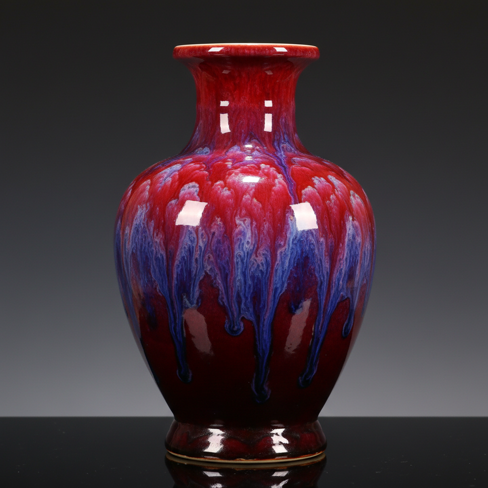

# Flambé Glaze Art 窑变釉艺术

> "Flambé is the kiln's own painting — copper dissolved in a glaze and fired in fierce reduction produces rivers of crimson, purple, and blue that flow and pool unpredictably across the surface, each piece a unique landscape of color that no human hand could plan or repeat, the fire itself becoming the artist while the potter merely sets the stage and surrenders control to chemistry and chance." — Unknown

## 概述

窑变釉艺术（Flambé Glaze Art）是一种利用铜红釉在高温还原气氛中产生丰富色彩变化的陶瓷釉色艺术。窑变釉的"窑变"意味着在窑炉中发生的不可预测的色彩变化——铜元素在还原气氛中被还原为胶体铜，产生从深红到紫色、蓝色、绿色的丰富色彩流动。每一件窑变釉作品都是独一无二的，因为色彩的分布完全取决于窑内温度和气氛的微妙变化。

窑变釉艺术的核心要素包括：1）铜红基础——以铜为着色剂；2）还原气氛——需要强还原烧成；3）不可预测——色彩分布不可控；4）色彩流动——如火焰般流动的色彩；5）独一无二——每件作品独特；6）高温烧成——需要高温还原；7）自然之美——窑火自然造就的美。

## 核心特征

| 特征 | 描述 |
|------|------|
| 铜红着色 | 以铜为着色剂 |
| 还原烧成 | 强还原气氛 |
| 不可预测 | 色彩分布不可控 |
| 色彩流动 | 如火焰般流动 |
| 独一无二 | 每件作品独特 |
| 自然造就 | 窑火自然之美 |

## 视觉特征

- **深红色**：浓郁的铜红色调
- **紫色渐变**：红到紫的渐变过渡
- **蓝色斑块**：局部的蓝色区域
- **色彩流动**：如火焰般的流动纹理
- **光泽感**：深沉的玻璃质光泽
- **层次丰富**：多层色彩的叠加

## 代表作品

| 作品 | 艺术家/文化 | 年代 | 意义 |
|------|-------------|------|------|
| *钧窑窑变* | 中国 | 宋代 | 中国窑变釉的巅峰 |
| *郎窑红* | 中国 | 清代 | 铜红釉的经典 |
| *Sang de boeuf* | 欧洲仿制 | 18-19世纪 | 欧洲对中国窑变的模仿 |
| *Bernard Moore* | 英国 | 20世纪初 | 英国窑变釉大师 |
| *当代窑变* | 各地陶艺家 | 当代 | 窑变釉的当代探索 |

## 历史时间线

| 时期 | 事件 |
|------|------|
| 宋代 | 中国钧窑窑变釉的辉煌 |
| 明清 | 郎窑红等铜红釉的发展 |
| 18世纪 | 欧洲开始模仿中国窑变 |
| 19世纪 | 欧洲陶艺家成功复制窑变 |
| 当代 | 窑变釉在全球的广泛实践 |

## 中国语境

窑变釉是中国陶瓷最辉煌的成就之一。中国宋代钧窑的窑变釉被誉为"入窑一色，出窑万彩"——其紫红、天蓝、月白等色彩变化令人叹为观止。清代的郎窑红、豇豆红等铜红釉更是将窑变釉推向了技术的极致。中国古人将窑变视为"窑神"的杰作——不可预测的色彩变化被赋予了神秘的意义。中国的窑变釉传统深刻影响了世界陶瓷——18世纪欧洲陶艺家花费数十年试图复制中国的铜红窑变效果。中国当代陶艺家继续探索窑变釉的可能性——在传统配方基础上进行创新，创造出新的窑变效果。

## AI生成概念图

## 与其他风格的关系

- **Jun Ware** → 钧窑
- **Copper Red** → 铜红釉
- **Reduction Firing** → 还原烧成
- **Sang de Boeuf** → 牛血红
- **Transmutation Glaze** → 窑变釉
- **Chinese Ceramics** → 中国陶瓷

---

*浮光艺志 | Chronicle of Artistry*
